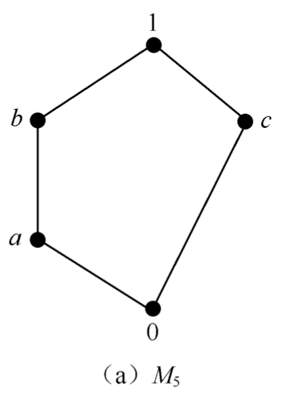
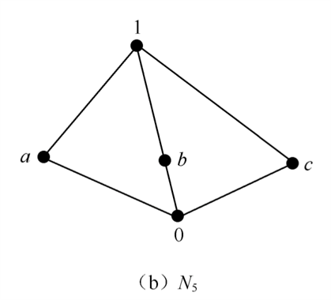

# 格

## 偏序

**偏序集**$(P;\preceq)$是由一个非空集合$P$及在$P$上定义的**偏序关系**$\preceq$构成

在**偏序集**$(P;\preceq)$中，若对$\forall a,b \in P$有$a\preceq b$或$b \preceq a$时称$P$为**全序**

## 格

设$(L;\preceq)$为**偏序集**，如果对$\forall a,b \in L$有**最小上界**与**最大下界**都在$L$中时，称$L$为**格**

以$a \vee b=lub(a,b)$表示$a,b$的**最小上界**

以$a \wedge b=glb(a,b)$表示$a,b$的**最大下界**

- **定理 16.1**: $(L;\le)$为格，则对任意$a,b \in L$有:
  - $a≤a \vee b,b≤a \vee b,a \wedge b≤a,a \wedge b≤b$
  - $a≤b$当且仅当$a\vee b=b$
  - $a≤b$当且仅当$a\wedge b=a$
- **定理 16.2**: $(L;≤)$为格，则对任意$a,b,c \in L$有:
  - $L_1$**幂等律**: $a \vee a=a,a\wedge a=a$
  - $L_2$**交换律**: $a\vee b=b \vee a,a\wedge b=b \wedge a$
  - $L_3$**结合律**: $a\vee(b\vee c)=(a\vee b)\vee c,a\wedge(b\wedge c)=(a\wedge b)\wedge c$
  - $L_4$**吸收律**: $a \vee (a \wedge b)=a,  a \wedge (a \vee b)=a$

## 覆盖

$(L;\preceq)$为**格**，如果$a \preceq b, a \neq b$(记为$a \prec b$)，且不存在$u \in L-\{a,b\}$使$a \preceq u \preceq b$，则称$b$**覆盖**$a$

当$a \prec b$时，如有$c_1,c_2,...,c_k \in L(k \ge 1)$，使$c_{i+1}$覆盖$c_i(i=1,2,...,k-1)$，且有$a=c_1 \prec c_2 \prec ... \prec c_k=b$,则称$c_1,c_2,...,c_k$为连接$a,b$的**链**

如果$L$的任何两个元素$a \prec b$, 总有连接它们的**链**, 则称$L$是**离散的**(也是全序的)

_有限的离散全序集的哈斯图由一条链组成_

## 完全格

设$(L,\preceq)$为偏序集, $A\subseteq L,A=\{a_i|1 \le i \le n,a_i \in L\}$

记$\bigvee_{i=1}^na_i=a_1 \vee a_2 \vee ... \vee a_n$为$A$的**最小下界**

记$\bigwedge_{i=1}^na_i=a_1 \wedge a_2 \wedge ... \wedge a_n$为$A$的**最小上界**

当任意$A\subseteq L$有**最大下界**，**最小上界**时，$L$显然是格，且进一步称为**完全格**

其中:

- $L$自身的**最小上界**是整个格$L$的**最大元**，记为$1$
- $L$自身的**最大下界**为整个格$L$的**最小元**，记为$0$
- $\forall x \in L,x \preceq 1,0 \preceq x$

## 作为代数系统的格

- **引理 16.1**: 在$[L;\vee,\wedge]$中, 二元运算$\vee,\wedge$满足$L_1～L_4$，则$\forall a,b \in L,a\wedge b=a$, 当且仅当$a \vee b=b$
- **引理 16.2**: 在$[L;\vee,\wedge]$中, 二元运算$\vee,\wedge$满足$L_1～L_4$，在$L$上定义二元关系$≤:\forall a,b \in L,a \le b$当且仅当$a\vee b=b$，则$(L;≤)$为**偏序集**
- **定理 16.3**: 如**引理 16.2**所得之偏序集$[L;∨,∧]$为**格**

$[L;\vee,\wedge]$为一代数系统，二元运算$\vee,\wedge$满足$L_1～L_4$时，称$L$为**格**, 并称$\wedge$为**积(或交)**，$\vee$为**和(或并)**

若$L$中存在元素$0$，使得对任意的$x \in L$有$x \vee 0=x$，则称$0$为$\vee$的**单位元**，并称$0$是**格的零元**

若$L$中存在元素$1$，使得对任意的$x \in L$有$x \wedge 1=x$，则称$1$为$\wedge$的**单位元**，并称$1$是**格的单位元**

**零元, 单位元**存在则必唯一, 若存在零元$0$和单位元$1$，则$0$和$1$分别是$L$的**最小元**和**最大元**

- **定理 16.4(保序性)**: 格$[L;\vee,\wedge]$，任$a,b,c \in L$，当$b≤c$时有$a\vee b≤a \vee c$及$a\wedge b≤a\wedge c$

## 子格

$[L;\vee,\wedge]$为**格**，$T\neq\varnothing,T \subseteq L,T$关于$\vee,\wedge$封闭时，则称$T$为$L$的**子格**

但当$T\subseteq L$，$T$关于$L$中的偏序关系$≤$为格时，$T$不一定是$L$的子格

## 格的同态与同构

设$[L;\vee,\wedge]$与$[S;+,·]$为两个**格**, 如果存在映射$\varphi:L→S$，使对任$a,b∈L$有：

- $\varphi(a\vee b)=\varphi(a)+\varphi(b)$
- $\varphi(a\wedge b)=\varphi(a)·\varphi(b)$

则称$\varphi$为$L$到$S$的**同态映射**

当$\varphi(L)=S$即$\varphi$为**满射**时，又说格$L$与格$S$**同态**, 当$\varphi$是**一一对应**时，说格$L$与$S$**同构**

若$S=L$时，又分别称它是**自同态**与**自同构**

- **定理 16.5**: 格$[L;\vee,\wedge]$与格$[S;+,·]$同态，$\varphi$为其**同态映射**，则$\varphi$同时是**保序映射**，即对任$a, b \in L$，当$a≤b$时，$\varphi(a)≤\varphi(b)$
- **定理 16.6**: $\varphi$是格$L$到格$S$的**一一对应**，则$\varphi$是**同构映射**，当且仅当: 对任何$a,b \in L, a≤b ⇔ \varphi(a)≤\varphi(b)$
- **定理 16.7(对偶原理)**
  - 设$P$是对任意偏序集都为真的一个**命题**，$P'$是将$P$中所有$≤,≥$对换得到的**对偶命题**，则$P'$对任意偏序集也为真
  - 设$P$是从格$[B; ∨, ∧]$推出的**命题**，$P'$是将$P$中$∨$与$∧$对换得到的**对偶命题**，则$P'$对格$[B;∧,∨]$也为真

## 有界格

具有最大元$1$和最小元$0$的格$[L;\vee,\wedge]$称为**有界格**

- **定理 16.8**: $[L;\vee,\wedge]$为**有界格**, 则对任意$a \in L$有：$a\vee 1=1,a\wedge 0=0, a\wedge 1=a, a\vee 0=a$

## 有补格

$[L;\vee,\wedge]$为**有界格**，对$a \in L$, 如果存在$b\in L$，使$a\vee b=1, a\wedge b=0$，则称$b$为$a$的**补元**，记$b$为$a'$, 若$L$中的**每个元**有补元, 则称$L$为**有补格**

## 分配格

- **定理**: 对**任意格**成立**分配不等式**，即格$[L;\vee,\wedge]$中任$a,b,c\in L$有：
  - $a\vee(b\wedge c)≤(a\vee b)\wedge(a\vee c)$
  - $(a\wedge b)\vee(a\wedge c)≤a\wedge(b\vee c)$

$[L;∨,∧]$为格，当对其任意元$a,b,c∈L$成立**分配律**，即上两式中等号成立，则称该格为**分配格**

**非分配格**$M_5,N_5$:

- **定理 16.9**: $[L;\vee,\wedge]$为**任意格**，则下述条件等价:
  - 对任意$a,b,c\in L$有：$a\wedge(b\vee c)=(a\wedge b)\vee(a\wedge c)$
  - 对任意$a,b,c\in L$有：$a\vee(b\wedge c)=(a\vee b)\wedge(a\vee c)$
  - 对任意$a,b,c\in L$有：$(a\wedge b)\vee(a\wedge c)\vee(b\wedge c)=(a\vee b)\wedge(a\vee c)\wedge(b\vee c)$
  - 不含与$M_5$或$N_5$同构的**子格**

# 布尔代数

**有补分配格**称为**布尔(Boole)格**, 习惯上写成$(B;≤)$

布尔格$(B;≤)$又可称为**布尔代数**$[B;∨,∧,']$, 其中$∨,∧$为一般格中的**交(积)**与**并(和)**，而$~'~$为**求补**

- **定理 16.10**: **布尔格**$(B;≤)$中任$a,b\in B$有:
  - $a$的**补元**是唯一的
  - $(a\wedge b)'=a'\vee b',(a\vee b)'=a'\wedge b'$
  - $a\wedge b=0 \Leftrightarrow a≤b'$
- **布尔代数**性质汇总：
  - **格**的性质
    - $L_1$**幂等律**: $a \vee a=a,a\wedge a=a$
    - $L_2$**交换律**: $a\vee b=b \vee a,a\wedge b=b \wedge a$
    - $L_3$**结合律**: $a\vee(b\vee c)=(a\vee b)\vee c,a\wedge(b\wedge c)=(a\wedge b)\wedge c$
    - $L_4$**吸收律**: $a \vee (a \wedge b)=a,  a \wedge (a \vee b)=a$
  - **分配格**的性质
    - $D_1:a\wedge(b\vee c)=(a\wedge b)\vee(a\wedge c),a\vee(b\wedge c)=(a\vee b)\wedge(a\vee c)$
    - $D_2:(a\wedge b)\vee(a\wedge c)\vee(b\wedge c)=(a\vee b)\wedge(a\vee c)\wedge(b\vee c)$
  - **有界格**的性质
    - $B_1:a\vee 1=1,a\wedge 0=0$
    - $B_2:a\wedge 1=a,a\vee 0=a$
  - **有补格**的性质
    - $C_1:a\vee a'=1,a\wedge a'=0$
    - $C_2:0'=1$
    - $C_3:(a\vee b)'=a'\wedge b',(a\wedge b)'=a'\vee b’$
  - **运算**$\vee,\wedge$的性质
    - $P_1: a\vee b$是$a$和$b$的最小上界，$a\wedge b$是$a$和$b$的最大下界
    - $P_2: a≤b$当且仅当$a\wedge b=a$
    - $P_3: a\wedge b=0 \Leftrightarrow a≤b’$
- **定理 16.11**: $B$至少包含两个元素，$\vee$和$\wedge$为$B$上的两个二元运算, $'$为$B$上的一元运算，若对任何$a,b,c\in B$满足:
  - $H_1: a\vee b=b\vee a,a\wedge b=b\wedge a$
  - $H_2: a\wedge(b\vee c)=(a\wedge b)\vee(a\wedge c),a\vee(b\wedge c)=(a\vee b)\wedge(a\vee c)$
  - $H_3:$在$B$中存在**零元**$0$, 使$a\vee0=a, a\wedge0=0$; 存在**单位元**$1$, 使$a\wedge 1=a, a\vee 1=1$
  - $H_4: a'\in B$，使$a\wedge a'=0,a\vee a'=1$
- 则$[B;\vee,\wedge,']$为布尔代数
- 重要结论:
  - 任意一个**有限布尔代数**必为$2^n(n≥1)$元的
  - 对任一自然数$n≥1$，必定能找到一个布尔代数$B$，使$|B|=2^n$
  - 任意一个$2^n$元的布尔代数都**同构于**$[B;∨,∧,']$

## 布尔环

**布尔代数**$[B;\vee,\wedge,']$中定义$B$上的二元运算$+$及$·$如下：$\forall a,b\in B$

- $a+b=(a\wedge b')\vee(a'\wedge b)$
- $a·b=a\wedge b$

$[B;+,·]$是**可交换的有单位元环**, 称为**布尔环**

- **定理 16.12**: $[B;+,·]$为具有**幂等律**的环，则对任意$a\in B$有$2a=0$

## 例题

### 1

设$B=\{0,1\}$，$≤_n$为定义在$B^n$上的关系，对任$(a_1,a_2,...,a_n),(b_1,b_2,...,b_n)\in B^n, (a_1,a_2,...,a_n)≤_n (b_1,b_2,...,b_n)$当且仅当$a_i≤b_i(1 \le i \le n)$，显然这是一个**偏序关系**, 并且$(B^n,≤_n)$是**格**
