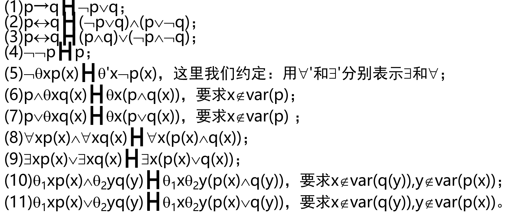

# 谓词代数

## 变元

由表示某种不确定的可列个个体对象全体所组成的集合称为**个体变元集**，记为$X=\{x_1,x_2,...,x_n,...\}$，这里$x_i$称为**个体变元**，用来表示不确定的个体对象

## 常元

由表示某种确定的个体对象全体所组成的集合称为**个体常元集**，它是可列集或有限集，也可以是空集，记为$C=\{c_1,c_2,...,c_n,...\}$，这里$c_i$称为**个体常元**，用来表示某个确定的个体对象

另：它们也可以看作为$0$元运算集$T_0=\{{f_0}^i|ar({f_0}^i)=0\}$的元素

## 项

$X∪C$上的自由$T^{(1)}$-代数$I$称为**项集**，$I$中的每个元素称为**项**，不含**个体变元**的项称为**闭项**，$I$上的代数运算${f_n}^i$称为**第**$i$**个**$n$**元函数词**

如果$X∪C,T^{(1)}$可列，则项集$I$也是可列集

## 原子公式

**关系集**$R=\bigcup_{n=0}^{\infin}R_n$，其中$R_n=\{{R_n}^i|ar({R_n}^i)=n\}$

对$\forall {R_n}^i\in R_n\subseteq R$，称$I$上的$n$元关系${R_n}^i(t_1,t_2,...,t_n)$为$I$上的**原子公式**

- 特别地，${R_0}^i$就是**原子命题公式**
- 这里$t_1,t_2,...,t_n\in I,{R_n}^i$称为第$i$个$n$元谓词
- 基于关系集$R$的所有$I$上的**原子公式**全体称为$I$的**原子公式集**，记为$Y$

## 谓词代数

**原子公式集**$Y=\{R_n(t_1,t_2,...,t_n)|R_n\subseteq R,t_i\in I, 1\le i\le n\}$上关于**类型**$\{F,→,\forall x|x\in X\}$的**自由代数**称为**谓词代数**，记为$P(Y)$

$P(Y)$中的元素称为**谓词合式公式**，因此$P(Y)$也称为**谓词公式集**

用$F, →,\forall x$来定义一元运算$\neg,\exist x$，以及二元运算$\vee,\wedge,\leftrightarrow$如下:

- $¬p≝p→𝐹$
- $\exist x≝\neg\forall x\neg$
- $𝑝∨𝑞≝(¬p)→𝑞$
- $𝑝∧𝑞≝¬((¬p)∨(¬q))$
- $𝑝↔𝑞≝(𝑝→𝑞)∧(𝑞→𝑝)$

## 辖域

在**谓词合式公式**$q=\theta xp$($\theta$表示$\forall$或$\exist$)中

- 称$p$为$\theta x$的**辖域**
- $p$中$x$的出现称为$x$在$q$中的**约束出现**
- $p$中不是**约束出现**的其它变元的出现称为变元在$q$中的**自由出现**
- 如果变元$x$在$q$中**约束出现**，则称$x$是$q$中的**约束变元**
- 如果变元$x$在$q$中**自由出现**，则称$x$是$q$中的**自由变元**
- $q$中**自由出现**的个体变元全体构成的集合用$var(q)$表示
- 若$var(q)=\varnothing$，则称$q$为**闭式**

设$p(x)$是$P(Y)$中**谓词合式公式**，$x$是其**自由变元**之一，$t(z)$是**项**，$z$代表$t$中的任一个**个体变元**。当$x$不出现在$p$的$\theta z$的**辖域**内，则称$t$对于$p$中的$x$是**自由的**，否则就称$t$对于$p$中的$x$是**不自由的**

## 量词深度和层次

设$p\in P(Y),p$的**量词深度**和**层次**分别用$d(p),l(p)$表示，定义为：

- 如$q$是$P(Y)$中的**原子公式**，则$d(q)=l(q)=d(F)=l(F)=0$
- $d(p_1\rightarrow p_2)=max\{d(p_1),d(p_2)\},l(p_1\rightarrow p_2)=1+max\{l(p_1),l(p_2)\}$
- $d(\forall xp)=\begin{cases}
    1+d(p)&x\in var(p)\\
    d(p)&x\notin var(p)
\end{cases},l(\forall xp)=1+l(p)$

# 谓词公式语义解释

## 解释域

$P(Y)$的**解释域**是一个四元组$(U,\varphi_1,\varphi_2,\varphi_3)$，其中：

- $U$是非空集，称为**论域**
- $\varphi_1$是$C→U$的函数
- $\varphi_2$是$P(Y)$上的**函数词集合**$F$到$U$上**运算集**的函数，使得$\varphi_2({f_n}^i)={f'_n}^i$，这里${f'_n}^i$是$U$上的$n$**元运算**
- $\varphi_3$是$P(Y)$上的**谓词集合**$R$到$U$上**关系集**的函数，使得$\varphi_3({R_n}^i)={R'_n}^i$，这里${R'_n}^i$是$U$上的$n$**元关系**

解释域$U$中的元素也称为**个体对象**

我们以后通常把解释域$(U,\varphi_1,\varphi_2,\varphi_3)$简记为$\mathscr{U}$

## 变元的指派和项解释

- **定理 19.1**：设$\mathscr{U}$为$P(Y)$的一个**解释域**，则$\varphi_0:X→U$可唯一扩张为$I→U$的**同态映射**$\varphi$，使得$\varphi(c_i)=c'_i,c'_i\in U$

$X→U$的映射$\varphi_0$称为个体变元的**指派**，$I→U$的同态映射$\varphi$称为**项解释**

## $P(Y)$的赋值

给定**解释域**$\mathscr{U}$和**项解释**$\varphi$, **原子公式集**$Y$记为$Y^{U,\varphi}$, **谓词公式集**$P(Y)$则相应记为$P(Y^{U,\varphi})$

谓词公式的**赋值函数**$v:P(Y^{U,\varphi})→Z_2$分三步$a,b,c_k$，定义如下:

- $a:$对于**原子公式**$p={R_n}^i(t_1,t_2,...,t_n)\in Y^{U,\varphi}$, 定义$v(p)=\begin{cases}
    1&(\varphi(t_1),\varphi(t_2),...,\varphi(t_n))\in {R'_n}^i\\
    0&(\varphi(t_1),\varphi(t_2),...,\varphi(t_n))\notin {R'_n}^i
\end{cases}$
- $b:v$是$\{F,→\}$-代数的同态映射, 即：$v(F)=0$；对任何$p,q\in P(Y^{U,\varphi})$，有$v(p→q)=v(p)→v(q)$
- $c_k:$设$p=∀xq(x)∈P_k(Y^{U,\varphi})$，则$q(x)∈P_{k-1}(Y^{U,\varphi})$，取$X'=X∪\{x'\}$，这里$x'\notin X∪C$
  - 如果：对$φ_0$的每个扩张$φ_0':X'→U$，和每个满足$a,b,c_i(i<k)$的$v'_{k-1}:P_{k-1}(Y^{U,\varphi'})→Z_2$，总有$v'_{k-1}(q(x'))=1$那么定义$v(p)=1$；否则定义$v(p)=0$

设$P_k(Y^{U,\varphi})=\{p|p\in P(Y^{U,\varphi}),d(p)\le k\}$,于是$P(Y^{U,\varphi})=\bigcup_{k\ge 0}P_k(Y^{U,\varphi})$

- **引理 19.1**：设$v_0$为$Y^{U,\varphi}→Z_2$的映射，则$v_0$可**唯一扩张**为$P_0(Y^{U,\varphi})→Z_2$的同态映射$v'_0$, 这里的同态是指关于$\{F,→\}$的同态
- **定理 19.2**：设$v_0$为$Y^{U,\varphi}→Z_2$的映射，则$v_0$可**唯一扩张**为$P(Y^{U,\varphi})→Z_2$的同态映射$v$，并对量词深度满足上述定义过程。则称$v$为$P(Y^{U,\varphi})$的赋值
- 运算映射
  $$
  \begin{align*}
      v(p\rightarrow q)=v(p)\rightarrow v(q)&=1+v(p)+v(p)v(q)\\
      v(\neg p)=v(p\rightarrow F)&=1+v(p)\\
      v(p\vee q)=v(\neg p\rightarrow q)&=v(p)+v(q)+v(p)v(q)\\
      v(p\wedge q)=v(\neg(\neg p\vee\neg q))&=v(p)v(q)\\
      v(p\leftrightarrow q)=v((p\rightarrow q)\wedge(q\rightarrow p))&=1+v(p)+v(q)\\
      v(\exist xp)=v(\neg\forall x\neg p)&=1+v(\forall x\neg p)
  \end{align*}
  $$

设$p\in P(Y)$：

- 若在解释域$\mathscr{U}$和项解释$\varphi$下，有$v(p)=1$，则称$p$在解释域$\mathscr{U}$和$\varphi$下**取值为真**
- 若在某解释域$\mathscr{U}$下，对任一项解释$\varphi$，$p$的取值总为真，则称$p$在解释域$\mathscr{U}$下是**有效的**
- 若对任一解释域$\mathscr{U}$和任一项解释$\varphi$，$p$都是有效的，则称$p$为**有效式**，也称为**重言式**

## 语义推论

设$A\subseteq P(Y),p\in P(Y),v(A)=\{v(q)|q\in A\}$，若不存在一个使得$v(A)\subseteq \{1\}$而$v(p)=0$的解释域和项解释，则称$p$是**假设集**$A$的**后件**，或称$A$**语义蕴含**$p$，记为$A╞p$，用$Con(A)$表示$A$的**后件全体**，即$Con(A)=\{p|p\in P(Y),A╞p\}$

若$\varnothing╞p$，则$p$就是**重言式**，简记为$╞p$

设$p,q∈P(Y)$，若$\{p\}╞ q$且$\{q\}╞ p$，则称$p,q$**等价**，记为$p╞╡q$

- **定理 19.3**：设$p,q\in P(Y)$
  - 如果$p$和$q$**语义等价**，则$\forall xp╞╡\forall xq$
  - 在$p$中将$\theta xq(x)$的某些(不一定所有)出现替换为$\theta yq(y)$而得到$p'$(这里$y$不在$q(x)$中出现)，则$p╞╡p'$
- **定理 19.4**：设$p,p_1,p_2\in P(Y),p_1╞╡p_2$，现在$p$中将$p_1$的某些(不一定所有)出现替换为$p_2$而得到的结果记为$p'$，则$p╞╡p'$

# 谓词演算的形式证明

$P(Y)$上的一阶谓词演算用$Pred(Y)$表示

## 公理

$Pred(Y)$上的**公理集**$\mathscr{A}=\mathscr{A}_1∪\mathscr{A}_2∪\mathscr{A}_3∪\mathscr{A}_4∪\mathscr{A}_5$, 其中：

- $\mathscr{A_1}=\{p→(q→p)|p,q\in P(Y)\}$
- $\mathscr{A_2}=\{(p→(q→r))→((p→q)→(p→r))|p,q,r\in P(Y)\}$
- $\mathscr{A_3}=\{\neg\neg p→p|p\in P(Y)\}$
- $\mathscr{A_4}=\{\forall x(p→q)→(p→\forall xq)|p,q\in P(Y),x\notin var(p)\}$
- $\mathscr{A_5}=\{\forall xp(x)→p(t)|p(x)\in P(Y),$项$t$对$p(x)$中的$x$是自由的$\}$

除**MP 规则**外的另一个重要**推理规则**：

对任意的$x$证明了$p(x)$，则有$\forall xp(x)$成立。全称推广规则也称为**G 规则**

## 证明

设$p\in P(Y),A\subseteq P(Y)$，由假设$A$导出$p$的长度为$n$的**证明**是一组有限序列：$p_1,p_2,...,p_n$，这里$p_i\in P(Y)(i=1,2,...,n),p_n=p$，而$p_1,p_2,...,p_{n-1}$是长度为$n-1$的由$A$导出$p_{n-1}$的证明序列，并且：对所有$k\le n$, 满足下列至少一个条件：

- $p_k\in \mathscr{A}∪A$
- 存在$i,j(i,j<k)$，有$p_i=(p_j→p_k)$
- $p_k=\forall xw(x)$，并且$p_1,p_2,...,p_{k-1}$的某个子序列$p_{k_1},p_{k_2},...,p_{k_r}$是一个由$A$的子集$A_0(x\notin var(A_0))$导出$w(x)$的证明(长度小于$n$)

如果存在一个由$A$导出$p$的**证明**，则记为$A┣p$，且用$Ded(A)$表示满足$A┣p$所有$p$的全体。对于$Ø┣p$，简写为$┣p$，并称$p$为$Pred(Y)$的**定理**

- **定理 19.5**(演绎定理): 设$A\subseteq P=P(Y),p,q\in P$, 则$A┣p→q$当且仅当$A∪\{p\}┣q$

## 等价

设$p,q\in P(Y)$，若$\{p\}┣q$且$\{q\}┣p$，则称$p,q$**语法等价**，记为$p┣┫q$

- **引理 19.2**：若$p┣┫q$，则$\forall xp┣┫\forall xq$
- **定理 19.6**(等价替换定理)：设$p,p_1,p_2\in P(Y),p_1┣┫p_2$，现在$p$中将$p_1$的某些(不一定所有)出现替换为$p_2$而得到的结果记为$p'$，则$p┣┫p'$
- **定理 19.7**(约束变元符可替换性)：设在$p$中将$\theta xq(x)$的某些(不一定所有)出现替换为$\theta yq(y)$而得到$p'$(这里$y\notin var(q(x))$，且$x$不出现在$q(y)$的辖域中)，则$p┣┫p'$
- **定理 19.8**：在$P(Y)$中有：
  

## 半同态

设$P_1=P(Y_1),P_2=P(Y_2)$，其**个体变元**与**个体常元**分别为$X_1,C_1,X_2,C_2$，并且或者$C_1=\varnothing$或者$C_2\neq\varnothing$：那么一个**半同态映射**$(\alpha,\beta):(P_1,X_1∪C_1)→(P_2,X_2∪C_2)$是一对映射$\alpha:P_1→P_2;\beta:X_1∪C_1→X_2∪C_2$, 它们联合实现了映射$p(x,c)→\alpha(p)(\beta(x), \beta(c))$,且具有性质：

- $\beta(X_1)\subseteq X_2,\beta(C_1)\subseteq C_2$，而且$\beta$在$X_1$上是**一对一的**
- $\alpha$是$\{F,→\}$-**同态映射**
- 对任何$p\in P_1$有$\alpha(\forall xp)=\forall\beta(x)\alpha(p)$

半同态映射满足有限运算同态性而不满足任意运算同态性

- **引理 19.3**：设$(\alpha,\beta):(P_1,X_1∪C_1)→ (P_2,X_2∪C_2)$是**半同态映射**，$p\in P_1$，并且假设$x\notin var(p)$。则$\beta(x)\notin var(\alpha(p))$
- **定理 19.9**(代换定理)：设$(\alpha,\beta):(P_1,X_1∪C_1)→ (P_2,X_2∪C_2)$是**半同态映射**，$A\subseteq P_1,p\in P_1$。如果$A┣p$，则$\alpha(A)┣\alpha(p)$

# 前束范式

$p\in P(Y)$为**前束范式**，当且仅当它具有下面的形式：$p=\theta_1x_1\theta_2x_2...\theta_kx_kq$,

- 其中$\theta_i(i=1,2,...,k)$是$\forall$或$\exist$
- 且$x_1,x_2,...,x_k$是不同的
- $q$是$P(Y)$中**不带量词**的公式
- 称$\theta_1x_1\theta_2x_2...\theta_kx_k$为前束，称$q$为母式

设$p\in P(Y)$，称与$p$**语法等价**的**前束范式**为$p$**的前束范式**

- **定理 19.10**：对任何$p\in P(Y)$，有前束范式$p'$满足$p┣┫p'$

## 斯柯伦范式

$p\in P(Y)$是**前束范式**，而且它的形式：$p=\theta_1x_1\theta_2x_2...\theta_kx_kq$中的所有全称量词$\forall$(如果有的话)总在存在量词$\exist$(如果有的话)的后面，则称$p$为**斯柯伦范式**

# 谓词演算的性质

- **定理 19.11**(可靠性定理)：设$A\subseteq P(Y),p\in P(Y)$。若$A┣p$，则有$A╞p$
- **推论 19.1**：(协调性定理)：$F$不是$Pred(Y)$的定理
- **引理 19.4**：设$A$是$P(Y)$的**协调子集**。如果$\exist xp(x)\in A,y\notin var(A)$，且项$y$对$p(x)$中的**自由变元**$x$自由，则$F\notin Ded(A∪p(y))$
- **引理 19.5**：设$A$是$P(Y)$的**协调子集**，则存在$X\subseteq X^*,A\subseteq A^*$，这里$A^*\subseteq P(Y^*)$，使得：
  - $F\notin Ded(A^*)$
  - 对所有的$p\in P(Y^*)$，或者$p\in A^*$，或者$\neg p\in A^*$
  - 如果$\exist xp(x)\in A^*$，则存在$x'\in X^*$，使得$p(x')\in A^*$
- **定理 19.12**(可满足性定理)：设$A$是$P(Y)$的**协调子集**，则存在$P(Y)$的解释域$U$和项解释$\phi$，使得$v(A)\subseteq\{1\}$
- **定理 19.13**(完备性定理)：设$A\subseteq P(Y),p\in P(Y)$, 若$A╞p$，则$A┣p$
- **定理 19.14**(紧致性定理)：如果$A╞p$，则存在$A$的某个有限子集$A_0$，使得$A_0╞p$
- **哥德尔完备性定理**: 如果$A⊆P(Y),p∈P(Y)$，则$A╞p$当且仅当$A├ p$
