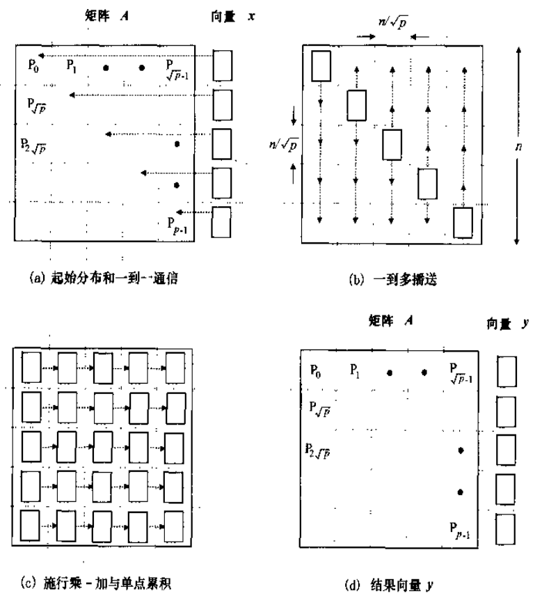

# 静态互联网络

- **节点度**: 射入或射出一个节点的边的数量, 在单向网络中, 节点度等于射入和射出的边的数量
- **网络直径**: 任意两个节点之间的最短路径的最大长度
- **对剖宽度**: 对分网络各半所必须移除的最少边数
- **对剖带宽**: 对分网络各半所必须移除的最少边数上的带宽
- 如果从任意节点观看网络都一样, 则称为**对称的**

## 一维线性阵列

- **线性阵列**: 一维线性阵列, 由$n$个节点组成, 每个节点都与其相邻的节点相连, 除了第一个和最后一个节点
- 节点度为$2$, 网络直径为$n-1$, 对剖宽度为$1$
- 可以首尾相连构成环形网络, 网络直径为$n/2$, 对剖宽度为$2$

## 二维网孔

- **网孔**: 二维网孔, 由$n^2$个节点组成, 每个节点都与其上下左右的节点相连, 节点度为$4$, 网络直径为$2(n-1)$, 对剖宽度为$n$
- **Illiac 网孔**: 垂直方向上带环绕, 水平方向呈蛇状, 节点度为$4$, 网络直径为$n-1$, 对剖宽度为$2n$
- **2-D 环绕**: 垂直和水平方向都带环绕, 节点度为$4$, 网络直径为$n$, 对剖宽度为$2n$


## 树

- **树**: 无环的连通图, 任意两个节点之间只有一条路径, 节点度为$3$, 网络直径为$2(\log_2 n - 1)$, 对剖宽度为$1$
- **胖树**: 靠近根部的地方变粗


## 超立方

- **超立方**: 由$2^n$个节点组成, 每个节点连出$n$条边, 节点度为$n$, 网络直径为$n$, 对剖宽度为$2^{n-1}$
- 将顶点替换为环, 可以得到**立方环**


# 并行算法

# 稠密矩阵

## 划分

### 带状

将矩阵**整行或整列**的划分为若干个组, 行和列可以是连续的, 也可以是等间距的, 前者称为**块带状划分**, 后者称为**循环带状划分**


### 棋盘

将方阵划分为若干个**子方阵**, 与带状划分类似, 子方阵可以是连续的, 也可以是等间距的, 前者称为**块棋盘划分**, 后者称为**循环棋盘划分**


## 转置

单处理机上的转置算法

```
for i = 2 to n
    for j = 1 to i - 1
        swap(A[i, j], A[j, i])
```

### 棋盘划分的转置

#### 网孔

设处理器个数为$p$, 矩阵边长为$n$

- 情形一: $p=n^2$
  1. 每个处理器负责一个块, 交换自己负责的元素
  2. 每个块移动到目标位置
- 情形二: $p<n^2$
  1. 将矩阵划分为$p$个块
  2. 同情形一
  3. 重复前两步, 直到所有块都移动到目标位置

#### 递归

将一个矩阵划分四个子矩阵, 移动子矩阵到目标位置, 递归处理子矩阵

#### 超立方

直接映射为递归算法


### 带状划分的转置

通讯比较复杂, 不再赘述

## 矩阵向量乘法

单处理机上的矩阵向量乘法算法

```
for i = 1 to n
    y[i] = 0
    for j = 1 to n
        y[i] += A[i, j] * x[j]
```

### 带状划分的矩阵向量乘法

仅讨论**行带状划分**, 开始时, 处理器$P_i$存储$x_i$和$a_{ij}, j \in [1, n]$, 负责计算$y_i$, 后各个处理器将其余向量元素多到多播送, 然后进行相乘得到结果


### 棋盘划分的矩阵向量乘法

仅讨论**块棋盘划分**, 开始时, 处理器$P_{ij}$存储$a_{ij}$, 处理器$P_{ii}$存储$x_i$, 然后每个$P_{ii}$将$x_i$多播送给同一列的其他处理器, 每个行方向进行计算, 最后一列的处理器收集最终结果



## 矩阵乘法

### 简单并行分块乘法

将矩阵划分为若干个子矩阵, 每个处理器负责一个子矩阵, 然后进行计算, 最后收集结果

问题: 通讯量大

### Cannon 算法

分块: 将矩阵$A,B,C$划分为$p$个子矩阵, 处理器$P_{ij}$存储$A_{ij}, B_{ij}, C_{ij}$


算法:

- $P_{ij}$将$A_{ij}$向左循环移动$i$个单位, $B_{ij}$向上循环移动$j$个单位
  
- $P_{ij}$计算$C_{ij} += A_{ij} \times B_{ij}$
- $A$和$B$向左和向上移动一个单位, 重复上述步骤$n-1$次
  
