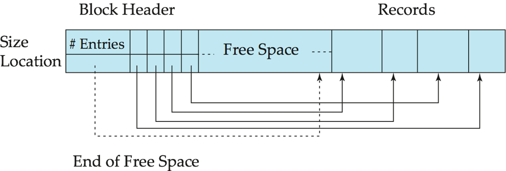
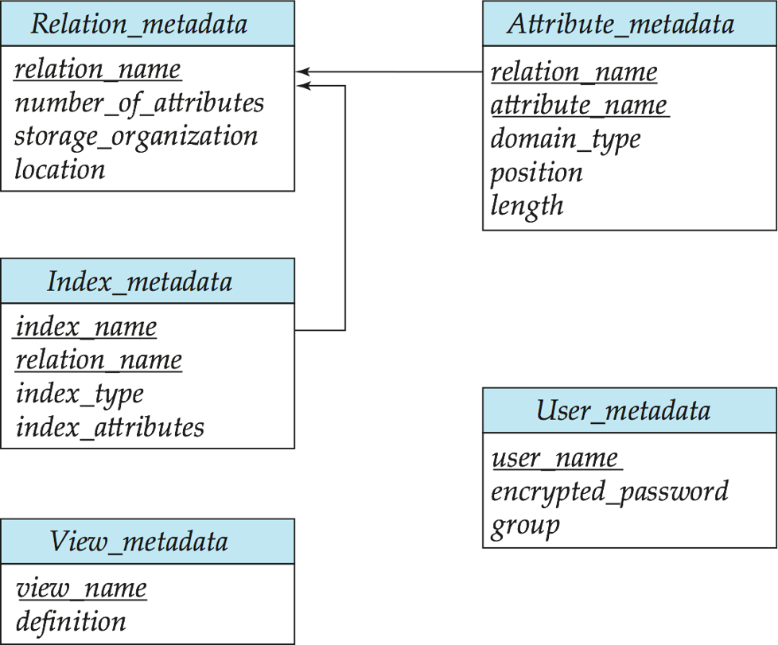

# 存储和文件结构

## 数据库文件组织

一个数据库映射到多个不同的文件，这些文件由底层的操作系统来维护，存储在磁盘上，一个文件在逻辑上组织成为记录的一个序列

每个文件分成定长的存储单元，称为**块**

- 块是存储分配和数据传输的基本单元。大多数数据库默认**4~8KB 块大小**
- 一个块可能包括**多条记录**
- 每条记录包含在**单个块**中

## 空闲列表

在文件的开始处，分配一定数量的字节作为**文件头**，**文件头**包含有关文件的各种信息。

在文件头中存储**被删除的第一个记录的地址**，用这第一个记录来存储**第二个可用记录的地址**，依次类推。把这些存储的地址看做指针，因为它们指向一个记录的位置，被删除的记录形成一条链表，称为**空闲列表**

**插入**一条新记录的操作：

- 使用文件头所指向的记录，并改变文件头的指针以指向下一个可用记录。
- 如果没有可用空间，新记录添加到文件末尾

## 变长记录

一条有变长度属性的记录表示通常具有两个部分：初始部分是定长属性，接下来是变长属性。

### 变长属性

- 在记录的初始部分有若干个元组：（**偏移量，长度**），其中偏移量表示在记录中该属性的数据**开始位置**，长度表示变长属性的**字节长度**
- **空位图**，用于表示记录中的哪些属性是**空的**，哪些属性是**非空的**。
- **数据**本体

### 分槽的页结构

每个块的**块头**包含以下结构：

- **记录数**，块中记录的数量
- 指向块中**空闲空间**末尾的指针
- 包含每个记录的位置（指针）和大小的**数组**

**插入**记录：

- 在**空闲空间尾部**给插入的记录分配空间
- 将包含这条记录**大小和位置**的条目添加到块头中。

删除记录：

- 记录所占用的**空间被释放**
- 条目被设置成被**删除状态**
- 被删除记录之前的记录被移动，使得由删除产生的空闲空间被重用，并且所有空闲空间存在于块头数组的最后一个条目和第一个记录之间

## 文件中记录的组织

在文件中组织记录的几种可能的方法

- **堆**：一条记录可以放在文件中的任何地方，只要那个地方有空间存放这条记录，记录没有顺序
- **顺序**：记录根据**搜索码的顺序**存储
- **散列**：在每条记录的某些属性上计算一个**散列函数**，**散列函数**的结果确定了记录应放在文件的哪个块中
- **多表聚簇文件组织**：**不同关系的记录存储在同一个文件中**，不同关系的相关记录存储在同一块中，一个 I/O 操作可以从所有的关系中取到相关的记录

### 顺序文件组织

指定一个**搜索码**，即一个属性或者属性的集合，没有必要是主码、超码，记录按照搜索码的顺序存储在文件中。

**指针链管理**：通过指针把记录链接起来，指向搜索码下一条记录

**插入**记录：

- 通过搜索码找到**待插入记录之前**的那一条记录
- 如果后面有**空余的空间**，就把待插入记录插入到这个空间中
- 否则，把待插入记录插入到文件末尾作为**溢出块**
- 无论哪种情况，都要把**指针链**更新

一段时间后，文件中会有很多溢出块，这时需要**重组**文件

### 多表聚簇文件组织

为高效执行涉及**自然连接**的查询而设计，其他类型查询处理变慢

为了区别，可以用指针把某个特定关系的所有记录链接起来

## 数据字典存储

数据字典是数据库的**元数据**，包含有关数据库中所有关系的信息，包括关系的**模式**和**存储**信息，以及关系之间的**联系**信息。

# 查询处理

从数据库中提取数据时涉及的一系列活动

- 将高层数据库语言表示的查询语句翻译为能在文件系统的物理层上使用的表达式
- 为优化查询而进行各种转换
- 查询的实际执行

关系数据库管理系统查询处理阶段：

1. 查询分析
   1. 对查询语句进行扫描、词法分析和语法分析
   2. 词法分析：从查询语句中识别出正确的语言符号
   3. 语法分析：进行语法检查
1. 查询检查
   1. 合法权检查
   2. 视图转换
   3. 安全性检查
   4. 完整性初步检查
   5. 检查通过后把 SQL 查询语句转换成内部表示，即等价的**关系代数表达式**
1. 查询优化
   1. 选择一个高效执行的查询处理策略
1. 查询执行
   1. 依据优化器得到的执行策略生成查询执行计划

## 查询代价的度量

执行一个查询所耗费的时间

**磁盘上存取数据的代价**通常是最主要的代价，因为磁盘存取比内存操作速度慢，CPU 速度的提升比磁盘的速度提升快得多

- $t_T$: 磁盘子系统**传输一个块**平均消耗时间
- $t_S$: 磁盘**块平均访问时间**, 磁盘搜索时间加上旋转延迟

## 选择运算

### 全表扫描方法

对查询的基本表顺序扫描，逐一检查每个元组是否满足选择条件，把满足条件的元组作为结果输出

适合小表，不适合大表

### 索引扫描方法

适合于选择条件中的属性上有索引(例如 B+树索引或 Hash 索引)

通过索引先找到满足条件的元组主码或元组指针，再通过元组指针直接在查询的基本表中找到元组

# 查询优化

两个关系表达式$E_1$和$E_2$是**等价**的，可记为$E_1≡E_2$

常用的等价变换规则：

- 连接、笛卡尔积交换律
  - 设$E_1$和$E_2$是关系代数表达式，$F$是连接运算的条件，则有
  - $E_1×E_2≡E_2×E_1$
  - $E_1\bowtie E_2≡E_2\bowtie E_1$
  - $E_1\bowtie_F E_2≡E_2\bowtie_F E_1$
- 连接、笛卡尔积的结合律
  - 设$E_1,E_2,E_3$是关系代数表达式，$F_1$和$F_2$是连接运算的条件
  - $(E_1×E_2) × E_3≡E_1 × (E_2 × E_3)$
  - $(E_1\bowtie E_2) \bowtie E_3≡E_1 \bowtie (E_2 \bowtie E_3)$
  - $(E_1\bowtie_{F_1} E_2) \bowtie_{F_2} E_3≡E_1 \bowtie_{F_1} (E_2 \bowtie_{F_2} E_3)$
- 投影的串接定律
  - $\pi_{A_1,A_2,...,A_n}(\pi_{B_1,B_2,...,B_m}(E))≡\pi_{A_1,A_2,...,A_n}(E)$
  - $E$是关系代数表达式
  - $A_i(i=1,2,...,n),B_j(j=1,2,...,m)$是属性名
  - $\{A_1,A_2,...,A_n\}$构成$\{B_1,B_2,...,B_m\}$的子集
- 选择的串接定律
  - $\sigma_{F_1}(\sigma_{F_2}(E))≡\sigma_{F_1\wedge F_2}(E)$
  - $E$是关系代数表达式，$F_1,F_2$是选择条件
  - 选择的串接律说明选择条件可以合并, 这样一次就可检查全部条件
- 选择与投影操作的交换律
  - $\sigma_F(\pi_{A_1,A_2,...,A_n}(E))≡\pi_{A_1,A_2,...,A_n}(\sigma_F(E))$
  - 选择条件$F$只涉及属性$A_1,A_2,...,A_n$
  - 若$F$中有不属于$A_1,A_2,...,A_n$的属性$B_1,B_2,...,B_m$有更一般规则：
  - $\pi_{A_1,A_2,...,A_n}(\sigma_F(E))≡\pi_{A_1,A_2,...,A_n}(\sigma_F(\pi_{A_1,A_2,...,A_n,B_1,B_2,...,B_m}(E)))$
- 选择与笛卡尔积的交换律
  - 如果$F$中涉及的属性都是$E_1$中的属性，则$σ_F(E_1×E_2)≡σ_F(E_1)×E_2$
  - 如果$F=F_1∧F_2$，并且$F_1$只涉及$E_1$中的属性，$F_2$只涉及$E_2$中的属性，则由上面的等价变换规则 1，4，6 可推出：$σ_F(E_1×E_2)≡\sigma_{F_1}(E_1)×\sigma_{F_2}(E_2)$
  - 若$F_1$只涉及$E_1$中的属性，$F_2$涉及$E_1$和$E_2$两者的属性，则仍有$σ_F(E_1×E_2)≡\sigma_{F_2}(\sigma_{F_1}(E_1)×E_2)$, 它使部分选择在笛卡尔积前先做
- 选择与并的分配律
  - 设$E=E_1∪E_2,E_1,E_2$有相同的属性名，则$σ_F(E_1∪E_2)≡σ_F(E_1)∪σ_F(E_2)$
- 选择与差运算的分配律
  - 若$E_1$与$E_2$有相同的属性名，则$σ_F(E_1-E_2)≡σ_F(E_1)-σ_F(E_2)$
- 选择对自然连接的分配律
  - $σ_F(E_1\bowtie E_2)≡σ_F(E_1)\bowtie σ_F(E_2)$
  - $F$只涉及$E_1$与$E_2$的公共属性
- 投影与笛卡尔积的分配律
  - 设$E_1$和$E_2$是两个关系表达式，$A_1,A_2,...,A_n$是$E_1$的属性，$B_1,B_2,...,B_m$是$E_2$的属性，则$\pi_{A_1,A_2,...,A_n,B_1,B_2,...,B_m}(E_1\times E_2)≡\pi_{A_1,A_2,...,A_n}(E_1)\times \pi_{B_1,B_2,...,B_m}(E_2)$
- 投影与并的分配律
  - 设$E_1$和$E_2$有相同的属性名，则$\pi_{A_1,A_2,...,A_n}(E_1\cup E_2)≡\pi_{A_1,A_2,...,A_n}(E_1)\cup\pi_{A_1,A_2,...,A_n}(E_2)$
