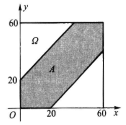
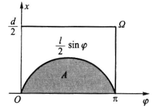

# Chapter 1 随机事件与概率

## 1.1 随机事件

### 样本空间

事件所有可能的结果组成的集合称为**样本空间**, 记为$\Omega=\{\omega\}$, 其中$\omega$称为样本点

### 随机事件

样本空间的子集称为**随机事件**, 记为$A\subseteq\Omega$

事件$A$发生了, 即为

- $A$中的某个样本点$\omega$发生了
- 测试结果$\omega\in A$

一些特殊事件:

- 样本空间中的单个样本点$\omega$称为**基本事件**
- 样本空间$\Omega$称为**必然事件**
- 空集$\varnothing$称为**不可能事件**

### 随机变量

随机变量是**样本空间**到**实数集**的**映射**, 即$X:\Omega\rightarrow\mathbb{R}$

### 事件间的关系

- 包含关系: $A\subseteq B$
- 相等关系: $A=B\Leftrightarrow A\subseteq B \wedge B\subseteq A$
- 互不相容: $A\cap B=\varnothing$

### 事件间的运算

- 并: $A\cup B=\{\omega\in\Omega|\omega\in A\vee\omega\in B\}$, 即$A,B$至少一个发生
- 交: $A\cap B=\{\omega\in\Omega|\omega\in A\wedge\omega\in B\}$, 即$A,B$同时发生, 也记为$AB$
  - $A,B$互不相容时, $AB=\varnothing$
- 差: $A-B=\{\omega\in\Omega|\omega\in A\wedge\omega\notin B\}$, 即$A$发生而$B$不发生
- 对立: $\overline{A}=\{\omega\in\Omega|\omega\notin A\}$, 即$A$不发生
  - $\overline{\overline{A}}=A$
  - $A-B=A\overline{B}$
- 事件间运算的性质同集合间运算的性质

### 事件域

样本空间$\Omega$的某些子集及其运算结果构成的集合称为**事件域**, 记为$\mathscr{F}$

如果集合$\mathscr{F}$满足:

- $\Omega\in\mathscr{F}$
- $A\in\mathscr{F}\Rightarrow\overline{A}\in\mathscr{F}$
- $A_n\in\mathscr{F},n=1,2,\cdots\Rightarrow\bigcup_{n=1}^\infty A_n\in\mathscr{F}$

则称$\mathscr{F}$为一个**事件域**, 又称为$\sigma$域或$\sigma$代数, 称$(\Omega,\mathscr{F})$为一个**可测空间**

#### 常见的事件域

- $\Omega=\{\omega_1,\omega_2\}$的事件域: $\mathscr{F}=\{\varnothing,\{\omega_1\},\{\omega_2\},\Omega\}$
- 有限集$\Omega=\{\omega_1,\omega_2,\cdots,\omega_n\}$的事件域: $\mathscr{F}=\{A|A\subseteq\Omega\}$
- 可列集$\Omega=\{\omega_1,\omega_2,\cdots\}$的事件域$\mathscr{F}$仍为可列集
- Borel 事件域: $\Omega=\mathbb{R},\mathscr{P}=\{(-\infty,x)|x\in\mathbb{R}\}$
  - 事件域$\mathscr{F}$为包含$\mathscr{P}$的最小事件域, 即$\mathscr{F}$由$\mathscr{P}$中的元素及其运算结果生成, 生成过程如下
  - 引入左闭右开区间: $\overline{(-\infty,x)}=[x,+\infty)\in\mathscr{F}$
  - 通过交运算得到$[a,b)\in\mathscr{F}$
  - 引入闭区间: $[a,b]=\bigcap_{n=1}^\infty[a,b+\frac{1}{n})\in\mathscr{F}$
  - 引入单点集: $\{b\}=[a,b]-[a,b)\in\mathscr{F}$

### 样本空间的分割

设$D_1,D_2,\cdots,D_n$是样本空间$\Omega$的一组事件, 且满足:

- $D_i\cap D_j=\varnothing,i\neq j$
- $\bigcup_{i=1}^nD_i=\Omega$

则称$D_1,D_2,\cdots,D_n$是样本空间$\Omega$的一个**分割**, $D_i$也可以有可列个

## 1.2 概率

### 概率的定义

设$(\Omega,\mathscr{F})$是一个可测空间, 如果函数$P:\mathscr{F}\rightarrow\mathbb{R}$满足:

- **非负性**: $P(A)\geq 0$
- **正则性**: $P(\Omega)=1$
- **可列可加性**: $A_1,A_2,\cdots\in\mathscr{F},A_i\cap A_j=\varnothing,i\neq j\Rightarrow P(\bigcup_{i=1}^\infty A_i)=\sum_{i=1}^\infty P(A_i)$

则称$P(A)$为事件$A$的**概率**, 称$(\Omega,\mathscr{F},P)$为**概率空间**

### 频率方法

$n$次重复实验中, 记$n(A)$为事件$A$的**频数**, 称:

$$
f_n(A)=\frac{n(A)}{n}
$$

为事件$A$出现的**频率**, 随着$n$越大, $f_n(A)$接近某个稳定值, 称为事件$A$的**频率稳定值**, 称为概率

### 古典概型

古典概型思想如下:

- 试验的样本空间是**有限集**, 设为$\Omega=\{\omega_1,\omega_2,\cdots,\omega_n\}$
- 每个样本点发生的**可能性相同**
- 若事件$A$包含$m$个样本点, 则
  $$P(A)=\frac{m}{n}$$

#### 抽样模型

设有$N$件产品, 其中$M$件不合格品, 从中不放回地抽取$n$件, 记$A_m$为抽取的$n$件产品中有$m$件不合格品, 则

$$
P(A_m)=\frac{C_M^mC_{N-M}^{n-m}}{C_N^n}
$$

#### 放回抽样

设有$N$件产品, 其中$M$件不合格品, 从中放回地抽取$n$件, 记$A_m$为抽取的$n$件产品中有$m$件不合格品, 则

$$
P(A_m)=C_n^m(\frac{M}{N})^m(1-\frac{M}{N})^{n-m}
$$

#### 盒子模型

设有$n$个球, 每个球等可能地落入$N$个盒子中的一个, 每个盒子所放球数不限, 则

- 指定的$n$个盒子中每个盒子各有一球的概率$p_1=\frac{n!}{N^n}$
- 恰好有$n$个盒子中每个盒子各有一球的概率$p_2=\frac{C_N^nn!}{N^n}$

#### 摸球问题

设有$a$个红球, $b$个黑球, 依次等可能地从中摸球, 则第$k$次摸到红球的概率$P_k$为

$$
P_k=\frac{a}{a+b}
$$

### 几何概型

样本空间$\Omega$是一个**几何空间**, 其大小由**几何度量**$S_\Omega$给出, 事件$A$是$\Omega$的一个**几何子集**, 其大小由**几何度量**$S_A$给出, 则事件$A$的概率为

$$
P(A)=\frac{S_A}{S_\Omega}
$$

这个概率称为**几何概率**

#### 会面问题

甲乙两人约定在时间$0\thicksim 60$分钟之间会面, 两人都有可能在$0\thicksim 60$分钟之间的任意一个时间点等可能到达, 约定先到者等待另一人$20$分钟, 之后可以离去, 问两人会面的概率是多少?

- 样本空间: $\Omega=\{(x,y)|0\leq x,y\leq 60\}$, 可以建立几何集合如下图所示
- 事件$A=\{(x,y)||x-y|\leq 20\}$, 即两人会面的事件, 为下图阴影部分

阴影面积为$S_A=60^2-40^2$, 故概率为

$$
P(A)=\frac{S_A}{S_\Omega}=\frac{60^2-40^2}{60^2}=\frac{5}{9}
$$

#### 比丰投针问题

在一块地板上, 画有间距为$d$的平行线, 一根长度为$l(l<d)$的针随机地抛向地板, 问针与任意一条线相交的概率是多少?

- 用两个量来描述针的位置: $x\in [0,\frac{d}{2}]$为针中点到最近的一条线的距离, $\theta\in [0,\frac{\pi}{2}]$为针与水平方向的夹角
- 样本空间: $\Omega=\{(x,\theta)|0\leq x\leq \frac{d}{2},0\leq\theta\leq\frac{\pi}{2}\}$, 可以建立几何集合如下图所示
- 相交的等价条件: $x\leq\frac{l}{2}\sin\theta$
- 事件$A=\{(x,\theta)|x\leq\frac{l}{2}\sin\theta\}$, 即针与任意一条线相交的事件, 为下图阴影部分

阴影面积为$S_A=\int_0^{\pi}\frac{l}{2}\sin\theta\mathrm{d}\theta=l$, 故概率为

$$
P(A)=\frac{S_A}{S_\Omega}=\frac{l}{\frac{d}{2}\pi}=\frac{2l}{d\pi}
$$

## 1.3 概率的性质

- 对于不可能事件$\varnothing$有
  $$P(\varnothing)=0$$
- **有限可加性**: 若有限个事件$A_1,A_2,\cdots,A_n$互不相容, 则有
  $$P(\bigcup_{i=1}^n A_i)=\sum_{i=1}^n P(A_i)$$
- 对任一事件$A$, 有
  $$P(\overline{A})=1-P(A)$$
- **单调性**: 若$B\subset A$, 则
  $$P(A-B)=P(A)-P(B)$$
  - 推论: 若$A\subset B$, 则
    $$P(A)\leq P(B)$$
- 任意两个事件$A,B$有
  $$P(A-B)=P(A)-P(AB)$$
- **加法公式**: 对于任意事件$A,B$, 有
  $$P(A\cup B)=P(A)+P(B)-P(AB)$$
  - 对于任意$n$个事件$A_1,A_2,\cdots,A_n$, 有
    $$
    \begin{aligned}
      P(\bigcup_{i=1}^n A_i)=&\sum_{i=1}^n P(A_i)-\sum_{1\leq i<j\leq n}P(A_iA_j)\\
      &+\sum_{1\leq i<j<k\leq n}P(A_iA_jA_k)\\
      &+\cdots\\
      &+(-1)^{n-1}P(A_1A_2\cdots A_n)
    \end{aligned}
    $$
  - 推论: **半可加性**
    $$
    P(\bigcup_{i=1}^n A_i)\leq\sum_{i=1}^n P(A_i)
    $$

### 概率的连续性

#### 极限事件

对于$\mathscr{F}$中任一单调不减的事件序列$F_1\subset F_2\subset\cdots\subset F_n\subset\cdots$, 称可列并$\bigcup_{i=1}^\infty F_i$为事件序列$\{F_n\}$的**极限事件**, 记为
$$ \lim*{n\rightarrow\infty}F_n=\bigcup*{i=1}^\infty F_i $$

对于$\mathscr{F}$中任一单调不增的事件序列$F_1\supset F_2\supset\cdots\supset F_n\supset\cdots$, 称可列交$\bigcap_{i=1}^\infty F_i$为事件序列$\{F_n\}$的**极限事件**, 记为
$$ \lim*{n\rightarrow\infty}F_n=\bigcap*{i=1}^\infty F_i $$

性质:

- 对于单调不减的事件序列$\{F_n\}$, 有$F_n=\bigcup_{i=1}^n F_i=\bigcup_{i=1}^n(F_i-F_{i-1})$
- 对于单调不减的事件序列$\{F_n\}$, 有$F_n=\bigcup_{i=1}^\infty F_i=\bigcup_{i=1}^\infty(F_i-F_{i-1})$

#### 连续性

对于$\mathscr{F}$上的一个概率$P$

- 如果对于$\mathscr{F}$中任一单调不减的事件序列$\{F_n\}$, 有
  $$
  P(\lim_{n\rightarrow\infty}F_n)=\lim_{n\rightarrow\infty}P(F_n)
  $$
  则称$P$是**下连续**的
- 如果对于$\mathscr{F}$中任一单调不增的事件序列$\{F_n\}$, 有
  $$
  P(\lim_{n\rightarrow\infty}F_n)=\lim_{n\rightarrow\infty}P(F_n)
  $$
  则称$P$是**上连续**的
- 若$P$是事件域$\mathscr{F}$上的概率, 则$P$是**连续**的, 即$P$既是下连续的, 又是上连续的
- 若$P$是事件域$\mathscr{F}$上满足$P(\Omega)=1$的非负集合**函数**, 则它具有可列可加性的充要条件是:
  - $P$是有限可加的
  - $P$是下连续的

## 1.4 条件概率

$A,B$是样本空间$\Omega$上的两个事件, 且$P(B)>0$, 称

$$
P(A|B)=\frac{P(AB)}{P(B)}
$$

为在事件$B$发生的条件下事件$A$发生的**条件概率**

条件概率是概率, 若设$P(B)>0$, 则

- $P(A|B)\geq 0, A\in\mathscr{F}$
- $P(\Omega|B)=1$
- 若$A_1,A_2,\cdots\in\mathscr{F}$互不相容, 则
  $$
  P(\bigcup_{i=1}^\infty A_i|B)=\sum_{i=1}^\infty P(A_i|B)
  $$

### 乘法公式

- 若$P(B)>0$, 则
  $$
  P(AB)=P(A|B)P(B)
  $$
- 若$P(A_1A_2\cdots A_n)>0$, 则
  $$
  P(A_1A_2\cdots A_n)=P(A_1)P(A_2|A_1)P(A_3|A_1A_2)\cdots P(A_n|A_1A_2\cdots A_{n-1})
  $$

### 罐子模型

设罐中有$b$个黑球, $r$个红球, 每次随机取一个球, 取出后将原球放回, 再加入$c$个与原球同色的球和$d$个与原球异色的球, 记$B_i$为事件: 第$i$次取出的球是黑球, $R_j$为事件: 第$j$次取出的球是红球, 若连续取 3 个球, 其中 2 个为红球, 1 个为黑球, 则:

$$
\begin{aligned}
  P(B_1R_2R_3)=&P(B_1)P(R_2|B_1)P(R_3|B_1R_2)\\
  =&\frac{b}{b+r}\cdot\frac{r+d}{b+r+c+d}\cdot\frac{r+c+d}{b+r+2c+2d}
\end{aligned}
$$

$$
\begin{aligned}
  P(R_1B_2R_3)=&P(R_1)P(B_2|R_1)P(R_3|R_1B_2)\\
  =&\frac{r}{b+r}\cdot\frac{b+d}{b+r+c+d}\cdot\frac{r+c+d}{b+r+2c+2d}
\end{aligned}
$$

$$
\begin{aligned}
  P(R_1R_2B_3)=&P(R_1)P(R_2|R_1)P(B_3|R_1R_2)\\
  =&\frac{r}{b+r}\cdot\frac{r+c}{b+r+c+d}\cdot\frac{b+2d}{b+r+2c+2d}
\end{aligned}
$$

- 当$c=-1,d=0$时, 即为**不返回抽样**, 只要红球和黑球个数确定, 则概率不依赖抽出球的次序, 此例中有
  $$
  P(B_1R_2R_3)=P(R_1B_2R_3)=P(R_1R_2B_3)=\frac{br(r-1)}{(b+r)(b+r-1)(b+r-2)}
  $$
- 当$c=0,d=0$时, 即为**返回抽样**, 前次抽取结果不影响后次抽取结果, 此例中有
  $$
  P(B_1R_2R_3)=P(R_1B_2R_3)=P(R_1R_2B_3)=\frac{br^2}{(b+r)^3}
  $$
- 当$c>0,d=0$时, 称为**传染病模型**, 每次取出球会增加下次抽取到同色球的概率, 此例中有
  $$
  P(B_1R_2R_3)=\frac{br(r+c)}{(b+r)(b+r+c)(b+r+2c)}
  $$
- 当$c=0,d>0$时, 称为**安全模型**, 每次取出球会减少下次抽取到同色球的概率

### 全概率公式

设$B_1,B_2,\cdots,B_n$是样本空间$\Omega$的一个分割, 且$\bigcup_{i=1}^n B_i=\Omega$, 如果$P(B_i)>0,i=1,2,\cdots,n$, 则对于任一事件$A$, 有

$$
P(A)=\sum_{i=1}^n P(A|B_i)P(B_i)
$$

- 当$n=2$时, 有
  $$
  P(A)=P(A|B)P(B)+P(A|\overline{B})P(\overline{B})
  $$
- 条件: $B_1,B_2,\cdots,B_n$是样本空间$\Omega$的一个分割, 可以改为$B_1,B_2,\cdots,B_n$互不相容, 且$A\subset\bigcup_{i=1}^n B_i$, 此时全概率公式仍然成立
- 对于可列个事件$B_1,B_2,\cdots,B_n,\cdots$, 仍然成立

### 贝叶斯公式

设$B_1,B_2,\cdots,B_n$是样本空间$\Omega$的一个分割, 且$\bigcup_{i=1}^n B_i=\Omega$, 如果$P(A)>0,P(B_i)>0,i=1,2,\cdots,n$, 则

$$
P(B_i|A)=\frac{P(A|B_i)P(B_i)}{\sum_{j=1}^n P(A|B_j)P(B_j)}
$$

- 当$n=2$时, 有
  $$
  P(B|A)=\frac{P(A|B)P(B)}{P(A|B)P(B)+P(A|\overline{B})P(\overline{B})}
  $$

## 1.5 独立性

如果事件$A,B$满足

$$
P(AB)=P(A)P(B)
$$

则称事件$A,B$是**相互独立**的, 简称为**独立**的

- 如果事件$A,B$是独立的, 则事件$A,\overline{B}$也是独立的, 事件$\overline{A},B$也是独立的, 事件$\overline{A},\overline{B}$也是独立的

### 多个事件独立性

设$A,B,C$是三个事件, 如果有

$$
\begin{cases}
  P(AB)=&P(A)P(B)\\
  P(AC)=&P(A)P(C)\\
  P(BC)=&P(B)P(C)\\
\end{cases}
$$

则称事件$A,B,C$是**两两独立**的, 如果进一步有

$$
P(ABC)=P(A)P(B)P(C)
$$

则称事件$A,B,C$是**互相独立**的(注: 两两独立不一定互相独立)

如果事件$A_1,A_2,\cdots,A_n$满足

$$
P(A_{i_1}A_{i_2}\cdots A_{i_k})=P(A_{i_1})P(A_{i_2})\cdots P(A_{i_k})
$$

其中$1\leq i_1<i_2<\cdots<i_k\leq n,1\le k\le n$, 则称事件$A_1,A_2,\cdots,A_n$是**相互独立**的, 简称为**独立**的

- 如果事件$A_1,A_2,\cdots,A_n$是独立的, 则事件$A_1,A_2,\cdots,A_n$的**任意子集**也是独立的
- 如果事件$A_1,A_2,\cdots,A_n$是独立的, 则将其中任意一个事件用其**对立事件**替换, 所得到的事件组仍然是独立的

### 试验的独立性

设有两个试验$E_1,E_2$, 如果试验$E_1$的每个结果与试验$E_2$的每个结果都是相互独立的事件, 则称试验$E_1,E_2$是**相互独立**的

设有$n$个试验$E_1,E_2,\cdots,E_n$, 如果试验$E_1,E_2,\cdots,E_n$的每个结果都是相互独立的事件, 则称其为$n$次**独立重复试验**

$n$次独立重复试验中, 若每次试验的可能结果为$A$或$\overline{A}$, 则称为$n$次**伯努利试验**
