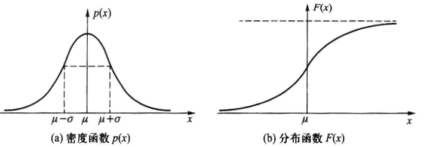
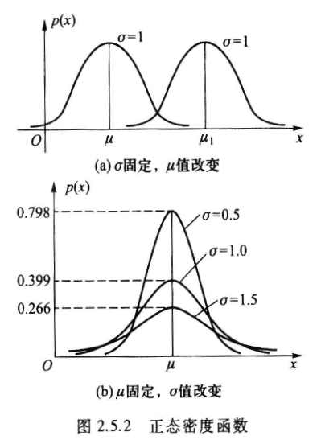
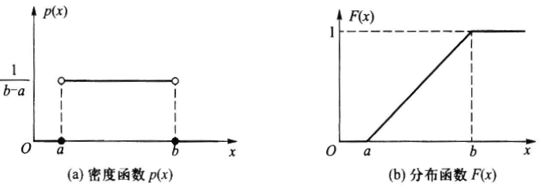

# Chapter 2 随机变量

定义在样本空间$\Omega$上的实值函数$X=X(\omega)$称为**随机变量**, 如果随机变量是有限个或可列个样本点的函数, 则称为**离散型随机变量**

## 随机变量分布函数

设$X$是一个随机变量, 对于任意实数$x$, 称函数

$$
F(x)=P(X\leq x)
$$

为随机变量$X$的**分布函数**, 称$X$服从分布函数$F(x)$, 记为$X\sim F(x)$

- $F(x)$定义域是$(-\infty,+\infty)$
- $P(a<X\leq b)=F(b)-F(a)$

### 分布函数的性质

- **单调不减**: $x_1<x_2\Rightarrow F(x_1)\leq F(x_2)$
- **有界性**: $F(+\infty)\triangleq\lim_{x\rightarrow+\infty}F(x)=1,F(-\infty)\triangleq\lim_{x\rightarrow-\infty}F(x)=0$
- **右连续性**: $\lim_{x\rightarrow x_0^+}F(x)=F(x_0)$

注:

- 若$F(x)\triangleq P(X<x)$, 则$F(x)$是左连续的
- 满足上述三个性质的函数都是分布函数
- $P(X<a)=P(\bigcup_{n=1}^\infty(X<a-\frac{1}{n}))=F(a-)$
- $P(X=a)=F(a)-F(a-)$
- 若$F(x)$连续, 则$F(x+)=F(x-)=F(x)$, 即$P(X=a)=0$

### 柯西分布函数

$$
F(x)=\frac{1}{\pi}\arctan x+\frac{1}{2}
$$

## 离散随机变量的概率分布列

设$X$是一个离散型随机变量, 如果$X$的所有可能取值为$x_1,x_2,\cdots,x_n,\cdots$, 记$X$取值为$x_i$的概率为$p_i$, 称

$$
\begin{array}{c|ccccc}
  X&x_1&x_2&\cdots&x_n&\cdots\\
  \hline
  P&p_1&p_2&\cdots&p_n&\cdots
\end{array}
$$

为$X$的**概率分布列**, 简称为**分布列**, 记为$X\sim \{p_i\}$

### 分布列的基本性质

- **非负性**: $p_i\geq 0,i=1,2,\cdots$
- **正则性**: $\sum_{i=1}^\infty p_i=1$

## 连续随机变量的概率密度函数

设$X$是一个随机变量, 分布函数为$F(x)$, 如果存在非负可积函数$p(x)$, 使得对于任意实数$x$有

$$
F(x)=\int_{-\infty}^xp(t)\mathrm{d}t
$$

则称$p(x)$为$X$的**概率密度函数**, 简称为**密度函数**, 同时称$X$为**连续型随机变量**, 称$F(x)$为$X$的**连续分布函数**

- $F(x)$在$(-\infty,+\infty)$上连续
- 若$p(x)$连续, 则$F(x)$可导, 且$F'(x)=p(x)$
- $\forall a\in\mathbb{R},P(X=a)=F(a)-F(a-)=0$
- $P(a<X\leq b)=P(a\leq X<b)=P(a\leq X\leq b)=P(a<X<b)=F(b)-F(a)=\int_a^bp(x)\mathrm{d}x$
- $P(x\in I)=\int_Ip(x)\mathrm{d}x$
- 改变$p(x)$在有限个点上的值不影响$F(x)$, 但会影响$P(X=a)$的值

柯西分布的密度函数为

$$
p(x)=\frac{1}{\pi}\frac{1}{1+x^2}
$$

### 密度函数的性质

- **非负性**: $p(x)\geq 0$
- **正则性**: $\int_{-\infty}^{+\infty}p(x)\mathrm{d}x=1$

## 随机变量的数学期望

### 离散型随机变量的数学期望

设$X$是一个随机变量, 其分布列为

$$
\begin{array}{c|ccccc}
  X&x_1&x_2&\cdots&x_n&\cdots\\
  \hline
  P&p_1&p_2&\cdots&p_n&\cdots
\end{array}
$$

如果

$$
\sum_{i=1}^\infty|x_ip_i|<+\infty
$$

则称

$$
E(X)=\sum_{i=1}^\infty x_ip_i
$$

为$X$的**数学期望**, 简称为**期望**, 如果级数发散, 则称$X$的数学期望不存在

### 连续型随机变量的数学期望

设$X$是一个随机变量, 其密度函数为$p(x)$, 如果

$$
\int_{-\infty}^{+\infty}|xp(x)|\mathrm{d}x<+\infty
$$

则称

$$
E(X)=\int_{-\infty}^{+\infty}xp(x)\mathrm{d}x
$$

为$X$的**数学期望**, 简称为**期望**, 如果积分发散, 则称$X$的数学期望不存在

### 验血问题

在一个人数为$N$的人群中检验某种疾病, 为此要抽验$N$个人的血, 为了减少工作量, 按每$k$个人进行分组, 每组的人血样混合在一起, 用一次试验检验, 如果检验结果为阳性, 则说明这$k$个人中至少有一个人患病, 如果检验结果为阴性, 则说明这$k$个人都没有患病, 设疾病发病率为$p$, 问$k$满足什么样的条件可以减少平均检验次数?

令$X$为人群中每个人需要的验血次数, $X$的分布列为:

$$
\begin{array}{c|cc}
  X&1/k         &1+1/k\\
  \hline
  P&(1-p)^k   &1-(1-p)^k
\end{array}
$$

所以每个人平均需要的验血次数为:

$$
E(X)=\frac{1}{k}(1-p)^k+\frac{1}{1+1/k}(1-(1-p)^k)=1-(1-p)^k+\frac{1}{k}
$$

只要求得$E(X)$关于$k$的最小值即可

### 期望的性质

- 设随机变量$X$的分布列用$p(x_i)$表示, 则关于$X$的函数$Y=g(X)$的数学期望为
  $$
  E(Y)=\sum_{i=1}^\infty g(x_i)p(x_i)
  $$
- 设随机变量$X$的密度函数用$p(x)$表示, 则关于$X$的函数$Y=g(X)$的数学期望为
  $$
  E(Y)=\int_{-\infty}^{+\infty}g(x)p(x)\mathrm{d}x
  $$
- 若$c$是常数, 则$E(c)=c$
- 若$X$是随机变量, $c$是常数, 则$E(cX)=cE(X)$
- 对任意两个函数$g(X),h(X)$, 有$E[g(X)\pm h(X)]=E[g(X)]\pm E[h(X)]$

## 随机变量的方差与标准差

若随机变量$X^2$的数学期望存在, 则称**偏差平方**$(X-E(X))^2$的数学期望为随机变量$X$的**方差**, 记为:

$$
\begin{align*}
Var(X)&=E[(X-E(X))]^2\\
      &=\begin{cases}
        \sum_{i=1}^\infty(x_i-E(X))^2p(x_i)&\text{Discrete}\\
        \int_{-\infty}^{+\infty}(x-E(X))^2p(x)\mathrm{d}x&\text{Continuous}
      \end{cases}\\
\end{align*}
$$

方差的算术平方根称为随机变量的**标准差**, 记为$\sigma(X)$或$\sigma_X$

### 方差的性质

- $Var(X)=E(X^2)-[E(X)]^2$
- $Var(c)=0$
- $Var(aX+b)=a^2Var(X)$
- $\forall c\in\mathbb{R},Var(X)\leq E(X-c)^2$

### 切比雪夫不等式

设随机变量$X$的数学期望和方差都存在, 则对于任意正数$\varepsilon$, 有

$$
P(|X-E(X)|\geq\varepsilon)\leq\frac{Var(X)}{\varepsilon^2}
$$

或

$$
P(|X-E(X)|<\varepsilon)\geq 1-\frac{Var(X)}{\varepsilon^2}
$$

若随机变量$X$的方差存在, 则$Var(X)=0$的充要条件是$P(X=c)=1$, 其中$c$为常数

## 常见离散分布

### 二项分布

记$X$为$n$重伯努利试验中成功(记为事件$A$)的次数, 则$X$的可能取值为$0,1,\cdots,n$, 记$p$为每次试验成功的概率, 则

$$
P(X=k)=C_n^kp^k(1-p)^{n-k},k=0,1,\cdots,n
$$

这个分布称为**二项分布**, 记为$X\sim b(n,p)$

- $n=1$时的二项分布称为**两点分布**
- 若$X\sim b(n,p)$, 则$E(X)=np,Var(X)=np(1-p)$

### 泊松分布

泊松分布的概率分布列是:

$$
P(X=k)=\frac{\lambda^k}{k!}e^{-\lambda},k=0,1,\cdots
$$

其中$\lambda>0$是常数, 称为泊松分布的**参数**, 记为$X\sim P(\lambda)$

- 若$X\sim P(\lambda)$, 则$E(X)=\lambda,Var(X)=\lambda$

### 二项分布的泊松近似

在$n$重伯努利试验中, 记事件$A$在一次试验中发生的概率为$p_n$, 如果当$n\rightarrow\infty$时, 有$np_n\rightarrow\lambda$, 则

$$
\lim_{n\rightarrow\infty}C_n^kp_n^k(1-p_n)^{n-k}=\frac{\lambda^k}{k!}e^{-\lambda},k=0,1,\cdots
$$

### 超几何分布

设有$N$件产品, 其中$M$件不合格品, 从中不放回地抽取$n$件, 记$X$为抽取的不合格品的件数, 则随机变量$X$服从超几何分布, 记为$X\sim H(n,N,M)$, 其概率分布列为

$$
P(X=k)=\frac{C_M^kC_{N-M}^{n-k}}{C_N^n},k=0,1,\cdots,r
$$

其中$r=\min\{M,n\}$, $N,M,n$为正整数, 且$N\geq M,n$

- 若$X\sim H(n,N,M)$, 则$E(X)=\frac{nM}{N},Var(X)=\frac{nM(N-M)(N-n)}{N^2(N-1)}$

### 超几何分布的二项近似

在超几何分布中, 当$n\ll N$时, 可以用二项分布来近似超几何分布, 即

$$
\frac{C_M^kC_{N-M}^{n-k}}{C_N^n}\approx C_n^kp^k(1-p)^{n-k},k=0,1,\cdots,r
$$

其中$p=\frac{M}{N}$, $r=\min\{M,n\}$

### 几何分布

设$X$为一系列独立试验中第一次成功所需试验次数, 则$X$的概率分布列为

$$
P(X=k)=p(1-p)^{k-1},k=1,2,\cdots
$$

其中$0<p<1$, 称$X$服从**几何分布**, 记为$X\sim Ge(p)$

- 若$X\sim Ge(p)$, 则$E(X)=\frac{1}{p},Var(X)=\frac{1-p}{p^2}$
- **无记忆性**: $P(X>m+n|X>m)=P(X>n)$

### 负二项分布

设$X$为一系列独立试验中第$r$次成功所需试验次数, 则$X$的概率分布列为

$$
P(X=k)=C_{k-1}^{r-1}p^r(1-p)^{k-r},k=r,r+1,\cdots
$$

其中$0<p<1$, 称$X$服从**负二项分布**, 记为$X\sim Nb(r,p)$, 也称为**Pascal 分布**

- 若$X\sim Nb(r,p)$, 则$E(X)=\frac{r}{p},Var(X)=\frac{r(1-p)}{p^2}$
- 当$r=1$时, 负二项分布就是几何分布
- 负二项分布的随机变量可以分解成$r$个独立的几何分布的和

## 常见连续分布

### 正态分布

设随机变量$X$的密度函数为

$$
p(x)=\frac{1}{\sqrt{2\pi}\sigma}e^{-\frac{(x-\mu)^2}{2\sigma^2}},-\infty<x<+\infty
$$

其中$\mu,\sigma(\sigma>0)$为常数, 称$X$服从**正态分布**, 记为$X\sim N(\mu,\sigma^2)$

其概率密度函数如下图, 图线关于$x=\mu$对称, $\mu\pm\sigma$处有拐点

正态分布的分布函数$F(x)$为

$$
F(x)=\frac{1}{\sqrt{2\pi}\sigma}\int_{-\infty}^xe^{-\frac{(t-\mu)^2}{2\sigma^2}}\mathrm{d}t
$$

概率密度函数随$\sigma,\mu$的变化如下图所示

#### 标准正态分布

称$\mu=0,\sigma=1$的正态分布$N(0,1)$为**标准正态分布**, 通常记标准正态分布的随机变量为$U$, 其密度函数记为$\varphi(u)$, 分布函数记为$\Phi(u)$, 即

$$
\varphi(u)=\frac{1}{\sqrt{2\pi}}e^{-\frac{u^2}{2}},-\infty<u<+\infty
$$

$$
\Phi(u)=\frac{1}{\sqrt{2\pi}}\int_{-\infty}^ue^{-\frac{t^2}{2}}\mathrm{d}t
$$

对于$\Phi(u)$, 有

- $\Phi(-u)=1-\Phi(u)$
- $P(U>u)=1-\Phi(u)$
- $P(a<U<b)=\Phi(b)-\Phi(a)$
- $P(|U|<c)=2\Phi(c)-1$

#### 正态变量的标准化

全体正态分布的集合为

$$
\mathscr{P}=\{N(\mu,\sigma^2)|-\infty<\mu<+\infty,\sigma>0\}
$$

对于任意$X\in\mathscr{P}$, 有

$$
X\sim N(\mu,\sigma^2)\Leftrightarrow\frac{X-\mu}{\sigma}\sim N(0,1)
$$

若$X\sim N(\mu,\sigma^2)$, 则

- $E(X)=\mu,Var(X)=\sigma^2$
- $P(X\leq x)=\Phi(\frac{x-\mu}{\sigma})$
- $P(a<X\leq b)=\Phi(\frac{b-\mu}{\sigma})-\Phi(\frac{a-\mu}{\sigma})$

对于任意随机变量$X$, 如果$X$的期望和方差都存在, 则称

$$
X^*=\frac{X-E(X)}{\sqrt{Var(X)}}
$$

为$X$的**标准化变量**, 其中$E(X^*)=0,Var(X^*)=1$

#### 正态分布的 3$\sigma$原则

对于正态分布$X\sim N(\mu,\sigma^2)$, 有

- $P(|X-\mu|\leq\sigma)\approx 0.6826$
- $P(|X-\mu|\leq 2\sigma)\approx 0.9545$
- $P(|X-\mu|\leq 3\sigma)\approx 0.9973$

### 均匀分布

设随机变量$X$的密度函数为

$$
p(x)=\begin{cases}
  \frac{1}{b-a}&a<x<b\\
  0&\text{其他}
\end{cases}
$$

其中$a,b$为常数, 称$X$服从**均匀分布**, 记为$X\sim U(a,b)$, 其分布函数为

$$
F(x)=\begin{cases}
  0&x\leq a\\
  \frac{x-a}{b-a}&a<x<b\\
  1&x\geq b
\end{cases}
$$

密度函数和分布函数如下图所示

- 若$X\sim U(a,b)$, 则$E(X)=\frac{a+b}{2},Var(X)=\frac{(b-a)^2}{12}$

### 指数分布

设随机变量$X$的密度函数为

$$
p(x)=\begin{cases}
  \lambda e^{-\lambda x}&x>0\\
  0&x\leq 0
\end{cases}
$$

其中$\lambda>0$为常数, 称$X$服从**指数分布**, 记为$X\sim Exp(\lambda)$, 其分布函数为

$$
F(x)=\begin{cases}
  1-e^{-\lambda x}&x>0\\
  0&x\leq 0
\end{cases}
$$

- 若$X\sim Exp(\lambda)$, 则$E(X)=\frac{1}{\lambda},Var(X)=\frac{1}{\lambda^2}$
- **无记忆性**: $P(X>s+t|X>s)=P(X>t)$

### 伽马分布

称以下函数

$$
\Gamma(\alpha)=\int_0^{+\infty}x^{\alpha-1}e^{-x}\mathrm{d}x
$$

为**伽马函数**, 其中参数$\alpha>0$, 且

- $\Gamma(1)=1, \Gamma(\frac{1}{2})=\sqrt{\pi}$
- $\Gamma(\alpha+1)=\alpha\Gamma(\alpha)$, 当$\alpha$为正整数时, $\Gamma(\alpha)=(\alpha-1)!$

若随机变量$X$的密度函数为

$$
p(x)=\begin{cases}
  \frac{\lambda^\alpha}{\Gamma(\alpha)}x^{\alpha-1}e^{-\lambda x}&x\geq0\\
  0&x<0
\end{cases}
$$

则称$X$服从**伽马分布**, 记为$X\sim Ga(\alpha,\lambda)$, 其中$\alpha>0$为形状参数, $\lambda>0$为尺度参数

- 当$0<\alpha<1$时, $p(x)$是严格递减的, 且在$x=0$处有奇异点
- 当$\alpha=1$时, $p(x)$是严格递减的, 且在$x=0$处$p(0)=\lambda$
- 当$1<\alpha\leq2$时, $p(x)$是单峰函数, 先上凸后下凸
- 当$\alpha>2$时, $p(x)$是单峰函数, 先下凸, 中间上凸, 最后下凸, 且$\alpha$越大, $p(x)$越近似于正态密度函数
- 若$X\sim Ga(\alpha,\lambda)$, 则$E(X)=\frac{\alpha}{\lambda},Var(X)=\frac{\alpha}{\lambda^2}$

#### 伽马分布的两个特例

- 当$\alpha=1$时, 伽马分布就是指数分布
- 称$\alpha=\frac{n}{2}, \lambda=\frac{1}{2}$时的伽马分布是**自由度**为$n$的**卡方分布**, 记为$X\sim\chi^2(n)$, 即
  $$
  Ga(\frac{n}{2},\frac{1}{2})=\chi^2(n)
  $$
  其中$n$为正整数, 其密度函数为
  $$
  p(x)=\begin{cases}
    \frac{1}{2^{\frac{n}{2}}\Gamma(\frac{n}{2})}x^{\frac{n}{2}-1}e^{-\frac{x}{2}}&x\geq0\\
    0&x<0
  \end{cases}
  $$
  - 若$X\sim\chi^2(n)$, 则$E(X)=n,Var(X)=2n$

## 随机变量函数的分布

**离散型随机变量函数的分布**比较简单, 用$X$的分布列求出$Y$的分布列即可, 只讨论**连续型随机变量函数的分布**, 连续随机变量$X$的函数$Y=g(X)$不一定为连续随机变量, 下面分类讨论

### $Y=g(X)$为离散随机变量

计算分布列即可

### $g(X)$为严格单调函数

设$X$为连续型随机变量, 其密度函数为$p_X(x),Y=g(X)$是另一个连续随机变量, 若$g(x)$是严格单调的, 其反函数$g^{-1}(y)$有连续导函数, 则$Y=g(X)$的密度函数为

$$
p_Y(y)=\begin{cases}
  p_X[g^{-1}(y)]\left|\frac{\mathrm{d}g^{-1}(y)}{\mathrm{d}y}\right|&y\in (a,b)\\
  0&\text{其他}
\end{cases}
$$

其中$a=\min\{g(-\infty),g(\infty)\},b=\max\{g(-\infty),g(\infty)\}$

- 若$X\sim N(\mu,\sigma^2)$, 则$a\neq0$时, 有$Y=aX+b\sim N(a\mu+b,a^2\sigma^2)$
  - 定理表明: 正态分布的线性变换仍然是正态分布, 且$Y$的均值和方差可以直接求出
- **对数正态分布**: 若$X\sim N(\mu,\sigma^2)$, 则$Y=e^X$的密度函数为
  $$
  p_Y(y)=\begin{cases}
    \frac{1}{y\sqrt{2\pi}\sigma}e^{-\frac{(\ln y-\mu)^2}{2\sigma^2}}&y>0\\
    0&y\leq0
  \end{cases}
  $$
  - 这个分布称为**对数正态分布**, 记为$Y\sim LN(\mu,\sigma^2)$
- 若$X\sim Ga(\alpha,\lambda)$, 则当$k>0$时, 有$Y=kX\sim Ga(\alpha,\lambda/k)$
  - 当$X\sim Ga(\alpha,\lambda)$, 有$2\lambda X\sim Ga(\alpha,1/2)=\chi^2(2\alpha)$, 即任一伽马分布都可以转化为自由度为$2\alpha$的卡方分布
- 若随机变量$X$的分布函数$F_X(x)$为严格单调增的连续函数, 其反函数$F_X^{-1}(y)$存在, 则$Y=F_X(X)$服从$U(0,1)$分布

### $g(X)$为其他形式

没有通解, 需要具体分析

#### 例 1

设随机变量$X$服从标准正态分布$N(0,1)$, 求$Y=X^2$的分布

解: 先求分布函数$F_Y(y)$, 因为$Y=X^2\geq0$, 所以当$y\leq0$时, $F_Y(y)=0$, 当$y>0$时, 有

$$
\begin{align*}
  F_Y(y)&=P(Y\leq y)=P(X^2\leq y)\\
        &=P(-\sqrt{y}\leq X\leq\sqrt{y})\\
        &=\Phi(\sqrt{y})-\Phi(-\sqrt{y})\\
        &=2\Phi(\sqrt{y})-1
\end{align*}
$$

所以$Y$的分布函数为

$$
F_Y(y)=\begin{cases}
  0&y\leq0\\
  2\Phi(\sqrt{y})-1&y>0
\end{cases}
$$

求导得到密度函数

$$
p_Y(y)=\begin{cases}
  \frac{1}{\sqrt{2\pi y}}e^{-\frac{y}{2}}&y>0\\
  0&y\leq0
\end{cases}
$$

所以$Y\sim \chi^2(1)$

#### 例 2

随机变量$X$的密度函数为

$$
p_X(x)=\begin{cases}
  \frac{2x}{\pi^2}&0<x<\pi\\
  0&\text{其他}
\end{cases}
$$

求$Y=\sin X$的密度函数$p_Y(y)$

解: 因为$X$在$(0,\pi)$上取值, 所以$Y$在$(0,1]$上取值, 在区间之外的取值概率为$0$

$$
\begin{align*}
  F_Y(y)&=P(Y\leq y)=P(\sin X\leq y)\\
        &=P(X\in(0,\arcsin y]\cup[\pi-\arcsin y,\pi))\\
        &=\int_0^{\arcsin y}\frac{2x}{\pi^2}\mathrm{d}x+\int_{\pi-\arcsin y}^\pi\frac{2x}{\pi^2}\mathrm{d}x
\end{align*}
$$

求导得到密度函数

$$
p_Y(y)=\begin{cases}
  \frac{2}{\pi\sqrt{1-y^2}}&0<y<1\\
  0&\text{其他}
\end{cases}
$$

## 分布的其他特征数

### $k$阶矩

设$X$为随机变量, $k$是正整数, 若$E(X^k)$存在, 则称$E(X^k)$为$X$的$k$**阶原点矩**, 称$\nu_k=E(X-E(X))^k$为$X$的$k$**阶中心矩**

显然, $1$阶原点矩就是数学期望, $2$阶中心矩就是方差

### 分位数

设连续随机变量$X$的分布函数为$F(x)$, 密度函数为$p(x)$, 对任意$0<p<1$, 称满足方程

$$
F(x_p)=\int_{-\infty}^{x_p}p(x)\mathrm{d}x=p
$$

的$x_p$为$X$的$p$**分位数**, 又称**下侧**$p$**分位数**

同理, 称满足方程

$$
1-F(x_p')=\int_{x_p'}^{+\infty}p(x)\mathrm{d}x=p
$$

的$x_p'$为$X$的**上侧**$p$**分位数**

#### 中位数

当$p=0.5$时, 称$x_{0.5}$为$X$的**中位数**, 有

$$
P(X\leq x_{0.5})=P(X\geq x_{0.5})=0.5
$$
