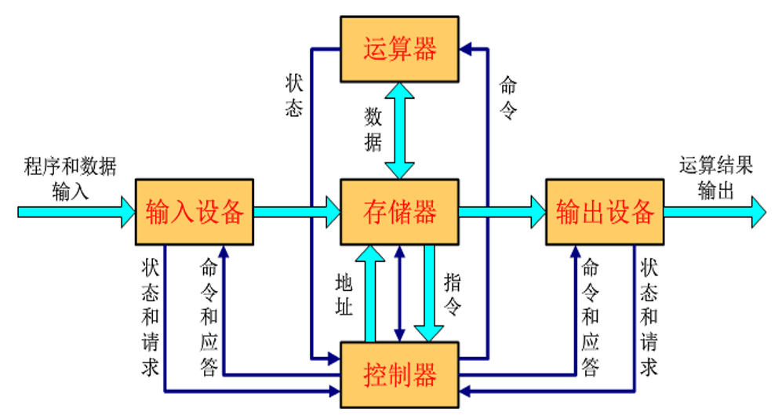
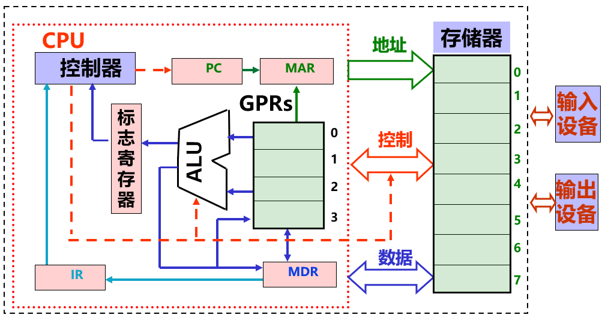
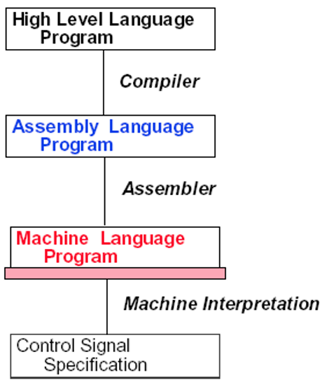
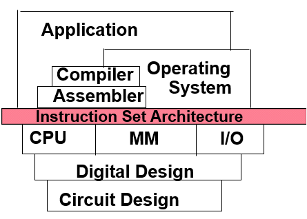
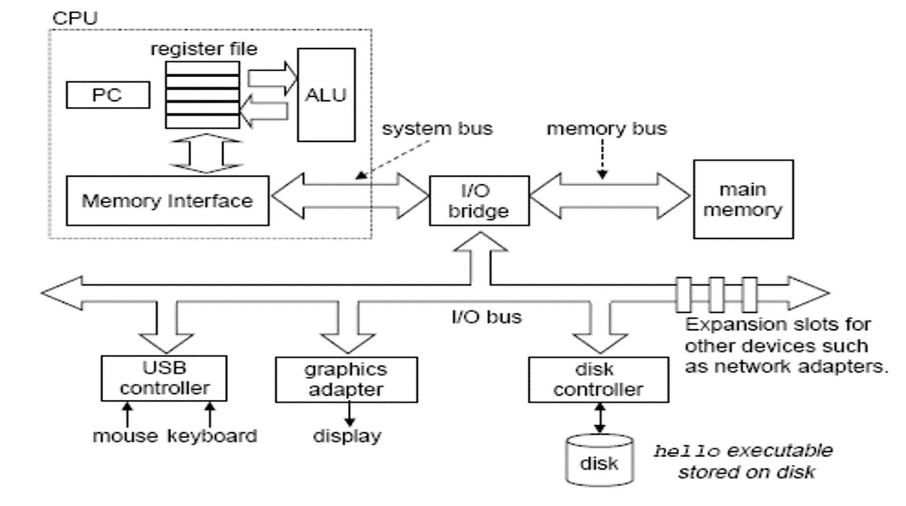
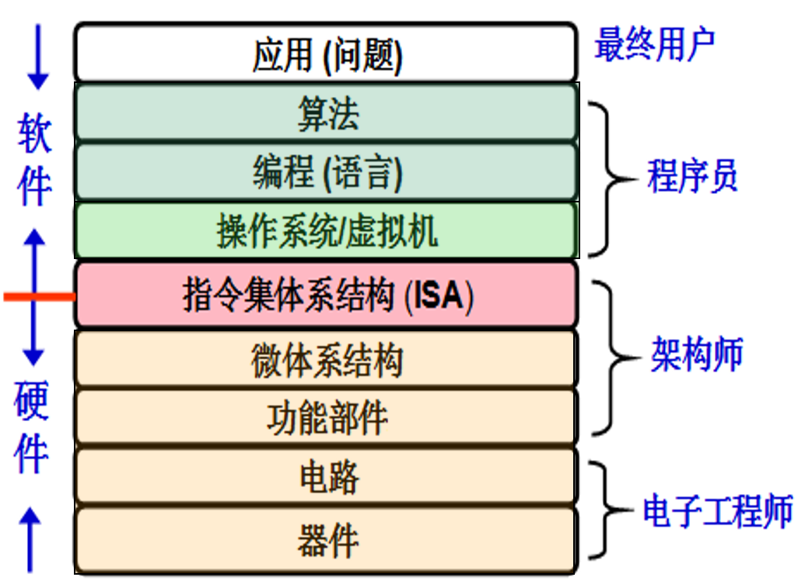

# Chapter 1 Class 1 计算机系统概述

## 计算机发展简史

- 第一代：真空管 1946~1957
  - 1946 年诞生第 1 台电子计算机**ENIAC**
  - 冯·诺依曼机：存储器、控制器、运算器、输入/输出设备
- 第二代：晶体管 1958~1964
- 第三代：SSI/MSI 1965~1971
- 第四代：LSI/VLSI/ULSI 1972~至今

## 计算机系统的组成

计算机是一种能对**数字化信息**进行**自动**、**高速算术和逻辑运算**的处理装置

### 计算机的基本部件及功能

1. 运算器（数据运算）：ALU、GPRs、标志寄存器等

2. 存储器（数据存储）：存储阵列、地址译码器、读写控制电路

3. 总线（数据传送）：数据(MDR)、地址(MAR)和控制线

4. 控制器（控制）：对指令译码生成控制信号

### 冯·诺依曼结构

### 现代计算机结构模型

### 计算机基本部件

CPU：中央处理器 **_Central Processing Unit_**

PC：程序计数器 **_Program Counter_**

MAR：存储器地址寄存器 **_Memory Address Register_**

ALU：算术逻辑部件 **_Arithmetic Logic Unit_**

IR：指令寄存器 **_Instruction Register_**

MDR：存储器数据寄存器 **_Memory Data Register_**

GPRs：通用寄存器组 **_General Purposed Registers_**

### 计算机工作过程

执行前：**数据**和**指令**事先存放在**存储器**中，指令按序存放，指令由**OP、ADDR 字段**组成，程序**起始地址置 PC**

执行：

- 取指
- 译码
- 取操作数
- 执行
- 写回
- 更新 PC

### 软硬件界面

软件和硬件的界面：**_指令集体系结构 ISA (Instruction Set Architecture)_**

### 软件

- 系统软件 **_System software_** ：简化编程，并使硬件资源被有效利用
  - 操作系统 **_Operating System_** ：硬件资源管理，用户接口
  - 语言处理系统：
    - 汇编程序 **_Assembler_**：汇编语言源程序 → 机器目标程序
    - 编译程序 **_Complier_**：高级语言源程序 → 汇编/机器目标程序
    - 解释程序 **_Interpreter_**：将高级语言语句逐条翻译成机器指令并立即执行
  - 其他实用程序
- 应用软件 **_Application software_** ：解决具体应用问题

## 计算机层次结构

### 一个典型系统的硬件组成

### 抽象层转化

### 指令集体系结构

规定了如何使用硬件：

- 可执行的指令集合，包括**指令格式、操作种类以及每种操作对应的操作数**的相应规定；
- 指令可以接受的**操作数的类型**；
- 操作数所能存放的寄存器组的结构，包括每个寄存器的**名称、编号、长度和用途**；
- 操作数所能存放的存储空间的**大小和编址方式**；
- 操作数在存储空间存放时按照**大端**还是**小端**方式存放；
- 指令获取操作数的方式，即**寻址方式**；
- 指令执行过程的控制方式，包括**程序计数器**、**条件码**定义等。

# Chapter 1 Class 2 计算机性能评价

## 性能

### Time to do the task

- 响应时间（response time）
- 执行时间（execution time）
- 等待时间或时延（latency）

### Tasks per day, hour, sec, ns...

- 吞吐率（throughput）
- 带宽（bandwidth）

## 基本性能评价标准

**_CPU 的执行时间_**

通常把用户感觉到的响应时间分成以下两个时间：

- CPU 时间：指 CPU 真正花在程序执行上的时间。又包括两部分：
  - 用户 CPU 时间：用来运行用户代码的时间
  - 系统 CPU 时间：为了执行用户程序而需要运行操作系统程序的时间
- 其他时间：指等待 I/O 操作完成或 CPU 花在其他用户程序的时间

系统性能和 CPU 性能不等价，有一定的区别

- 系统性能(System performance)：系统响应时间，与 CPU 外的其他部分也都有关系
- CPU 性能(CPU performance)：用户 CPU 时间

## CPU 执行时间的计算

**_CPI：Cycles Per Instruction_**

**CPU 执行时间** =

- CPU 时钟周期数 × 时钟周期
- CPU 时钟周期数 ÷ 时钟频率
- 指令条数 × CPI × 时钟周期

CPU 时钟周期数 = 指令条数 × CPI

CPI = CPU 时钟周期数 ÷ 指令条数

## 产品指标

**_MIPS(Million Instructions Per Second)_**

计算：MIPS=时钟频率 ÷ CPI

## 选择性能评价程序（Benchmarks）

- 用基准程序来评测计算机的性能
  - 基准测试程序是专门用来进行性能评价的一组程序
  - 不同用户使用的计算机用不同的基准程序
  - 基准程序通过运行实际负载来反映计算机的性能
  - 最好的基准程序是用户实际使用的程序或典型的简单程序
- 基准程序的缺陷
  - 现象：基准程序的性能与某段短代码密切相关时，会被利用以得到不当的性能评测结果
  - 手段：硬件系统设计人员或编译器开发者针对这些代码片段进行特殊的优化，使得执行这段代码的速度非常快
