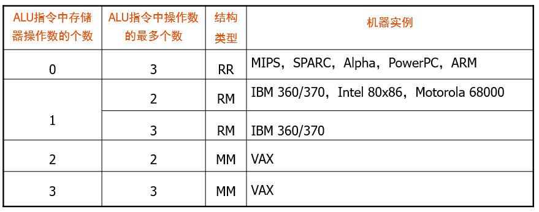
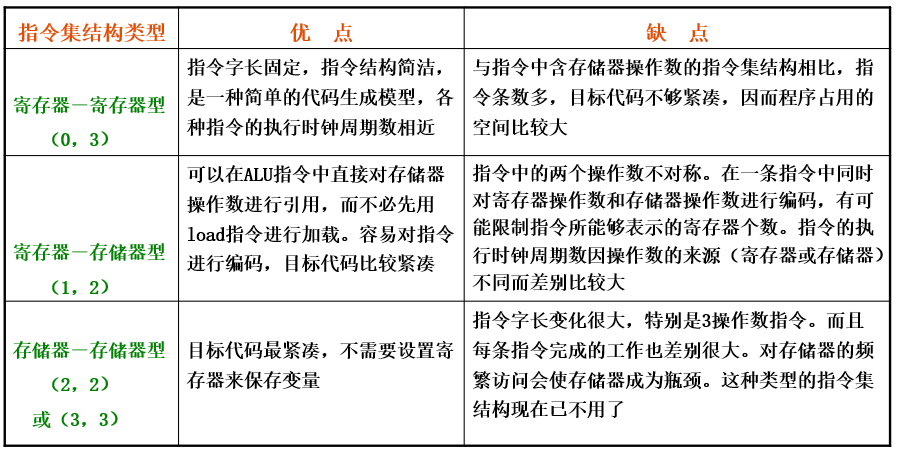
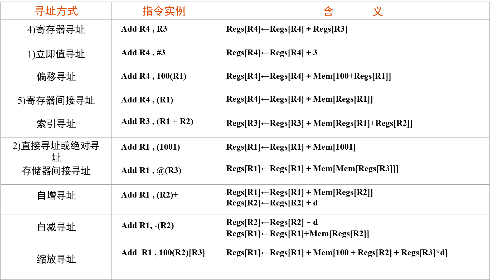
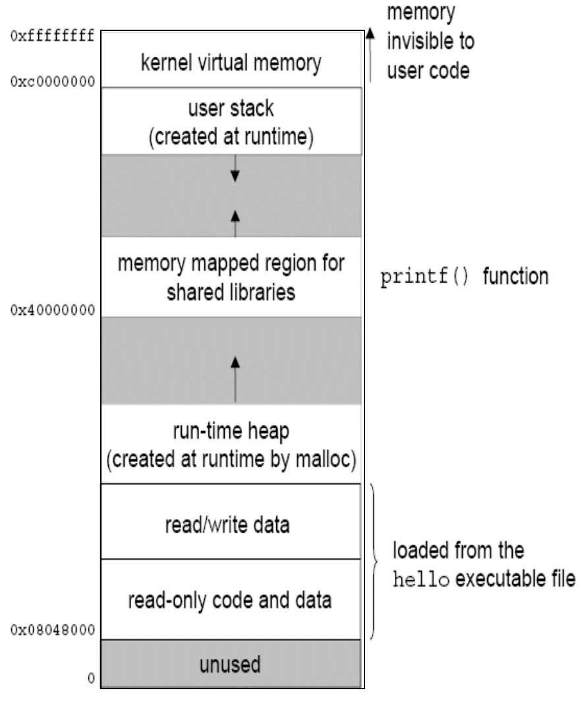
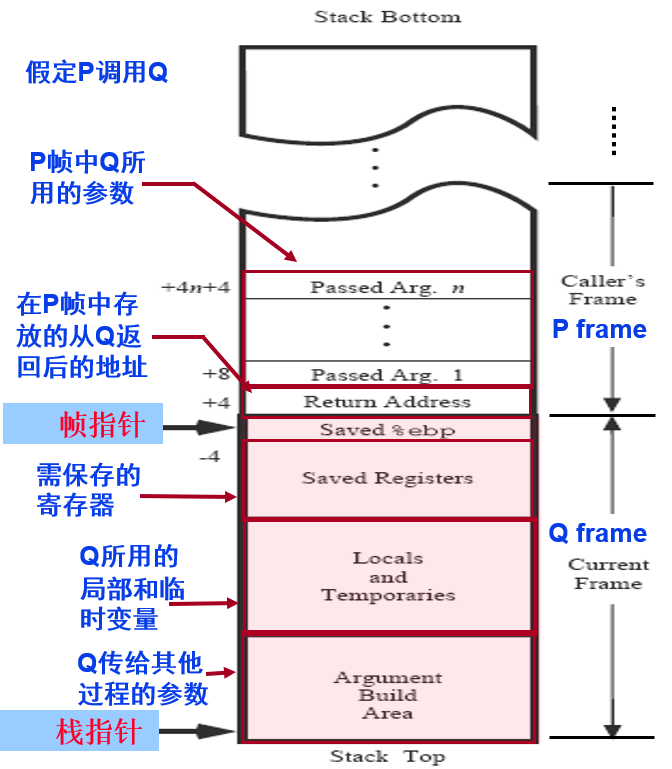

# Chapter 4 Class 1 指令系统的设计

## 指令集结构的分类

以 CPU 中用来存储操作数的存储单元为依据把指令集结构分为三种类型

- 堆栈结构
- 累加器结构
- 通用寄存器结构

对于通用寄存器，根据操作数的来源，可以把指令集结构分为

- 存储器-存储器结构(MM 结构)
  - 指令中的所有操作数都来自存储器
- 寄存器-存储器结构(RM 结构)
  - ALU 指令的至少一个操作数来自存储器，部分操作数来自寄存器
  - 除 load/store 以外的指令也能访问内存
- 寄存器-寄存器结构(RR 结构)
  - ALU 指令的所有操作数都来自通用寄存器组
  - 只允许 load/store 指令访问内存

四种指令集结构

1. 堆栈结构
2. 累加器结构
3. 寄存器-存储器结构（主流）
4. 寄存器-寄存器结构（主流）

### 通用寄存器结构分类

## 寻址方式

| 方式   | 算法       | 优点               | 缺点           |
| :----- | :--------- | :----------------- | :------------- |
| 立即   | 操作数=A   | 指令执行速度快     | 操作数幅值有限 |
| 直接   | EA=A       | 有效地址计算简单   | 地址范围有限   |
| 间接   | EA=(A)     | 有效地址范围大     | 多次存储器访问 |
| 寄存器 | 操作数=(R) | 指令执行快，指令短 | 地址范围有限   |
| 寄间接 | EA=(R)     | 地址范围大         | 额外存储器访问 |
| 偏移   | EA=A+(R)   | 灵活               | 复杂           |
| 堆栈   | EA=栈顶    | 指令短             | 应用有限       |

三类偏移寻址：

| 偏移寻址 | EA=A+(R)  | 说明                              | 应用                       |
| :------- | :-------- | :-------------------------------- | :------------------------- |
| 相对寻址 | EA=A+(PC) | 相对于当前指令处位移量为 A 的单元 | 公共子程序的浮动、相对转移 |
| 基址寻址 | EA=A+(B)  | 相对于基址(B)处位移量为 A 的单元  | 程序重定位                 |
| 变址寻址 | EA=A+(I)  | 相对于首址 A 处位移量为(I)的单元  | 线性表元素的存取           |

### MIPS 中的寻址方式

## 操作码

### 定长操作码

- 特点：译码方便，但有信息冗余
- 基本思想：指令的操作码部分采用固定长度的编码

### 扩展操作码

- 基本思想：将操作码的编码长度分成几种固定长的格式
- 种类
  - 等长扩展法：4-8-12；3-6-9
  - 不等长扩展法
- 扩展方法：操作码按短到长进行扩展编码

## 条件测试

条件转移指令通常根据**_Condition Codes(CC)_**转移，通过执行算术指令或显式地由比较和测试指令来设置 CC

常用标识码

- **SF** – negative
- **OF** – overflow
- **CF** – 进位/借位
- **ZF** – zero

## 功能设计

### 软硬件功能分配

- 硬件实现的特点: 速度快、成本高、灵活性差
- 软件实现的特点: 速度慢、价格便宜、灵活性好

### 基本要求

- 完整性
  
- 规整性
  - 对称性: 所有与指令集有关的存储单元的使用、操作码的设置等都是对称的
  - 均匀性: 对于各种不同的操作数类型、字长、操作种类和数据存储单元，指令的设置都要同等对待
- 高效率
- 兼容性

### 设计策略

#### CISC（复杂指令集计算机）

目标: 强化指令功能，减少程序的指令条数，以达到提高性能的目的

- 面向目标程序增强指令功能
- 增强运算型指令的功能
- 增强数据传送指令的功能
- 增强程序控制指令的功能

典型代表: x86

#### RISC（精简指令集计算机）

- 指令条数少而简单
- 采用简单而又统一的指令格式, 并减少寻址方式, 指令字长都为 32 位或 64 位
- 指令的执行在单个机器周期内完成, 采用流水线机制, 充分利用流水技术来提高性能
- 只有 load 和 store 指令才能访问存储器
- 大多数指令都采用硬连逻辑来实现
- 强调优化编译器的作用, 为高级语言程序生成优化的代码

典型代表: MIPS

# Chapter 4 Class 2 程序的机器级表示

## MIPS 指令格式

- **R-Type**指令: op(6)+rs(5)+rt(5)+rd(5)+shamt(5)+func(6)
- **I-Type**指令: op(6)+rs(5)+rt(5)+immediate(16)
- **J-Type**指令: op(6)+target address(26)

## MIPS 寄存器

- 31 x 32-bit GPRs （r0 = 0）
- 32 x 32-bit FP regs （f0 ～ f31）
- HI, LO, PC: 专用特殊寄存器

## MIPS 指令寻址方式

- 寄存器
- 立即数+寄存器
- 基址或变址
- 相对寻址
- 伪直接寻址

## 条件判断

- 判断条件, 不成立则跳转到**else**
- **if**中的语句块
- **_goto exit_**
- **_else_**: **else**中的语句块
- **_exit_**

## 循环结构

- **_Loop_**: 循环代码块
- 判断条件, 若不满足跳转到**Loop**

## 过程调用

（假定过程**P**调用过程**Q**）

在调用过程**P**中完成:

1. 保存**临时寄存器**`$t0`~`$t9`的值（如果需要使用）
2. 将**参数**放到**参数寄存器**`$a0`~`$a3`和**自己的栈帧**中
3. 将**返回地址**存到`$ra`，将控制转移到过程**Q**

在被调用过程**Q**中完成:

1. 保存**返回地址**`$ra`（如果需要使用）
2. 保存**保存寄存器**`$s0`~`$s7`的值(如果需要使用)
3. 为自己的**局部变量**分配空间（局部变量临时保存在栈中）
4. 执行过程**Q**
5. **返回结果**放到`$v0`~`$v1`中
6. 取出**返回地址**，返回到**P**中

调用约定

- 保存寄存器`$s0`~`$s7`、返回地址`$ra`、栈指针`$sp`、栈指针**以上的栈空间**的值在从被调用过程返回后**还要被用**，被调用者需要保留
- 临时寄存器`$t0`~`$t9`、参数寄存器`$a0`~`$a3`、返回值寄存器`$v0`~`$v1`、栈指针**以下的栈空间**的值在从被调用过程返回后**不需要被用**，被调用者可以随意使用
- 全局指针寄存器`$gp`的**值不变**
- 帧指针寄存器`$fp`用栈指针寄存器`$sp`**-4**来初始化
- 所有**局部数组**和**结构**等复杂类型变量也要入栈保存
- 如果**局部变量**和**临时变量**发生寄存器溢出，则也要入栈

## 虚拟地址空间

## 栈帧

