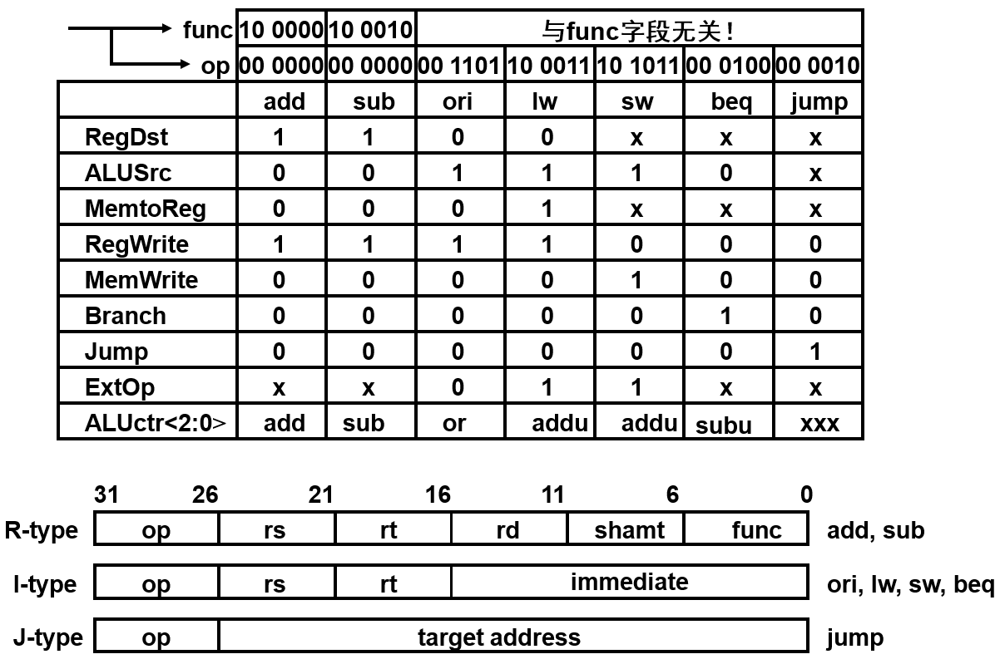
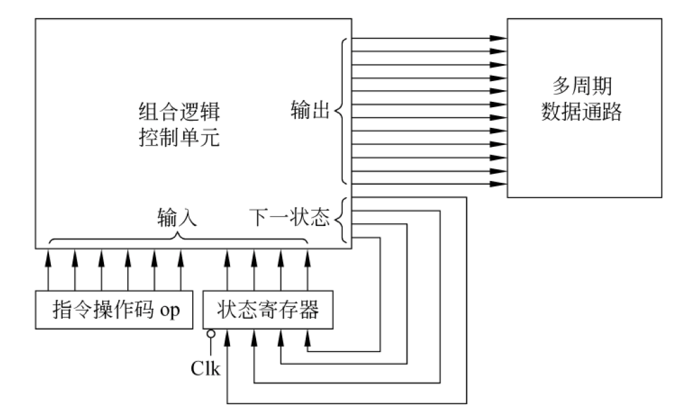

# Chapter 5 Class 1 数据通路概述

## CPU 功能及其与计算机性能的关系

计算机性能(程序执行快慢)由三个关键因素决定：指令数目、CPI、时钟周期。指令数目由编译器和 ISA 决定；时钟周期和 CPI 主要由 CPU 的设计与实现决定

## 组成指令功能的基本操作

- **读取主存单元**的内容，并将其**装入寄存器**
- 把一个数据从**寄存器**存入给定的**主存单元**中
- 把一个数据从**寄存器**送到另一个**寄存器或者 ALU**
- 进行**算术或逻辑运算**

可形式化描述为：

- **R[r]**:寄存器**r**的内容
- **M[addr]**:主存单元**addr**的内容
- 传送方向用“$\leftarrow$”表示
- 程序计数器**PC**直接用**PC**表示其内容

## 数据通路

指令执行过程中，数据所经过的路径，包括路径中的部件，是指令的**执行部件**

### 组合逻辑元件（操作元件）

其输出只取决于当前的输入。即：若输入一样，则其输出也一样

### 时序逻辑元件(状态元件/存储元件)

具有存储功能，在时钟控制下输入被写到电路中，直到下个时钟到达

输入端状态由时钟决定何时被写入，输出端状态随时可以读出

- **D 触发器**:
  - **建立时间(setup time)**: 在时钟边沿**之前**, **输入**需要稳定
  - **保持时间(hold time)**: 在时钟边沿**之后**, **输入**需要保持
  - **Clock-to-Q time**: 输入信息总是在一个时钟边沿到达后的“Clock-to-Q”时才被写入到单元中, 此时的输出才反映新的状态值
- **寄存器**
  - 有一个**写使能**(Write Enable)信号的**D 触发器**
- **寄存器组**
  - _组合逻辑操作_：**RA**和**RB**给出地址, 地址**RA**或**RB**有效后，经一个**取数时间**，读出两个寄存器值
  - _时序逻辑操作_：**写使能**的情况下，时钟边沿到来时，输入的值被写入**RW**指定的寄存器中
- **理想存储器**
  - _组合逻辑操作_：**Address**有效后，经一个**取数时间**，读出内存值
  - _时序逻辑操作_：**写使能**的情况下，时钟边沿到来时，输入的值被写入**Address**指定的存储单元中

### 同步系统

所有动作有专门**时序信号**来定时，由**时序信号**规定何时发出什么动作

### 时序信号

同步系统中用于进行同步控制的定时信号，如**时钟信号**

**Cycle Time** = **Latch Prop**(clk-to-Q) + **Longest Delay Path**(门延迟) + **Setup**(建立时间) + **Clock Skew**(电路延迟)

约束条件：(**Latch Prop**(clk-to-Q) + **Shortest Delay Path**(门延迟) - **Clock Skew**(电路延迟)) > **Hold Time**(保持时间)

### 指令周期

**取并执行**一条指令的时间

# Chapter 5 Class 2 单周期数据通路的设计

# Chapter 5 Class 3 单周期控制器的设计

## 主译码器

## ALU 译码器

# Chapter 5 Class 4 多周期处理器的设计

## 单周期处理器的缺点

所有指令执行时间都以最长的 load 指令为准，导致时钟周期很长，时钟周期远远大于其他指令实际所需的执行时间，效率极低

## 基本思想

- 把指令的执行分成**多个阶段**，每个阶段在一个时钟周期内完成
- 时钟周期以最复杂阶段所花时间为准
- 尽量分成**大致相等的若干阶段**
- 规定每个阶段**最多只能完成 1 次访存**或**寄存器堆读/写**或**ALU**
- 每步都设置存储元件，每部执行结果都在下个时钟开始保存到相应单元

优点：

- 时钟周期短
- 不同指令所用周期数可以不同
- 允许功能部件在一条指令执行过程中被重复使用

## 竞争问题

### 寄存器文件

实际寄存器组在单周期通路中不能可靠工作，这是因为：

不能保证**RWrite**和**busWrite**在**RegWrite=1**之前稳定

### 存储器

实际存储器在单周期通路中也不能可靠工作，这是因为：

不能保证**Address**和**DataIn**在**WriteEnable=1**之前稳定

### 如何在多周期通路中避免竞争问题

- 确认地址和数据在第**N**周期结束时已稳定
- 使写使能信号在一个周期后(即：第**N+1**周期)有效
- 在写使能信号无效前地址和数据不改变

## 多周期数据通路

## 多周期状态转换图

## 多周期控制器

多周期 CPU 每个指令有多个周期，每个周期控制信号取值不同

### 有限状态机

基本思路: 由**时钟**、**当前状态**和**操作码**确定**下一状态**, 不同状态输出不同**控制信号**值

#### 状态转换表

### 微程序

_见下一章节_

# Chapter 5 Class 5 微程序控制器设计与异常处理

## 硬连线路设计的特点

- **优点**：速度快，适合于简单或规整的指令系统
- **缺点**：对于复杂指令系统来说，结构庞杂，实现困难；修改、维护不易；灵活性差。甚至无法用有限状态机描述

## 微程序控制器基本思想

- 编制每个**指令**对应的**微程序**（**_微程序=指令_**）
- 每个**微程序**由若干条**微指令**构成，各**微指令**包含若干条**微命令**（**_微指令=各个状态，微命令=控制信号_**）
- 所有**指令**对应的**微程序**放在**只读存储器**中，执行某条指令时，取出对应**微程序**中的各条**微指令**，对**微指令**译码产生对应的**微命令**，这个**微命令**就是**控制信号**
- **只读存储器**称为控制存储器，简称控存**CS**

## 微程序控制器基本结构

- **输入**：（来自内存的）指令、条件码
- **输出**：控制信号/微命令
- **核心**：控存 CS
- **µPC**：指出将要执行的微指令在 CS 中的位置
- **µIR**：正在执行的微指令

每个**时钟**执行一条**微指令**，**微程序**第一条**微指令**地址由**起始地址发生器**产生

**顺序执行**时，每个时钟**µPC+1**

**转移执行**时，由**转移控制**字段指出对哪些**条件码**进行测试，**转移地址发生器**根据**条件码**修改**µPC**

## 微指令格式的设计

### 水平型微指令

**基本思想**：相容**微命令**尽量多地安排在一条**微指令**中

**优点**：微程序短，并行性高，适合于较高速度的场合

**缺点**：微指令长，编码空间利用率较低，并且编制困难

### 垂直型微指令

**基本思想**：一条**微指令**只控制一、二个**微命令**

**优点**：微指令短，编码效率高，格式与机器指令类似，故编制容易

**缺点**：微程序长，一条微指令只能控制一、二个，无并行，速度慢

### 微指令的构成

- **微操作码**：包含若干**微命令**
- **微地址码**：包含下条**微指令**地址（可选）
- 常数（可选）

## 微操作码编码方式

### 不译法（直接控制法）

**_基本思想：一位对应一个微命令（控制信号），不需译码_**

优点：

- 并行控制能力强，且不必译码，故执行速度快
- 编制的微程序短

缺点：

- 微指令字很长，可能多达几百位
- 编码空间利用率低（几百位中可能只有几位为 1）

### 字段直接编码法

基本思想：

- 将**微指令**分成若干字段，每个字段对包含的若干**微命令**编码
- 把**互斥微命令**组合在同一字段，**相容微命令**组合在不同字段
- 一条微指令中最多可同时发出的微命令个数就是字段数

优点：

- 有较高的**并行**控制能力，速度较快
- **微指令短**，能压缩到不译法的 1/2 到 1/3，节省控存容量

缺点:

- 增加译码线路，并开销一部分时间。但因分段后各字段位数少，所以译码对微指令的执行速度影响不大

效果图:

### 字段间接编码法

基本思想：

- 在字段直接编码法基础上，进一步压缩微指令长度
- 一个**微命令**字段可以表示多个**微命令组**，到底代表哪一组微命令，则由另一个专门的字段来确定

特点：

- 可进一步缩短微指令字长度，节省控存容量。(意义不大！)
- 译码线路复杂，时间开销大

### 最小(最短、垂直)编码法

基本思想：

- 采用指令编码思想，每条**微指令**只包含一个**微命令**

特点：

- 能得到最短的微指令字
- 微程序规整、直观，易于编制
- 并行能力差，速度慢，并且微程序长

## 下条微地址的确定方式

选择下条要执行的微指令有以下四种情况：

- **取指微程序首址**：每条指令执行前，CPU 先执行取指微程序
- **第一条微指令**：每条指令取出后，必须转移到该指令对应的第一条微指令执行
- **顺序执行**：微程序执行过程中顺序取出下条微指令执行
- **分支执行**：在遇到按条件转移到不同微指令执行时，需要根据**控制单元的输入**来选择下条微指令

### 增量(计数器)法

下条微指令地址**隐含**在微程序计数器**μPC**中

### 断定(下址字段)法

在本条微指令中**明显**指定下条微指令地址

## 带异常处理的数据通路

增加两个寄存器：

- **EPC**：32 位，用于存放**断点**
  - 写入**EPC**的断点可能是**正在执行的指令**的地址（PC-4 送 EPC），也可能是**下条指令**的地址（PC 送 EPC）
- **Cause**：32 位，记录**异常原因**
  - 假定处理的异常类型有以下两种：未定义指令（Cause=0）、溢出（Cause=1）

需要加入两个寄存器的“写使能”控制信号：

- **EPCWr**：在保存断点时该信号有效，使断点 PC 写入 EPC
- **CauseWr**：在处理器发现异常时该信号有效，使异常类型被写到 Cause 寄存器
  - 控制信号**IntCause**选择正确的值写入到 Cause 中

还需要将**异常查询程序的入口地址**写入 PC

## 带异常处理的控制器

在有限状态机中增加异常处理的状态，**每种异常占一个状态**

每个异常处理状态中，需考虑以下基本控制：

- **Cause**寄存器的设置
- 计算断点处的 PC 值（PC-4），并送**EPC**
- 将**异常查询程序的入口地址**送 PC
- 将中断允许位清 0（关中断）
