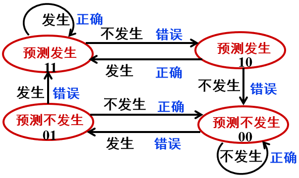

# Chapter 6 Class 1 流水线数据通路和控制逻辑

## 单周期与流水线的性能比较

设总共$n$条指令, 每个阶段用时$t$, 每条指令$k$个阶段

- 单周期: $T=nkt$
- 流水线: $T=(n+k-1)t$

理想情况下, 效率达到$k$倍

## 流水线指令集的设计

- **长度尽量一致**，有利于简化取指令和指令译码操作
- **格式少**，且源寄存器位置相同，有利于在指令未知时就可取操作数
- **load/Store**指令才能访问存储器，有利于减少操作步骤，规整流水线
- 内存中"**对齐**"存放，有利于减少访存次数和流水线的规整

## 流水的各个阶段

### 取指令阶段(IFetch)

- 根据`PC`值取指令`Instruction`
- 计算`PC+4`

### 译码/取数阶段(Reg/Dec)

- 进行**译码**, 得到**寄存器地址**, **立即数**
- 从寄存器中取出**寄存器值**

### 执行(Exec)

- 计算**内存地址**
- 计算**转移目标地址**
- 一般**ALU**运算

### 访问内存(Mem)

- **读内存**
- **写内存**

### 写回(Write Back)

- 将数据**写入寄存器**

## 控制信号

在 **取数/译码(Reg/Dec)** 阶段产生本指令每个阶段的**所有控制信号**

在下个时钟到达时，把执行结果以及前面传递来的后面各阶段要用到的所有数据和**控制信号**保存到**流水线寄存器**中

- **PC**不需要写使能
- **流水段寄存器**不需要写使能
- **IFetch**阶段和**Dec/Reg**阶段都没有控制信号
- **Exec**阶段的控制信号有四个
  - **ExtOp** (扩展器操作)
  - **ALUSrc** (ALU 的 B 口来源)
  - **ALUOp** (主控制器输出，用于辅助局部 ALU 控制逻辑来决定 ALUCtrl)
  - **RegDst** (指定目的寄存器)
- **Mem**阶段的控制信号有两个
  - **MemWr** (DM 的写信号)
  - **Branch** (是否为分支指令)
- **Wr**阶段的控制信号有两个
  - **MemToReg** (寄存器的写入源)
  - **RegWr** (寄存器堆写信号)

## 竞争问题

在流水线中存在**地址**和**写使能**之间的竞争问题

解决方案: 将**写使能**和**时钟信号**相**与**, 使得**写使能**在**地址**之后生效

# Chapter 6 Class 2 流水线冒险处理

冒险(Hazard): 指流水线遇到无法正确执行后续指令或执行了不该执行的指令

三种冲突：

1. **结构冲突**：同一个部件同时被不同指令所使用
2. **数据冲突**：后面指令用到前面指令结果数据时，前面指令的结果还没产生
3. **控制冲突**：转移或异常改变执行流程，后继指令在目标地址产生前已被取出

## 结构冲突

- 每个部件在特定的阶段被使用（**ALU**）
- 将`Instruction Memory`和`Data Memory`分开
- 寄存器的**读口**和**写口**分开

## 数据冲突

- **硬件**阻塞(stall)
- **软件**插入**NOP**
- 合理实现寄存器堆的读/写操作
  - **前半**时钟周期**写**，**后半**时钟周期**读**
  - 不能解决所有数据冲突
- 前向(Forwarding)或旁路(Bypassing)技术
  - 若相关数据是**ALU**结果，则可通过**转发**解决
  - 若相关数据是上条指令读**内存**结果，不能通过转发解决(称为**Load-use**冲突)，随后指令需被**阻塞一个时钟**或加**NOP**
- 编译优化：**调整指令顺序**
  - 不能解决所有数据冲突

**_数据冒险处理最佳方案：转发 + Load-use 阻塞_**

### 前向技术

转发的触发时机：

- 后面指令需用**ALU**输出结果
  - **C1**：`Rd`是后一条指令的`Rs/Rt`
  - **C2**: `Rd`是后第二条指令的`Rs/Rt`
- 后面指令需用从**DM**读出的结果
  - **C3**: `Rd`是后第二条指令的`Rs/Rt`

以下情况需要特殊考虑:

- 指令的结果**不写入**目的寄存器`Rd`时
- `Rd`等于`$0`时
- **C1=C2=1**时

用流水段寄存器来表示转发条件：（`EX/MEM`,`ID/EX`,`MEM/WB`表示阶段之间的**流水线寄存器**）

- **C1(a)**: **`EX/MEM.RegWr`** && **`EX/MEM.RegisterRd` != 0** && **`EX/MEM.RegisterRd` == `ID/EX.RegisterRs`**
- **C1(b)**: **`EX/MEM.RegWr`** && **`EX/MEM.RegisterRd` != 0** && **`EX/MEM.RegisterRd` == `ID/EX.RegisterRt`**
- **C2(a)**: **`MEM/WB.RegWr`** && **`MEM/WB.RegisterRd` != 0** && **`EX/MEM.RegisterRd` != `ID/EX.RegisterRs`** && **`MEM/WB.RegisterRd` == `ID/EX.RegisterRs`**
- **C2(b)**: **`MEM/WB.RegWr`** && **`MEM/WB.RegisterRd` != 0** && **`EX/MEM.RegisterRd` != `ID/EX.RegisterRt`** && **`MEM/WB.RegisterRd` == `ID/EX.RegisterRt`**
- **C3**就是**C2**

### 阻塞

阻塞条件：前面指令为**Load**并且**前面指令的目的寄存器**等于**当前刚取出指令的源寄存器**

流水段寄存器表示：**`ID/EX.MemRead`** && (**`ID/EX.RegisterRt` == `IF/ID.RegisterRs`** || **`ID/EX.RegisterRt` == `IF/ID.RegisterRt`**)

阻塞方式:

- 将`ID/EX`段寄存器中所有**控制信号**清 0，插入一个**气泡**
- `IF/ID`寄存器中的信息不变，指令重新译码执行
- `PC`中的值不变，指令重新被取出执行

## 控制冲突

- **阻塞**分支指令后三条指令的执行
  - 使后面三条指令清 0 或其操作信号清 0
- 软件上插入三条**NOP**指令
- **分支预测(Predict)**
  - **简单（静态）预测**：总是预测条件**不满足**，即：继续执行分支指令的后续指令
    - 可加**启发式规则**：在特定情况下总是预测**满足**，其他情况总是预测**不满足**
  - **动态预测**：根据程序执行的**历史情况**进行动态预测调整
  - _注：流水线控制必须确保被错误预测指令的执行结果不能生效，而且要能从正确的分支地址处重新启动流水线工作_
- **延迟分支(Delayed branch)**: 通过**编译程序**优化指令顺序
  - 把分支指令前面与分支指令无关的指令调到分支指令后执行，也称延迟转移

### 简单(静态)分支预测方法

**性能**：取决于程序的转移概率

减少预测错误的代价：将**转移地址计算**和**分支条件判断**操作调整到`ID`阶段来缩短延迟

预测错误的检测：增加控制信号`IF.Flush` = **Branch && Zero**，取值为 1 时说明预测失败

预测错误的处理：

- 将转移**目标地址** -> `PC`
- 将`IF/ID`中的指令字清 0，转变为**nop**指令

分支判断需要**前面指令的结果**时:

- **上上条指令**: `EXE`段结果可**转发**回来进行判断
- **上条指令**: `EXE`段结果来不及转发回来，引起 1 次**阻塞**

### 动态分支预测方法

基本思想：

- 利用**最近转移发生的情况**，来预测下一次可能转移还是不转移
- 根据实际情况来调整预测
- 转移发生的历史情况记录在**BHT**中

#### 分支历史记录表 BHT

- **分支指令**的地址
- 预测位（值为**跳转**或**不跳转**）
- **跳转目标**的地址

#### 基本执行流程

- 取到分支指令，**并行**在**分支指令**的地址中查找
- 如果查到，
  - 根据预测位执行**跳转**或**不跳转**
  - 根据实际跳转情况**修正预测位**
- 如果查不到，
  - 加入新项，并填入**分支指令**的地址和**跳转目标**的地址
  - 初始化预测位

#### 基本方法

- 一位预测位
  - 实际执行时，若预测错，则该位取反，否则，该位不变
  - 缺点：当连续两次的分支情况发生改变时，预测错误
- 二位预测位
  - 只有两次预测错误才改变预测方向
  - 好处：连续两次发生不同的分支情况时，会预测正确

### 分支延迟时间片的调度

把分支指令前面的**与分支指令无关的指令**调到分支指令后面执行，以填充延迟时间片

由编译程序重排指令顺序来实现

### 另一种控制冲突: 异常和中断

- 清除**异常指令**以及后面的所有已在流水线中的指令
- **关中断**（将中断允许触发器清 0）
- 保存`PC`或`PC-4`（**断点**）到`EPC`
- **异常处理程序**的首地址送`PC`

#### 难点问题

- 流水线中同时有 5 条指令，到底是哪一条发生异常？
  - 根据异常发生的流水段可确定是哪条指令，因为各类异常发生的流水段不同
    - **溢出**在**EXE**段检出
    - **无效指令**在**ID**段检出
    - **除数为 0**在**ID**段检出
    - **无效指令地址**在**IF**段检出
    - **无效数据地址**在**Load/Store 指令的 EXE**段检出
- **外部中断**与特定指令无关，如何确定处理点？
  - 可在**IF**段或**WB**段中进行中断查询，需要保证当前**WB**段的指令能正确完成，并在有中断发生时，确保下个时钟开始执行中断服务程序
- 检测到异常时，指令已经取出多条，当前 PC 的值已不是断点，怎么办？
  - 指令地址存放在流水段 R，可把这个地址送到 EPC 保存，以实现精确中断
  - 非精确中断不能提供准确的断点，而由操作系统来确定哪条指令发生了异常
- 一个时钟周期内可能有多个异常，该先处理哪个？
  - 异常：检出异常后，其原因存到专门寄存器中并流到最后阶段处理，使前面指令的异常优先级高于后面指令
  - 中断：在中断查询程序或中断优先级排队电路中按顺序查询
- 系统中只有一个 EPC，多个中断发生时，一个 EPC 不够放多个断点，怎么办？
  - 总是把优先级最高的送到 EPC 中
- 在异常处理过程中，又发生了新的异常或中断，怎么办？
  - 利用中断屏蔽和中断嵌套机制来处理
