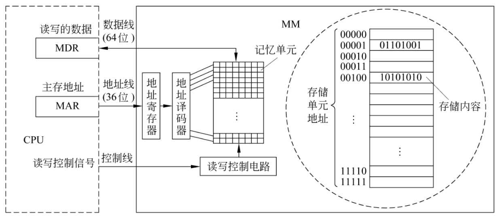
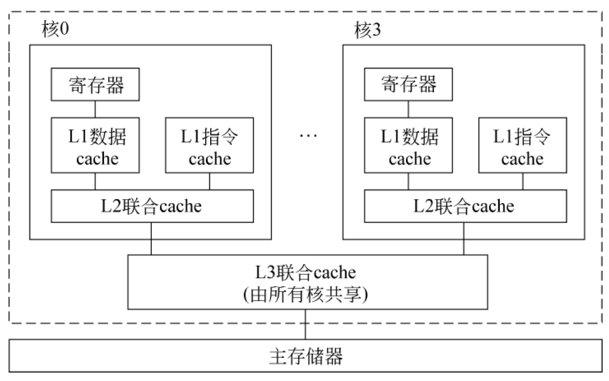
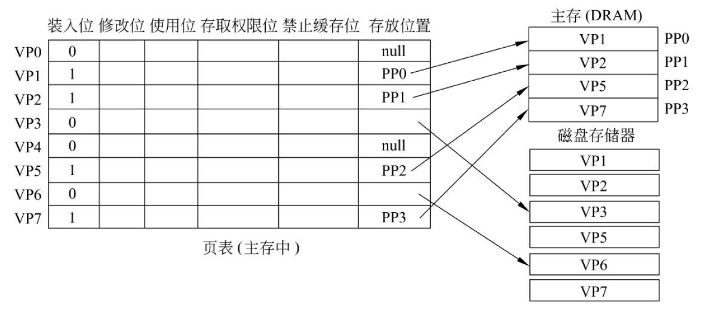
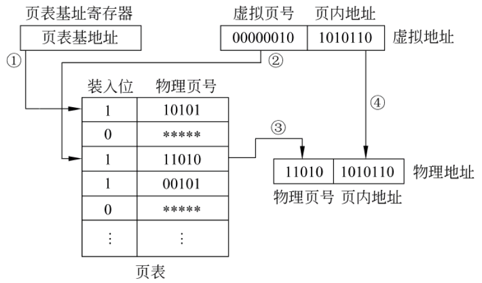
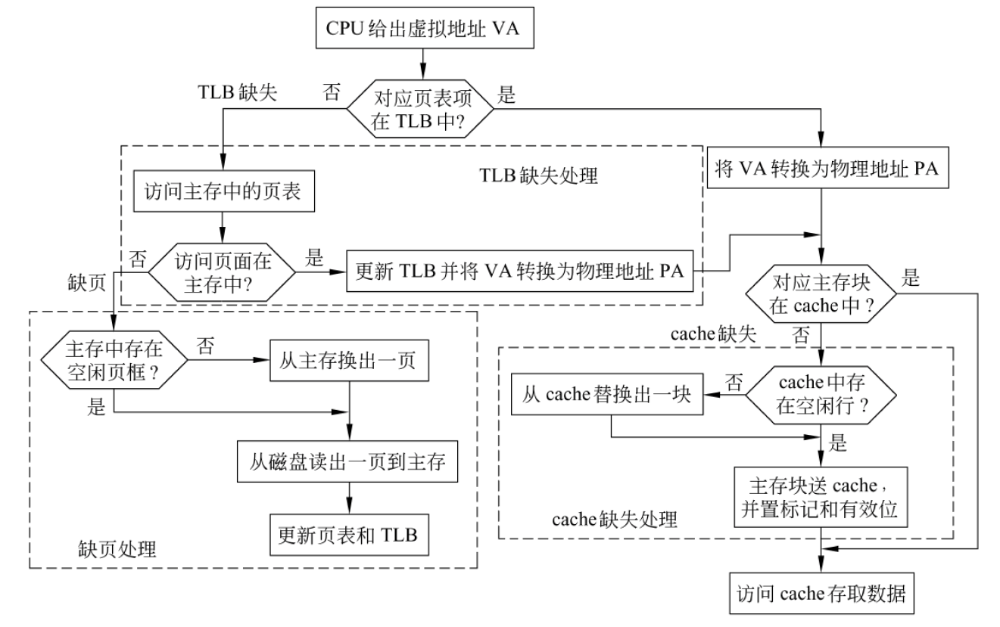
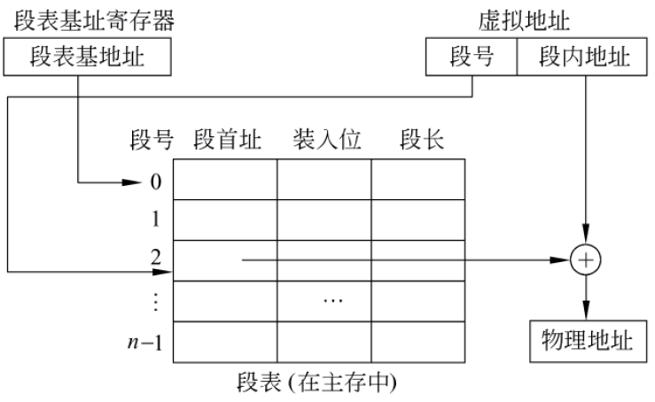

# Chapter 7 Class 1 存储器概述和 RAM 芯片

## 基本术语

- **记忆单元**（存储基元/存储元/位元）
  - 具有两种稳态的，能够表示二进制数码`0`和`1`的物理器件
- **存储单元**
  - 具有**相同地址的位**构成一个存储单元，也称为一个**编址单位**
- **存储体/存储矩阵/存储阵列**
  - 所有存储单元构成一个存储阵列
- **编址方式**
  - 字节编址、按字编址
- **存储器地址寄存器(MAR)**
  - 用于存放主存单元地址的寄存器
- **存储器数据寄存器(MDR)**
  - 用于存放主存单元中的数据的寄存器

## 主存的结构

**地址译码器**的输入是**地址**，输出是**地址驱动信号**（只有一根地址驱动线被选中）

## 主存的主要性能指标

- 按**字节**连续编址
- 存储容量：所包含的**存储单元的总数**
- **存取时间**$T_A$：从**CPU 送出内存单元的地址码**开始，到**主存读出数据并送到 CPU/把 CPU 数据写入主存**所需要的时间， 称为**读取时间/写入时间**
- **存储周期**$T_{MC}$：**连读两次访问存储器**所需的最小时间间隔，等于**存取时间+下一次存取开始前所要求的附加时间**，因此$T_{MC}>T_A$

## DRAM 芯片的刷新

**刷新周期**：相邻两次对某个特定行进行刷新的时间间隔

多采用**异步刷新方式**，将一个刷新周期分配给所有行，使得在一个刷新周期内每行至少刷新一次，且仅刷新一次

## CPU 与存储器之间的通信方式

- **异步方式**（读操作）
  - CPU 送**地址**到地址线，主存进行地址译码
  - CPU 发**读命令**，然后等待存储器发回**完成信号**
  - 主存收到读命令后开始读数，完成后发**完成信号**给 CPU
  - CPU 接收到**完成信号**，从数据线取数
  - 写操作过程类似
- **同步方式**
  - CPU 和主存由统一时钟信号控制，无需应答信号
  - 主存总是在**确定的时间内**准备好数据
  - CPU 送出地址和读命令后，总是在**确定的时间**取数据
  - 存储器芯片必须支持同步方式

## 只读存储器

特点

- **只读**
- 非破坏性读出，无需再生
- 随机访问
- 信息用特殊方式写入，一经写入，就可长久保存，不受断电影响

用途

- 存放一些固定程序，只要一接通电源，这些程序就能自动地运行
- 作为控制存储器，存放**微程序**
- 作为函数发生器和代码转换器
- 在输入/出设备中，被用作字符发生器，汉字库等。
- 在嵌入式设备中用来存放固化的程序。

## 闪存

有三种操作：**擦除、编程、读取**

- 写入：快擦（所有单元为 1），编程（需要之处写 0）
- 读出：控制栅加正电压，若状态为 0，则读出电路检测不到电流；若状态为 1，则能检测到电流

# Chapter 7 Class 2 主存与 CPU 的连接及其读写操作

## 存储器芯片的扩展

- **字扩展**（位数不变、扩充容量）
  - 例：`16K×8`位芯片扩成`64K×8`位存储器
- **位扩展**（字数不变，位数扩展）
  - 例：`4K×1`位芯片构成`4K×8`位存储器

## DRAM 芯片的规格

假设有一个$2^n×b$位 DRAM 芯片的存储阵列是$r$行$c$列

- **芯片容量**为$2^n×b$位, $2^n=r×c$
- **地址位数**为$n$，其中行地址位数为$\log_2r$，列地址位数为$\log_2c$
- $n$位地址中**高位部分**为**行地址**，**低位部分**为**列地址**
- 为提高 DRAM 芯片的性价比，通常设置的$r$和$c$满足$r≤c$且$|r-c|$最小

## 主存模块的连接和读写操作

- 存储控制器将**行地址**送**行译码器**，选中某一行，整行数据送**行缓冲**
- 存储控制器将**列地址**送**列译码器**，选中**行缓冲**的某一列，将数据读到数据线，并继续送往 CPU

# Chapter 7 Class 3 高速缓冲存储器

## 评价指标

- **命中率**$\alpha$：数据在 Cache 中的概率
- **命中时间**$t_h$：在 Cache 中的访问时间，包括：**Time to determine hit/miss + Cache access time**
- **缺失率**：数据不在 Cache 中的概率
- **缺失损失**$t_m$：访问一个主存块所花时间（$t_h<<t_m$）
- **平均访问时间**$t_{avg}=t_h+(1-\alpha)t_m$

## 有效位

**V**为有效位，为 1 表示信息有效，为 0 表示信息无效

- **开机或复位**时，使所有行的有效位 V=0
- 某行被**替换**后使其 V=1
- 某行装入**新块**时 使其 V=1
- 通过使 V=0 来**冲刷**Cache

## 映射策略

把主存空间划分成大小相等的**主存块**，Cache 中存放一个主存块的对应单位称为**槽/行/块**

主存地址分割为 3 部分：

- 标记位：**Flag**
- Cache 索引：**Index**
- 块内地址：**Offset**

**关联度**：一个主存块映射到 Cache 中时，可能存放的位置个数

### 直接

每个主存块映射到 Cache 的**固定行**

**Index** = **主存块号** mod **行数**

特点：

- 容易实现，命中时间短
- 无需考虑淘汰（替换）问题
- 不够灵活，Cache 存储空间得不到充分利用，命中率低

### 全相联

每个主存块映射到 Cache 的**任一行**

取消了**Index**字段

可以同时比较所有行的**Flag**

### 组相联

每个主存块映射到 Cache**固定组中任一行**

**组号** = **主存块号** mod **组数**

特点：

- 结合直接映射和全相联映射的优点。当 Cache 组数为 1 时，变为相联映射；当每组只有一个槽时，变为直接映射。
- 每组 2 或 4 行（称为 2-路或 4-路组相联）较常用。通常每组 4 行以上很少用。

## 替换策略

- 先进先出 FIFO
  - 总是把最先进入的那一块淘汰掉
- 最近最少用 LRU
  - 总是把最近最少用的那一块淘汰掉
  - 通过**计数值**来确定块的使用情况
    - **命中**时，被访问行的计数器置$0$，比其原值小的计数器加$1$，其余不变
    - **未命中**且该组**未满**时，新行计数器置为$0$，其余全加$1$
    - **未命中**且该组**已满**时，计数值为$3$的那一行中的主存块被淘汰，新行计数器置为$0$，其余加$1$
- 最不经常用 LFU
- 随机替换算法

## 写策略

### 写命中

- **Write Through**(通过式写、写直达、直写)
  - **同时**写 Cache 和主存
  - 使用**写缓冲**（Write Buffer）
    - 在**Cache**和**Memory**之间
    - CPU**同时**写数据到 Cache 和 Write Buffer
    - **Memory controller**（存控）将缓冲内容写主存
- **Write Back**(一次性写、写回、回写)
  - 只写 cache 不写主存，**缺失时一次写回**，每行有个**修改位**，控制可能很复杂

### 写不命中

- **Write Allocate**(写分配)
  - 将主存块装入 Cache，然后更新相应单元
  - 试图利用空间局部性，但每次都要从主存读一个块
- **Not Write Allocate**(非写分配)
  - 直接写主存单元，不把主存块装入到 Cache

## Cache 数目

- **单级/多级**
  - **外部**Cache: 不做在 CPU 内而是独立设置一个 Cache
  - **片内**Cache: 将 Cache 和 CPU 作在一个芯片上
  - **单级**Cache：只用一个片内 Cache
  - **多级**Cache：同时使用 L1 Cache 和 L2 Cache，甚至有 L3 Cache
- **联合/分立**
  - **分立**：指**数据**和**指令**分开存放在各自的 Cache 中
    - 一般 L1 Cache 都是分立 Cache
  - **联合**：指数据和指令都放在一个 Cache 中
    - 一般 L2 Cache 都是联合 Cache

## Intel Core i7 处理器的 cache 结构

# Chapter 7 Class 4 虚拟存储器

基本思想

- 把**地址空间**和**主存容量**的概念区分开来
- 程序员在**地址空间**里编写程序，而程序则在**真正的内存**中运行
- 由一个专门的机制实现地址空间和实际主存之间的**映射**

## 分页

基本思想：

- **内存**被分成固定长且比较小的**存储块**（页框、实页、物理页）
- 每个**进程**也被划分成固定长的**程序块**（页、虚页、逻辑页）
- **程序块**可装到存储器中可用的**存储块**中
  - 采用**按需调页**方式分配主存
- 无需用连续页框来存放一个进程
- 操作系统为每个进程生成一个**页表**，通过页表实现**逻辑地址**向**物理地址**转换
  - **逻辑地址**：程序中指令所用地址，也称为**虚拟地址**（VA）
  - **物理地址**：存放指令或数据的实际内存地址，也称为实地址、主存地址（PA）

## 虚拟存储系统

基本思想：

- 程序员在比实际主存空间大得多的**逻辑地址空间**中编写程序
- 程序执行时，把当前需要的**程序段**和相应的**数据块**调入主存，其他暂不用的部分存放在磁盘上
- 指令执行时，通过硬件将**逻辑地址**（也称**虚拟地址**或**虚地址**）转化为**物理地址**（也称**主存地址**或**实地址**）
- 在发生程序或数据访问失效(**缺页**)时，由操作系统进行主存和磁盘之间的信息交换

需考虑：

- 页大小与映射策略
  - **页大小**比 Cache 中的块大得多，采用**全相联映射**
  - 因为缺页的开销比 Cache 缺失开销大的多，页**命中率**比 cache 命中率更重要，**大页面**和**全相联**可提高页命中率
- 如果要找的内容不在主存，怎么办？
  - 通过软件来处理**缺页**，因为缺页时需要访问磁盘，慢，不能用硬件实现
- 写策略
  - 采用**Write Back**写策略，避免频繁的慢速磁盘访问操作
- 逻辑地址和物理地址如何转换，转换速度如何提高？
  - 地址转换用硬件实现，加快指令执行

## 页表结构

- **装入位**：表示相应页是否**装入主存**
  - 若为 1，则表明是**已分配的缓存页**
  - 若为 0，且存放位置非 null，则表明是**未分配页**
  - 若为 0，且存放位置为 null，则表明是**已分配的未缓存页**
- **修改位**：表示是否被修改过
- **使用位**：配合替换策略使用
- **存取权限位**：说明**只读/可读可写/可执行**
- **禁止缓存位**：决定是否可以被装入 Cache
- **存放位置**：指向**主存/磁盘**

### 逻辑地址转换为物理地址的过程

每个进程有各自的**页表基址寄存器**

## 可能出现的异常情况

- **缺页**
  - **产生条件**：当装入位为 0 时
  - **相应处理**：
    - 从磁盘读到内存，若内存没有空间，则还要从内存选择一页替换到磁盘上，替换算法类似于 Cache，采用回写法，淘汰时，根据**修改位**确定是否要写磁盘
    - 当前指令执行被**阻塞**，当前进程被挂起，处理结束回到原指令继续执行
- **保护违例/访问违例**
  - **产生条件**：当**存取权限**与所指定的具体操作不相符时
  - **相应处理**：
    - 在屏幕上显示“内存保护错”或“访问违例”信息
    - 当前指令的执行被阻塞，当前进程被**终止**

## TLB

把经常要查的**页表项**放到 Cache 中，这种在 Cache 中的页表项组成的页表称为**TLB**（快表）

TLB 中的页表项：**tag+主存页表项**，tag 用于和 TLB 页表项中的 tag 比较

## 访存全过程

## 分段式虚拟存储器

异常情况：

- **缺段**：装入位=0
- **地址出界**：偏移量超出最大段长
- **保护违例**：访问操作与访问方式不匹配

## 段页式存储器

- 段、页式结合：
  - 程序的虚拟地址空间**按模块分段**、**段内再分页**，进入主存仍以页为基本单位
- 逻辑地址由**段地址**、**页地址**和**偏移量**三个字段构成
- 用段表和页表（每段一个）进行两级定位管理
- 根据**段地址**到段表中查阅与该段相应的**页表首地址**，转向页表，然后根据**页地址**从页表中查到该页在主存中的**页框地址**，由此再访问到页内某数据

## 存储保护

- 什么是存储保护？
  - 为避免多道程序相互干扰，防止某程序出错而破坏其他程序的正确性或不合法地访问其他程序或数据区，应对每个程序进行存储保护
- 操作系统程序和用户程序都需要保护
- 以下情况发生存储保护错
  - 地址越界（转换得到的物理地址不属于可访问范围）
  - 访问越权（访问操作与所拥有的访问权限不符）
  - 页表中设定访问（存取）权限
- 访问属性的设定
  - 数据段可指定 R/W 或 RO；程序段可指定 R/E 或 RO
- 最基本的保护措施：
  - 规定各道程序只能访问属于自己所在的存储区和共享区
  - 对于属自己存储区的信息：可读可写，只读/只可执行
  - 对共享区或已获授权的其他用户信息：可读不可写
  - 对未获授权的信息（如 OS 内核、页表等）：不可访问
