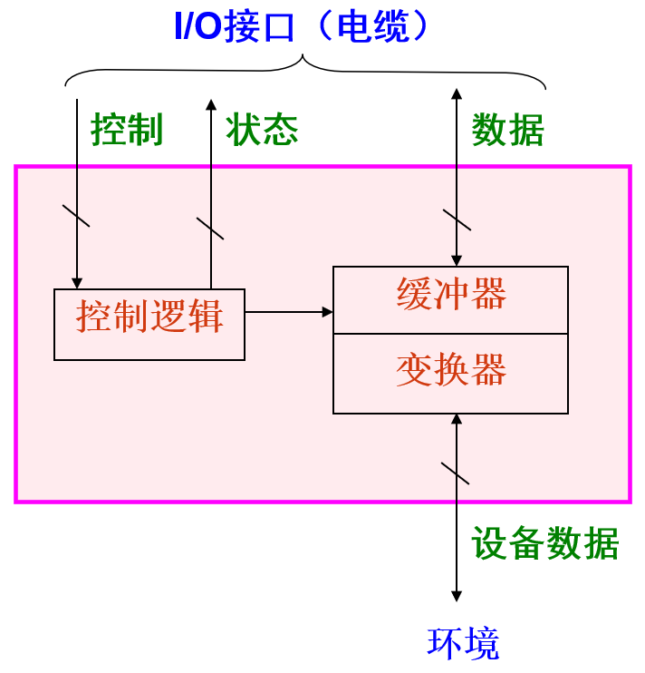
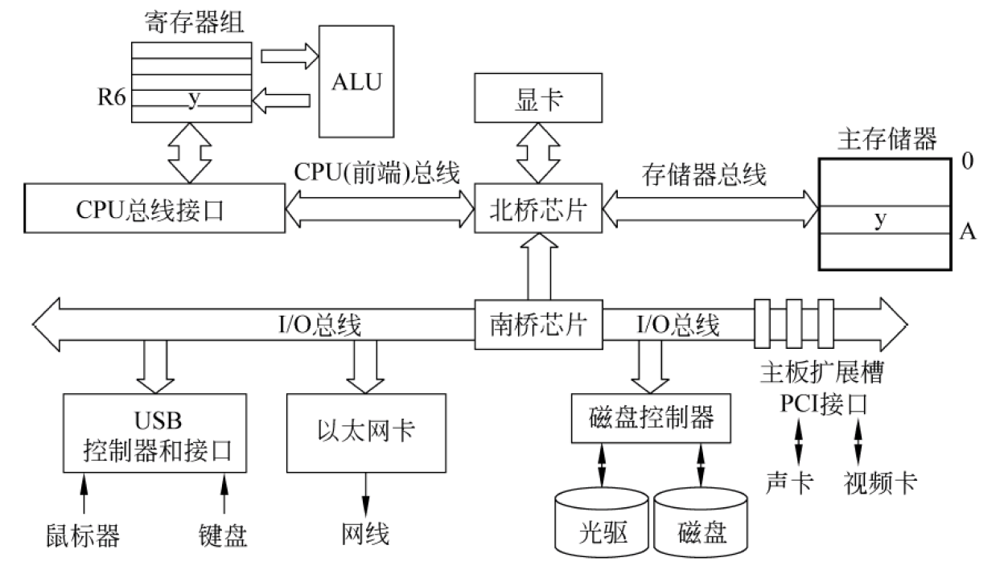
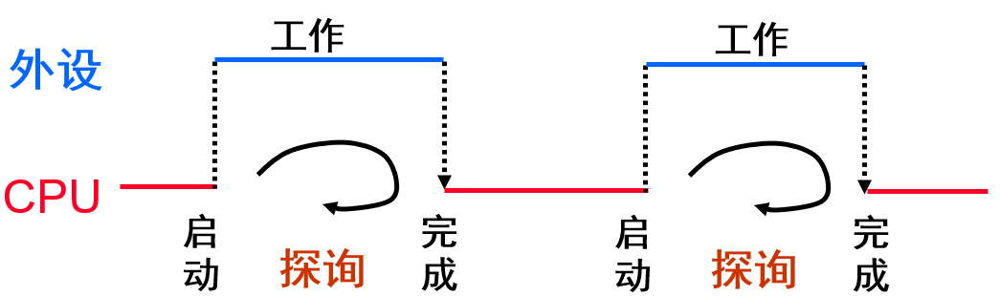
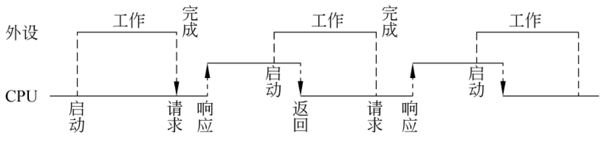
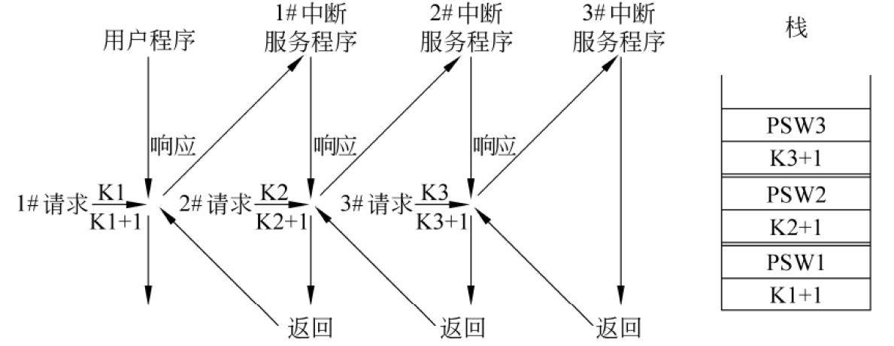

# Chapter 8 Class 1 I/O 设备和磁盘存储器

## 外部设备的通用模型

- **控制逻辑**根据**控制**信息控制设备的操作，并检测设备**状态**
- **缓冲器**用于保存交换的**数据**信息
- **变换器**用于在电信号形式（内部数据）和其他形式的设备数据之间进行转换

## 磁盘的磁道和扇区

- 磁盘表面被分为许多同心圆，每个同心圆称为一个**磁道**
  - 每个磁道都有一个编号，最外面的是 0 磁道
- 每个磁道被划分为若干**段**（段又叫**扇区**），每个扇区的存储容量为 512 字节
  - 每个扇区都有一个编号

### 增大磁盘片的容量

- 增加**磁道数目**: 提高磁道密度
- 增加**扇区数目**: 提高位密度，并采用可变扇区数

### 磁盘的访问时间

- **平均寻道时间**: 磁头寻找到指定**磁道**所需平均时间
- **平均旋转等待时间**: 指定**扇区**旋转到磁头下方所需平均时间
- **数据传输时间**

磁盘上的信息以扇区为单位进行读写，平均存取时间为：

**_T = 平均寻道时间 + 平均旋转等待时间 + 数据传输时间（忽略不计）_**

## 磁盘存储器的连接

磁盘的最小读写单位是扇区，因此，磁盘按**成批数据交换方式**进行读写，采用**直接存储器存取**（**DMA，Direct Memory Access**）方式进行数据输入输出，需用专门的 DMA 接口来控制外设与主存间直接数据交换，**数据不通过 CPU**。通常把专门用来控制总线进行 DMA 传送的接口硬件称为**DMA 控制器**

### 读一个磁盘扇区

1. **CPU**对**磁盘控制器**初始化, 然后启动**磁盘驱动器**工作
2. 磁盘控制器读相应的扇区，并按**DMA 方式**把数据送主存
3. 当 DMA 传送结束，磁盘控制器向 CPU 发出“**DMA 结束中断请求**”，要求 CPU 进行相应的后处理

## 冗余磁盘阵列

**RAID**是一种**磁盘阵列**，它是由一组**独立的磁盘**组成的，这些磁盘通过**阵列控制器**连接到计算机系统，RAID 通过**数据分布**和**冗余校验**技术，提高了**数据存取**的**速度**和**可靠性**

## 固态硬盘

**固态硬盘**（**SSD，Solid State Disk**）是一种**半导体存储器**，它采用**闪存**或**DRAM**作为存储介质

闪存的**擦写次数有限**，所以频繁擦写会降低其写入使用寿命

# Chapter 8 Class 2 总线及系统互连、I/O 接口

## 总线的分类

- **芯片内总线**：在**芯片内部**各元件之间提供连接
- **系统总线**：在**系统主要功能部件**（CPU 、MM 和各种 I/O 控制器）间提供连接
  - **单总线结构**: 将 CPU、MM 和各种 I/O 适配卡通过底板总线互连，底板总线为标准总线
  - **多总线结构**: 将 CPU、Cache、MM 和各种 I/O 适配卡用局部总线、处理器-主存总线、高速 I/O 总线、扩充 I/O 总线等互连。主要有两大类：
    - Processor-Memory Bus(Design specific or proprietary): 短而快，仅需与内存匹配，使 CPU-MM 之间达最大带宽
    - I/O Bus(Industry standard): 长而慢，需适应多种设备，一侧连接到 Processor-Memory Bus 或 Backplane Bus，另一侧连到 I/O 控制器
- **通信总线**：在主机和 I/O 设备之间或计算机系统之间提供连接

## I/O 总线,I/O 控制器与 I/O 设备的关系

- **I/O 设备**通常是物理上相互独立的设备，它们一般通过通信总线与 I/O 控制器连接
- **I/O 控制器**（I/O 接口）通过扩展卡或者南桥芯片与 I/O 总线连接
- **I/O 总线**经过北桥芯片与内存、CPU 连接

## 系统总线的组成

系统总线通常由**一组控制线、一组数据线和一组地址线**构成。也有些总线没有单独的地址线，地址信息通过数据线来传送，这种情况称为**数据/地址复用**

## 基本概念

- **总线裁决**
  - 早期：总线多是共享传输，需确定哪个设备使用总线
  - 现在：总线多是点对点传输，**无需裁决**
- **总线定时**
  - 定义总线事务中的每一步何时开始、何时结束
    - **Synchronous** (同步)：用时钟信号来确定每个步骤
    - **Asynchronous**(异步)：用握手信号来定时，前一个信号结束就是下一个信号的开始
    - **半同步**：结合使用时钟信号和握手信号来定时
- 并行/串行传输
  - **并行传输**：一个方向同时传输多位数据信号，故位与位需同步
  - **串行传输**：一个方向只传输一位数据信号，无需在位之间同步

## 总线的性能指标

- **总线宽度**
  - 总线中数据线的条数，决定了每次能同时传输的信息位数。
- **总线工作频率**
  - 早期的总线通常一个时钟周期传送一次数据，此时，工作频率等于总线时钟频率；现在有些总线一个时钟周期可以传送 2 次或 4 次数据，因此，工作频率是时钟频率的 2 倍或 4 倍。
- **总线带宽**
  - 总线的最大数据传输率
  - 对于同步总线，总线带宽计算公式：$B=W×F/N$，其中，$B$-总线带宽；$W$-总线宽度；$F$-总线时钟频率；$N$-完成一次数据传送所用时钟周期数。
  - $F/N$实际上就是总线工作频率
- **总线传送方式**
  - **非突发传送**：每个总线事务都传送地址，一个地址对应一次数据传送。
  - **突发传送**：即为成块数据传送。突发传送总线事务中，先传送一个地址，后传送多次数据，后续数据的地址默认为前面地址自动增量。

## 处理器总线

- **前端总线**（Front Side Bus，FSB）
  - **并行传输**、**同步定时方式**
  - 早期 Intel 架构使用，位于**CPU 芯片与北桥芯片**之间互连
- **QPI**（Quick Path Interconnect）总线
  - 目前在 Intel 架构中**CPU 芯片内部核之间、CPU 芯片之间、CPU 芯片与 IOH（I/O Hub）芯片之间**，都通过 QPI 总线互连
  - QPI 是基于**包交换**的**串行**、**高速点对点连接**：发送方和接收方各有时钟信号，双方同时传输数据（各有 20 条数据线），每个 QPI 数据包含 80 位，分两个时钟周期传送，每个时钟周期传两次，故每次传 20 位（16 位数据+4 位校验位），QPI 总线带宽为：每秒传送次数 ×2B×2。
  - QPI 总线的速度单位（工作频率）为 GT/s，表示每秒传送多少 G 次。

## I/O 总线

**PCI-Express 总线**

- 两个 PCI-Express 设备之间以一个链路（link）相连
- 每个链路包含多条通路（lane），可以是 1,2,4,8,16 或 32 条
- **PCI-Express×n**表示一个具有 n 条通路的 PCI-Express 链路
- 每条通路可同时发送和接受，每个数据字节被转换为 10 位信息被传输
- PCI-Express1.0 下，每条通路的发送和接受速率都是**2.5Gb/s**，故 PCI-Express×n 的带宽为：_2.5Gb/s×2×n/10=0.5GB/s×n_。

## I/O 设备的寻址方式

- **统一编址方式**（**内存映射方式**）
  - 与主存空间统一编址，将主存空间分出一部分地址给 I/O 端口进行编号
  - 地址线的高位参与片选控制逻辑
  - 无需设置专门 I/O 指令，只要用一般访存指令就可存取 I/O 端口
- **独立编址方式**（**特殊 I/O 指令方式**）
  - 不和主存单元一起编号，而是单独编号，使成为一个独立的 I/O 地址空间
  - 指令系统必须设计专门的 I/O 指令

# Chapter 8 Class 3 I/O 传输方式

## 数据交换的三种基本方式

## 程序直接控制(程序查询)方式

- 无条件传送：对简单外设定时（同步）进行数据传送
- 条件传送：Polling (轮询，查询): OS 主动查询，也称为程序查询方式
  - I/O 设备（包括 I/O 接口）将自己的状态放到一个状态寄存器中
  - OS 阶段性地查询状态寄存器中的特定状态，以决定下一步动作

特点：

- 简单、易控制、外围接口控制逻辑少
- CPU 与外设**串行工作**，**效率低**、**速度慢**，适合于**慢速设备**
- 查询开销极大 (CPU 完全在等待“外设完成”)

工作方式：完全串行工作方式或部分串行，CPU 用**100%的时间**为 I/O 服务

## 中断 I/O 方式

- 若一个 I/O 设备需要 CPU 干预，它就通过**中断请求**通知 CPU
- CPU 中止当前程序的执行，调出 OS（中断处理程序）来执行
- 处理结束后，再返回到被中止的程序继续执行
- OS 是被动调出的，也称为中断驱动 I/O 方式

中断过程

- **中断检测**（硬件实现）
- **中断响应**（硬件实现）
- **中断处理**（软件实现）

### 中断响应

中断响应是指主机发现外部中断请求，中止现行程序的执行，到调出中断服务程序这一过程

中断响应的**条件**

- CPU 处于**开中断状态**
- 在一条指令执行完
- 至少要有一个未被屏蔽的**中断请求**

中断响应过程

- 关中断
- 保护断点和程序状态
- 识别中断源

### 中断处理

典型的多重中断处理（中断服务程序）分为三个阶段：

- **先行段**（准备阶段）
  - 关中断
  - 保护现场及旧屏蔽字
  - 查明原因（软件识别中断时）
  - 设置新屏蔽字
  - 开中断
- **本体段**（具体的中断处理阶段）
  - 处在**允许中断**状态，可被新的处理优先级更高的中断打断
- **结束段**（恢复阶段）
  - 关中断
  - 恢复现场及旧屏蔽字
  - 清“中断请求”
  - 开中断
  - 中断返回

### 多重中断

中断优先级的概念：

- **中断响应优先级**: 由查询程序或硬联排队线路决定的优先权，反映**多个中断同时请求**时选择哪个响应。
- **中断处理优先级**: 由各自的中断屏蔽字来动态设定，反映**本中断与其它中断**间的关系

## DMA 输入/出方式

- 磁盘等高速外设成批地**直接和主存进行数据交换**
- 需要专门的 DMA 控制器控制总线，完成数据传送
- 当外设准备好数据后，向**DMA 控制器**发**DMA 请求信号**，**DMA 控制器**再向**CPU**发**总线请求**，CPU 让出**总线**后，由**DMA 控制器**控制总线进行传输，无需 CPU 干涉

### DMA 数据传送方式

由于 DMA 接口和 CPU**共享主存**，所以可能出现两者争用主存的现象，为使两者协调使用主存，DMA 通常采用以下三种方式进行数据传送

- **CPU 停止法**(成组传送)
  - DMA 传输时，CPU**脱离总线**，停止访问主存，直到 DMA 传送一块数据结束
  - **优点**：控制简单、适用于传输率很高的外设实现成组数据传送
  - **缺点**：
    - CPU 工作受影响。DMA 访存时 CPU 基本上处于停止状态。
    - 主存周期没有被充分利用。即使 I/O 设备高速运行，但两个数据之间的准备间隔时间也总大于一个存储周期，所以主存周期没有被充分利用
- **周期挪用法**(单字传送)
  - DMA 传输时，CPU 让出一个**总线事务周期**，由 DMA 控制总线来访问主存，传送完一个数据后立即释放总线
  - **优点**：既能及时响应 I/O 请求，又能较好地发挥 CPU 和主存的效率。这种方式下，在下一数据的准备阶段，主存周期被 CPU 充分利用。因此适合于 I/O 设备的读写周期大于主存周期的情况
  - **缺点**：每次 DMA 访存都要申请总线控制权、占用总线进行传送、释放总线，因此，会增加传输开销
- **交替分时访问法**
  - 每个存储周期分成**两个时间片**，一个给 CPU，一个给 DMA，这样在每个存储周期内，CPU 和 DMA 都可访问存储器

### DMA 控制器的功能

DMA 数据传送过程由 DMA 接口的控制逻辑完成，所以 DMA 接口也称 DMA 控制器。其功能为：

- **请求**。能接收外设发来的“DMA 请求”信号，并能向 CPU 发“总线请求”信号。
- **响应**。当 CPU 发出“总线响应”信号响应请求后，能接管对总线的控制。
- **修改主存地址**。能在地址线上给出主存地址，并自动修改主存地址。
- **识别传送方向**。能识别传送方向以在控制线上给出正确的读写控制信息。
- **确定传送数据个数**。
- **能发出 DMA 结束信号**。引起一次 DMA 中断，进行数据校验等一些后处理。

DMA 操作步骤

- DMA 控制器的预置(初始化)----软件实现
  - 准备内存、设置参数、启动外设
- DMA 数据传送----硬件实现
  - DMA 请求：选通，DMA 请求，总线请求
  - DMA 响应：总线响应(CPU 让出总线)，DMA 响应
  - DMA 传送：DMA 控制总线进行数据传送
- DMA 结束处理----软件实现
  - 根据计数值为“0”，发出 DMA 结束信号去接口控制产生 DMA 中断请求信号，转入中断服务程序，做一些数据校
    验等后处理工作。

## I/O 子系统

- 用户层 I/O 软件（I/O 函数调用系统调用）
- 与设备无关的操作系统 I/O 软件
- 设备驱动程序
- I/O 中断处理程序
