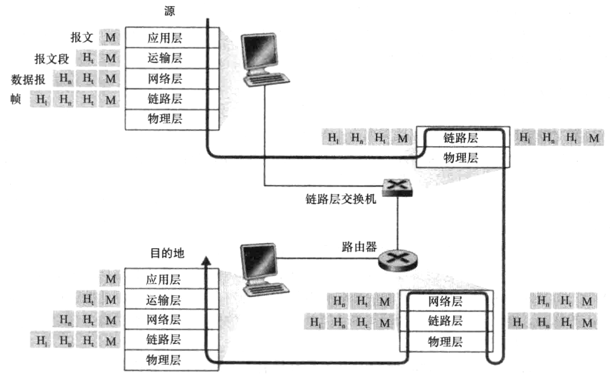

# 计算机和因特网

- 与因特网相连的设备称为**\*主机**或**端系统**
- **端系统**通过**通信链路**和**分组交换机**连接到一起
  - **通信链路**的传输速率以**比特每秒**计量
- **主机**之间数据交换通过**分组**(一种信息包)实现
  - **分组**经过的一系列**通信链路**和**分组交换机**称为**路径**
- 因特网的主要协议是**TCP**(传输控制协议)和**IP**(网际协议)

## 网络边缘

**边缘路由器**：连接**端系统**到因特网的路由器, 任何端系统连接到因特网都第一个经过边缘路由器

## 网络核心

### 分组交换

端系统将长报文划分为较短的数据段, 称为**分组**, 在**分组交换机**之间传输

源端系统发送一个$L$比特的分组, 链路传输速率为$R$比特每秒, 则传输该分组的时间为$L/R$秒

- **存储转发传输**: 分组交换机必须接收到整个分组后才能开始向**输出链路**传输该分组的第一个比特
- **排队时延**: 某个分组需要传输到一条链路上, 但该链路正忙于传输其他分组, 则该分组必须在**输出链路**的**输出缓存**中等待, 这种时延称为**排队时延**
- **分组丢失**: 如果到达**输出缓存**的分组发现该缓存已满, 会出现**分组丢失**, 到达的分组或者正在排队的分组之一将被丢弃
- **转发表**: 每个端系统具有一个**IP 地址**, 端系统发出的分组包含目的地的**IP 地址**, 路由器通过**转发表**将目的地**IP 地址**映射到输出链路

### 电路交换

电路交换会在端系统会话期间, 预留通信所需要的资源

## 分组交换网

### 时延

- **处理时延**: 检查分组首部和决定将该分组导向何处所需的时间
- **排队时延**: 分组在**输出链路**上等待传输的时间
- **传输时延**: 分组从**输出链路**传输到**输入链路**所需的时间
  - 传输时延 = 分组长度 / 传输速率
- **传播时延**: 电磁波在传输媒介上传播所需的时间
  - 传播时延 = 传输距离 / 电磁波在传输媒介上传播速率

令$d_{proc},d_{queue},d_{trans},d_{prop}$分别表示处理时延, 排队时延, 传输时延, 传播时延, 则总时延为

$$
d_{nodal}=d_{proc}+d_{queue}+d_{trans}+d_{prop}
$$

#### 排队时延

设$a$为每秒到达队列的分组数, $R$为传输速率, $L$为分组长度, 则比值$La/R$称为**流量强度**, 应当控制流量强度, 使得$La/R<1$, 以避免排队时延无限增长

### 端到端时延

假设源主机与目的主机之间有$N-1$个路由器, 此时网络无阻塞, 则端到端时延为

$$
d_{end-end}=N(d_{proc}+d_{trans}+d_{prop})
$$

式中有$d_{trans}=L/R$, $L$为分组长度, $R$为传输速率

## 协议层次及其服务模型

因特网的协议由五个层次构成, 自下而上分别为**物理层**, **数据链路层**, **网络层**, **运输层**, **应用层**

### 应用层

应用层协议定义了运行在不同端系统上的应用程序进程如何相互传递报文

- **HTTP**: 超文本传输协议, 用于从 Web 服务器传输 Web 对象到 Web 浏览器的传送协议
- **SMTP**: 简单邮件传送协议, 用于发送和接收电子邮件
- **FTP**: 文件传送协议, 用于在主机之间传输文件
- **DNS**: 域名系统, 用于将主机名转换为 IP 地址

端系统之间通过应用层协议交换信息的分组称为**报文**

### 运输层

运输层协议定义了运行在不同端系统上的应用程序进程如何相互传递报文

- **TCP**: 传输控制协议, 提供了面向连接的服务, 保证了应用程序进程之间可靠的数据传输
- **UDP**: 用户数据报协议, 提供了无连接的服务, 不保证应用程序进程之间可靠的数据传输

运输层分组称为**报文段**

### 网络层

负责将称为**数据报**的网络层分组从一台主机移动到另一台主机

- **IP**: 网际协议, 定义了分组交换机和端系统如何创建和发送**数据报**, 以及路由器如何将**数据报**从源端系统移动到目的端系统
- 其他路由选择协议

### 链路层

链路层负责将分组从一个节点移动到相邻节点, 网络层必须依赖链路层提供的服务, 链路层分组称为**帧**

### 物理层

物理层负责将**比特**从一个节点移动到相邻节点

### 封装

如图所示, 一个**应用层报文**在传输到另一个端系统之前, 会被**运输层协议**添加一个**运输层首部**, 从而形成一个**运输层报文段**, 然后再添加一个**网络层首部**, 形成一个**网络层数据报**, 然后再添加一个**链路层首部**, 形成一个**链路层帧**, 最后由**物理层**将**帧**中的**比特**从一个节点移动到相邻节点

因此在每一个分组都用两种类型的字段, 即**首部**和**有效载荷**



# 应用层

## 网络应用程序体系结构

- **客户-服务器体系结构**: 服务器提供一种服务, 客户通过向服务器发送请求来使用该服务
- **P2P 体系结构**: 对等方直接通信, 对等方之间既是客户也是服务器

## 进程通信

- **进程**: 运行在端系统上的程序
- **套接字**: 进程通过套接字向网络**发送报文**和从网络**接收报文**
- **进程寻址**: 一个进程通过一个**IP 地址**和一个**端口号**来标识, 该进程的**套接字**由该**IP 地址**和**端口号**唯一确定

## 可供应用程序使用的运输服务

- **可靠数据传输**: 保证数据从一个进程传输到另一个进程, 无差错, 无丢失, 无重复, 无失序
  - 即使不提供可靠数据传输, 部分**容忍丢失的应用**也可以接受
- **吞吐量**: 应用程序希望以某个速率传输数据
  - **带宽敏感**的应用程序需要尽快传输数据, 而**弹性应用**则可以容忍较低的吞吐量
- **定时**: 应用程序希望数据在某个时间之前到达
  - **实时应用程序**需要定时, 而**非实时应用程序**则不需要定时
- **安全性**: 应用程序希望数据在传输过程中不被窃听或篡改

## 因特网提供的运输服务

部分网络应用的要求:

|  应用程序  | 数据丢失 |      带宽       | 时间敏感 |
| :--------: | :------: | :-------------: | :------: |
|  文件传输  | 不能丢失 |      弹性       |    不    |
|  电子邮件  | 不能丢失 |      弹性       |    不    |
|  Web 文档  | 不能丢失 | 弹性(几个 kbps) |    不    |
|  视频会议  | 容忍丢失 |    kbps~Mbps    |    是    |
| 音频/视频  | 容忍丢失 |    kbps~Mbps    |    是    |
| 交互式游戏 | 容忍丢失 |    几个 kbps    |    是    |
|  即时讯息  | 不能丢失 |      弹性       |  不/是   |

### TCP

**TCP**服务模型包括**面向连接的服务**和**可靠数据传输服务**

- **面向连接的服务**: 在两个端系统之间传输数据之前, 必须先建立**TCP 连接**, 之后才能传输数据, 传输结束后, 必须释放**TCP 连接**
- **可靠数据传输服务**: 依赖 TCP 可以做到无差错, 无丢失, 无重复, 无失序
- **流量控制**: 当发送方和接收方之间出现网络拥堵时, TCP 通过**流量控制**机制来防止发送方发送过多的数据

### UDP

**UDP**服务模型包括**无连接的服务**和**不可靠数据传输服务**, 也没有流量控制和拥塞控制

### 部分互联网应用的应用层协议和运输协议

|   应用程序   |  应用层协议  | 运输层协议 |
| :----------: | :----------: | :--------: |
|   文件传输   |     FTP      |    TCP     |
|   电子邮件   |     SMTP     |    TCP     |
|     Web      |     HTTP     |    TCP     |
| 远程终端访问 |    Telnet    |    TCP     |
|    流媒体    |     HTTP     |    TCP     |
|  互联网电话  | SIP/RTP/专用 |  TCP/UDP   |

## Web 和 HTTP

### HTTP

Web 的应用层协议是**HTTP**, HTTP 由两个程序实现, 一个是**客户端程序**, 一个是**服务器程序**, 两个程序运行在不同的端系统上, 通过交换**HTTP 报文**进行会话

**Web 页面**由若干对象组成, 每个对象都是一个文件, 一个**Web 页面**可能包含多个**HTML 文件**, 一个**HTML 文件**可能包含多个**对象**, 一个**对象**可能是一个**HTML 文件**, 也可能是一个**JPEG 图像文件**, 也可能是一个**视频片段**, 也可能是一个**包含音频的视频片段**

**HTTP**定义了**Web 客户**如何向**Web 服务器**请求**Web 页面**, 以及**服务器**如何向**客户**传送**Web 页面**, 运输协议是**TCP**

**HTTP**是一个**无状态协议**, 即**HTTP 服务器**不会记录**客户**的任何信息, 也不会保存之前的请求信息, 因此**HTTP 服务器**不能根据之前的请求信息来处理当前的请求

### 非持续连接和持续连接

如果所有客户请求都需要建立一个新的**TCP 连接**, 则称为**非持续连接**, 如果允许客户和服务器之间的多个请求和响应共享一个**TCP 连接**, 则称为**持续连接**

**HTTP**默认模式是**带流水线的持续连接**, 即**客户**可以在一个**TCP 连接**上连续发送多个请求, 而不需要等待响应, 但一条连接上的请求和响应必须按照发送的顺序进行, 如果一条连接一段时间没有使用, 则会被关闭

### HTTP 报文

如下为一个典型的**HTTP 报文**

```http
GET /somedir/page.html HTTP/1.1
Host: www.someschool.edu
Connection: close
User-agent: Mozilla/5.0
Accept-language: fr
```
