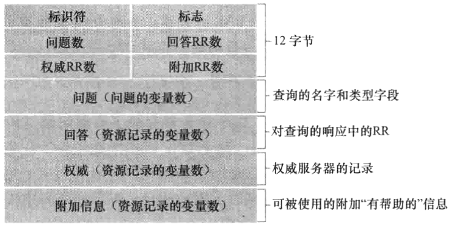

# 应用层

## 网络应用程序体系结构

- **客户-服务器体系结构**: 服务器提供一种服务, 客户通过向服务器发送请求来使用该服务
- **P2P 体系结构**: 对等方直接通信, 对等方之间既是客户也是服务器

## 进程通信

- **进程**: 运行在端系统上的程序
- **套接字**: 进程通过套接字向网络**发送报文**和从网络**接收报文**
- **进程寻址**: 一个进程通过一个**IP 地址**和一个**端口号**来标识, 该进程的**套接字**由该**IP 地址**和**端口号**唯一确定

## 可供应用程序使用的运输服务

- **可靠数据传输**: 保证数据从一个进程传输到另一个进程, 无差错, 无丢失, 无重复, 无失序
  - 即使不提供可靠数据传输, 部分**容忍丢失的应用**也可以接受
- **吞吐量**: 应用程序希望以某个速率传输数据
  - **带宽敏感**的应用程序需要尽快传输数据, 而**弹性应用**则可以容忍较低的吞吐量
- **定时**: 应用程序希望数据在某个时间之前到达
  - **实时应用程序**需要定时, 而**非实时应用程序**则不需要定时
- **安全性**: 应用程序希望数据在传输过程中不被窃听或篡改

## 因特网提供的运输服务

部分网络应用的要求:

|  应用程序  | 数据丢失 |      带宽       | 时间敏感 |
| :--------: | :------: | :-------------: | :------: |
|  文件传输  | 不能丢失 |      弹性       |    不    |
|  电子邮件  | 不能丢失 |      弹性       |    不    |
|  Web 文档  | 不能丢失 | 弹性(几个 kbps) |    不    |
|  视频会议  | 容忍丢失 |    kbps~Mbps    |    是    |
| 音频/视频  | 容忍丢失 |    kbps~Mbps    |    是    |
| 交互式游戏 | 容忍丢失 |    几个 kbps    |    是    |
|  即时讯息  | 不能丢失 |      弹性       |  不/是   |

### TCP

**TCP**服务模型包括**面向连接的服务**和**可靠数据传输服务**

- **面向连接的服务**: 在两个端系统之间传输数据之前, 必须先建立**TCP 连接**, 之后才能传输数据, 传输结束后, 必须释放**TCP 连接**
- **可靠数据传输服务**: 依赖 TCP 可以做到无差错, 无丢失, 无重复, 无失序
- **流量控制**: 当发送方和接收方之间出现网络拥堵时, TCP 通过**流量控制**机制来防止发送方发送过多的数据

### UDP

**UDP**服务模型包括**无连接的服务**和**不可靠数据传输服务**, 也没有流量控制和拥塞控制

### 部分互联网应用的应用层协议和运输协议

|   应用程序   |  应用层协议  | 运输层协议 |
| :----------: | :----------: | :--------: |
|   文件传输   |     FTP      |    TCP     |
|   电子邮件   |     SMTP     |    TCP     |
|     Web      |     HTTP     |    TCP     |
| 远程终端访问 |    Telnet    |    TCP     |
|    流媒体    |     HTTP     |    TCP     |
|  互联网电话  | SIP/RTP/专用 |  TCP/UDP   |

## Web 和 HTTP

Web 的应用层协议是**HTTP**, HTTP 由两个程序实现, 一个是**客户端程序**, 一个是**服务器程序**, 两个程序运行在不同的端系统上, 通过交换**HTTP 报文**进行会话

**Web 页面**由若干对象组成, 每个对象都是一个文件, 一个**Web 页面**可能包含多个**HTML 文件**, 一个**HTML 文件**可能包含多个**对象**, 一个**对象**可能是一个**HTML 文件**, 也可能是一个**JPEG 图像文件**, 也可能是一个**视频片段**, 也可能是一个**包含音频的视频片段**

**HTTP**定义了**Web 客户**如何向**Web 服务器**请求**Web 页面**, 以及**服务器**如何向**客户**传送**Web 页面**, 运输协议是**TCP**

**HTTP**是一个**无状态协议**, 即**HTTP 服务器**不会记录**客户**的任何信息, 也不会保存之前的请求信息, 因此**HTTP 服务器**不能根据之前的请求信息来处理当前的请求

### 非持续连接和持续连接

如果所有客户请求都需要建立一个新的**TCP 连接**, 则称为**非持续连接**, 如果允许客户和服务器之间的多个请求和响应共享一个**TCP 连接**, 则称为**持续连接**

**HTTP**默认模式是**带流水线的持续连接**, 即**客户**可以在一个**TCP 连接**上连续发送多个请求, 而不需要等待响应, 但一条连接上的请求和响应必须按照发送的顺序进行, 如果一条连接一段时间没有使用, 则会被关闭

### 报文

#### 请求报文

如下为一个典型的**HTTP 请求报文**

```http
GET /somedir/page.html HTTP/1.1
Host: www.someschool.edu
Connection: close
User-agent: Mozilla/5.0
Accept-language: fr
```

- 第一行为**请求行**, 由三个字段组成, 分别为**方法字段**, **URL 字段**, **HTTP 版本字段**
- 第二行为**首部行**, 由多个**首部字段**组成, 每个**首部字段**都是一个**名/值对**, 用冒号分隔, 用换行符结束
  - **Host**: 指定服务器的主机名
  - **Connection**: 指定客户端和服务器之间是否保持连接
  - **User-agent**: 指定客户端的类型, 例如浏览器类型
  - **Accept-language**: 指定客户端接受的语言类型
- 之后为空行, 用来分隔**首部**和**实体**
- 之后为**实体**, 由**实体主体**组成

#### 响应报文

如下为一个典型的**HTTP 响应报文**

```http
HTTP/1.1 200 OK
Connection: close
Date: Tue, 09 Aug 2011 15:44:04 GMT
Server: Apache/2.2.3 (CentOS)
Last-Modified: Tue, 09 Aug 2011 15:11:03 GMT
Content-Length: 6821
Content-Type: text/html

(data data data data data ...)
```

- 第一行为**状态行**, 由三个字段组成, 分别为**HTTP 版本字段**, **状态码字段**, **状态码短语字段**
- 第二行为**首部行**, 由多个**首部字段**组成, 每个**首部字段**都是一个**名/值对**, 用冒号分隔, 用换行符结束
  - **Connection**: 指定客户端和服务器之间是否保持连接
  - **Date**: 指定响应报文产生的时间
  - **Server**: 指定服务器的类型
  - **Last-Modified**: 指定被请求对象的最后修改时间
  - **Content-Length**: 指定被请求对象的长度
  - **Content-Type**: 指定被请求对象的类型
- 之后为空行, 用来分隔**首部**和**实体**
- 之后为**实体**, 由**实体主体**组成, 类型由**Content-Type**指定

部分**HTTP 状态码**:

| 状态码 | 状态码短语 | 含义                                                                |
| :----: | :--------: | :------------------------------------------------------------------ |
|  200   |     OK     | 请求成功                                                            |
|  301   |   Moved    | 被请求的对象已经被永久移走, 新的 URL 在响应报文的 Location 首部给出 |
|  400   |  Bad Req   | 请求报文存在语法错误                                                |
|  404   | Not Found  | 服务器上无法找到请求的对象                                          |
|  505   | HTTP Vers  | 服务器不支持请求报文中所指定的 HTTP 版本                            |

### Cookies

**Cookie**是**HTTP**的一个**无状态**扩展, 用来记录**服务器**和**客户**之间的状态

**Cookie**的构成:

- **响应报文**中的**cookie**首部行
- **请求报文**中的**cookie**首部行
- 保存在**客户端**的**cookie**文件, 由浏览器管理
- 保存在**Web 服务器**的**cookie**文件, 由服务器管理

**Cookie**的工作流程:

1. **客户**向**服务器**发送**请求报文**
2. **服务器**向**客户**发送**响应报文**, 其中包含**Set-Cookie**首部行
3. **客户**向**服务器**发送**请求报文**, 其中包含**cookie**首部行, 该首部行包含**服务器**之前发送的**cookie**首部行中的**cookie**信息
4. 此后, 每次**客户**向**服务器**发送**请求报文**, 都会包含**cookie**首部行, 该首部行包含**服务器**之前发送的**cookie**首部行中的**cookie**信息

### Web 缓存

**Web 缓存**是一种**临时存储**的**Web 文档**的**HTTP**仓库, 位于**客户端**和**服务器**之间, 用来减少**客户**访问**服务器**的次数, 从而减少**Web 流量**

**Web 缓存**的工作流程:

1. **客户**向**服务器**发送**请求报文**
2. 如果**Web 缓存**中有**请求的对象**, 则**Web 缓存**向**客户**发送**响应报文**
3. 如果**Web 缓存**中没有**请求的对象**, 则**Web 缓存**向**服务器**发送**请求报文**, 将**服务器**返回的**响应报文**存储在**Web 缓存**中, 然后向**客户**发送**响应报文**

### 条件 GET

为了验证**Web 缓存**中的**对象**是否过期, **Web 缓存**可以向**服务器**发送**条件 GET**请求, 格式为:

- 类型为**GET**的**请求报文**
- 包含**If-Modified-Since**首部行, 其值为**Web 缓存**中**对象**的最后修改时间

如果**服务器**上的**对象**没有被修改, 则**服务器**向**Web 缓存**发送**304 Not Modified**响应报文, 否则, **服务器**向**Web 缓存**发送**200 OK**响应报文, 并将**对象**的新版本包含在**响应报文**中

## FTP

**FTP**是一个**文件传输协议**, 用来在**客户**和**服务器**之间传输**文件**

**FTP**使用**TCP**作为运输协议, 有两个**TCP**连接, 一个用来传输**控制信息**, 一个用来传输**文件**

**FTP**服务器在整个会话期间都保留**客户**的**状态信息**, 称为**FTP 会话**

## 电子邮件

### 电子邮件系统的组成

- **用户代理**: 电子邮件客户端, 用来编写, 阅读, 发送, 接收电子邮件
- **邮件服务器**: 电子邮件服务器, 用来接收, 存储, 转发电子邮件
- **简单邮件传输协议(SMTP)**: 用来在**邮件服务器**之间传输电子邮件

### SMTP

典型的**电子邮件系统**工作流程:

1. 从发送方的**用户代理**向发送方的**邮件服务器**发送邮件, 邮件存放在**邮件服务器**的**报文队列**中
2. 发送方的**邮件服务器**发现**报文队列**中有新的邮件, 从**报文队列**中取出邮件
3. 发送方的**邮件服务器**向接收方的**邮件服务器**发送邮件
4. 接收方的**用户代理**从接收方的**邮件服务器**接收邮件

### 邮件访问协议

**邮件访问协议**用来从**邮件服务器**中取出邮件:

#### POP3

**POP3**是**邮件访问协议**的一种, 分三个阶段工作:

1. **特许阶段**: **用户代理**向**邮件服务器**发送**用户名**和**密码**, 以验证用户身份
2. **事务处理阶段**: **用户代理**向**邮件服务器**发送**命令**, 用来列出邮件, 读取邮件, 删除邮件等
   - 事务处理有两种配置: **下载并删除**和**下载并保留**
3. **更新阶段**: **用户代理**向**邮件服务器**发送**QUIT**命令, 用来结束**POP3**会话

#### IMAP

**IMAP**是**邮件访问协议**的一种, 与**POP3**不同, **IMAP**服务器把每个报文和一个文件夹联系起来, 用户可以创建文件夹, 或者将邮件移动到其他文件夹

#### HTTP

**HTTP**可以使用**Web 浏览器**作为**用户代理**访问**邮件服务器**

## DNS

**DNS**是一个**分布式数据库**, 用来将**主机名**转换为**IP 地址**, 运行在**UDP**上, 使用**53**端口

**DNS**所提供的服务:

- **主机别名**: 一个主机允许有多个别名
  - 调用**DNS**的**应用程序**可以使用**主机别名**来访问**主机**
- **邮件服务器别名**: 一个邮件服务器可能有多个别名
  - 调用**DNS**的**邮件应用程序**可以使用**邮件服务器别名**来访问**邮件服务器**
- **负载分配**: 繁忙的站点可能将服务分布在多台服务器上, 每个服务器都有一个**IP 地址**, 但这些**IP 地址**都对应同一个**主机名**
  - 调用**DNS**的**应用程序**可以使用**主机名**来访问**服务器**, **DNS**可以将**主机名**映射到多个**IP 地址**, 从而实现**负载分配**

### 工作机理

**DNS**采用**分布式数据库**的方式, 以层次方式组织, 有三种类型的**DNS 服务器**: **根 DNS 服务器**, **顶级域(TLD) DNS 服务器**, **权限 DNS 服务器**

- **根 DNS 服务器**: 位于层次结构的顶部, 负责管理**顶级域(TLD) DNS 服务器**
- **顶级域(TLD) DNS 服务器**: 负责管理顶级域名, 例如`com`, `org`, `net`, `edu`, `gov`等, 以及国家顶级域名, 例如`cn`, `uk`, `fr`等
- **权限 DNS 服务器**: 负责管理特定的主机或域名
- **本地 DNS 服务器**: 由**ISP**提供, 用来为**本地主机**提供**DNS**服务

为了改善**DNS**的性能, **DNS**采用了**缓存**机制, **DNS 服务器**会缓存**DNS 查询**的结果, 以便下次查询时直接使用

### 记录

**DNS 服务器**存储了**资源记录(RR)**, 每个**资源记录**包含一个**主机名**和一个**IP 地址**之间的映射, 每个**DNS 回答报文**包含若干条**资源记录**

一条**资源记录**包含如下字段: `(Name, Value, Type, TTL)`, 根据`Type`字段的不同, 可以分为以下几种类型:

| Type  |        Name        |             Value              |
| :---: | :----------------: | :----------------------------: |
|   A   |       主机名       |      主机名对应的 IP 地址      |
|  NS   |        域名        |  该域名对应的权威 DNS 服务器   |
| CNAME |    主机名(别名)    |      别名对应的规范主机名      |
|  MX   | 邮件服务器名(别名) | 别名对应的邮件服务器规范主机名 |

`TTL`字段指定了**资源记录**的生存时间

### 报文

格式如下:



- 前 12 个字节为**首部**
  - **标识符**: 占两个字节, 用来标识一个**查询**, 由**本地 DNS 服务器**生成, 用来匹配**回答报文**和**查询报文**
  - **标志**: 占两个字节, 包含若干标志位
  - 后四个字段记录的一些长度信息
- **问题**字段: 包含正在进行的查询信息
- **回答**字段: 包含**回答报文**中的**资源记录**, 可以有多条, 因为一个主机可以有多个**IP 地址**

## P2P
