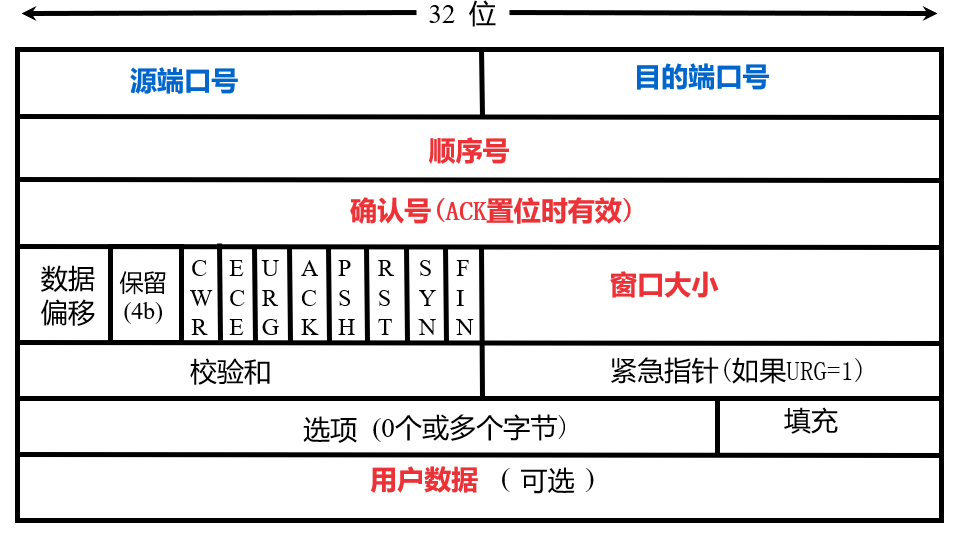

# 数据链路层

## 可靠数据传输(TCP)

### 等停协议(Stop-and-Wait)

- **ACK(acknowledgement)**: 确认帧
  - 发送方在发送每一帧之后都要等待接收方的**确认帧**, 才能发送下一帧
- **NAK(negative acknowledgement)**: 否定确认帧
  - 接收方在接收到损坏的帧之后, 会给发送方发送一个**否定确认帧**, 发送方在接收到这个帧之后, 会重传这一帧
- **SEQ(sequence number)**: 序号
  - 发送方在发送每一帧之前都要给这一帧分配一个序号, 接收方在接收到这一帧之后, 会给发送方发送一个确认帧, 这个确认帧中包含了这一帧的序号
- **捎带确认**: 接收方在接收到一帧之后, 会在发送确认帧的同时, 把下一帧的数据也发送给发送方
- **发送/接收窗口**: 发送方/接收方允许发送的帧的数量
- **GBN(Go-Back-N)**: 接收方只允许顺序接收时, 发送方如果未收到某一帧的 ACK, 会从这一帧开始全部重传
  - 这种情况下接收方的接收窗口大小为 1
- **选择重传**: 接收方允许乱序接收时, 发送方如果未收到某一帧的 ACK, 只会重传这一帧
  - 这种情况下接收方的接收窗口大小大于 1
- 假设帧序号使用$m$位二进制数表示, 则发送方的发送窗口大小为$2^m-1$, 接收方的接收窗口大小为$2^m-1$

### 概述

- **套接字(socket)**: 通信的端点
  - 一个套接字由`IP 地址`和 16 位的`端口号`组成, 其中`IP 地址`用于标识主机, `端口号`用于标识主机上的应用程序, 0~1023 的端口号为**知名端口号**, 分配给标准服务
- **MTU(Maximum Transmission Unit)**: 最大传输单元
  - 一次能够发送的最大数据量
- **MSS(Maximum Segment Size)**: 最大分段大小
  - 一次能够发送的最大数据量, 不包括 TCP 头部和 IP 头部
- **TCP 首部**: 20 字节
  - **源端口号**: 16 位
  - **目的端口号**: 16 位
  - **序号**: 32 位
  - **确认号**: 32 位
  - **首部长度**: 4 位
  - **保留**: 6 位
  - **标志**: 6 位
    - **URG**: 紧急指针有效
    - **ACK**: 确认序号有效
    - **PSH**: 接收方应该尽快将这个报文段交给应用层
    - **RST**: 重置连接
    - **SYN**: 同步序号用于建立连接
    - **FIN**: 发送方已经没有数据要发送了
  - **窗口大小**: 16 位
  - **校验和**: 16 位
  - **紧急指针**: 16 位
  - **选项**: 0~40 字节
  - **填充**: 0~8 字节
    
