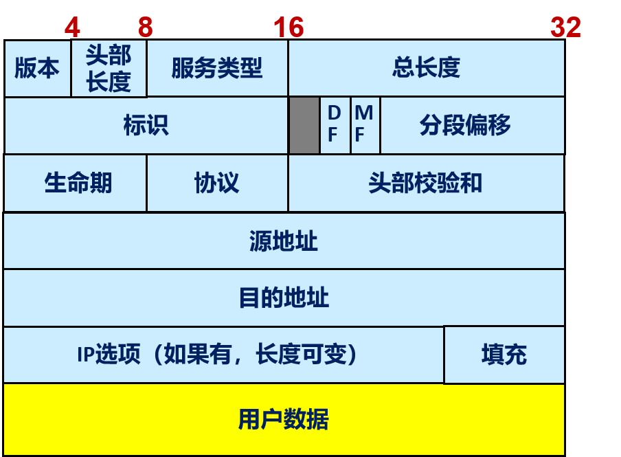
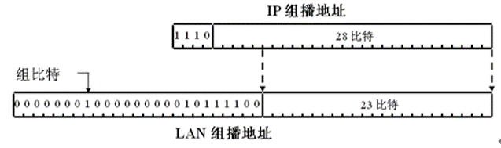

# 网络层: 网络互连

## Internet 的工作方式

在链路层提供的服务基础上通过**多跳传输**将数据递交到最终目的地

路由器的

- **数据平面**: 负责转发数据包
- **控制平面**: 维护路由表, 选择最佳路径

### 两种工作方式

- **虚电路**: 在通信前建立一条虚电路, 通信结束后释放
  - 分为**连接建立**, **数据传输**, **连接释放**三个阶段
  - 仅仅在最开始进行一次**路由选择**
- **数据报**: 无需建立连接, 传输时决定路由

### 虚电路

- 一条虚电路途中经过多个中间节点, 每个节点需要维护虚电路上的**上一节点**和**下一节点**信息
- 每个链路上可能会有多条虚电路通过, 要能够区分收到的分组属于**哪个虚电路**, 要转发给哪个下一跳节点

为了区分虚电路, 需要在引入**虚电路号**, 虚电路号的确定有两种方式

- **全局唯一**: 节点之间需要维护一个**全局的虚电路号表**, 开销大
- **链路唯一**: 每条链路上的虚电路号都是唯一的, 用于确定下一跳
  - 建立和释放虚电路的协议称为**信令协议**
  - **交换虚电路(SCV)**: 由交换机之间的信令协议建立的虚电路
  - **永久虚电路(PVC)**: 由网络管理员配置的虚电路

对于一条虚电路, 每个节点需要维护:

- **前一节点**
- **到来链路**的虚电路号
- **下一节点**
- **出去链路**的虚电路号

当某个节点收到分组时, 查找虚电路表, 确定下一跳节点和虚电路号, 将分组的**到来链路**的虚电路号替换为**出去链路**的虚电路号, 转发给下一跳节点, 称之为**标签交换(MPLS)**

### 数据报和虚电路

|                    | 数据报                                             | 虚电路                                   |
| ------------------ | -------------------------------------------------- | ---------------------------------------- |
| 路由选择           | 每个分组独立选择路由                               | 仅在连接建立时选择路由                   |
| 延时               | 分组传输延时                                       | 建立连接的延时 + 分组传输延时            |
| **节点失败影响**   | 除了崩溃时正由该节点转发的分组外, 其他分组不受影响 | 该节点崩溃时, 该节点上的所有虚电路都失效 |
| 拥塞控制和服务质量 | 难, 可能失序                                       | 可进行准入控制, 可进行差错和流量控制     |
| 地址(头部)开销     | 每个分组包含源端和目的端地址                       | 每个分组包含虚电路号                     |
| **状态信息**       | 无                                                 | 需要维护虚电路表                         |

## 互联网的路由方式

### 逐跳路由

每个路由器只知道**下一跳**的地址

- 可能短暂出现环路
- **单播路由**: 下一跳节点只有一个
- **多播路由**: 下一跳节点有多个

### 源路由

**发送者**决定途中需要经过的节点, 记录在分组的**首部**中

- 可以通过第三方获得网络拓扑信息, 决定路径
- 可以通过扩散等动态发现协议发现路径
- 首部长度限制了路径长度
- 适用**流量工程**, 可以根据网络拓扑信息选择最优路径
- **严格源路由**: 路径中的每个节点都必须是指定的节点
- **松散源路由**: 允许通过不在列表中的节点

## IP 协议

**IP**只要求下层物理网络提供**基本的数据递交功能**以及**MTU**一般不低于 576 字节, 提供**不可靠无连接**方式的数据递交服务:

- **单播**: 一到一
- **组播/多播**: 一到多或者多到多
- **广播**: 一到所有
- **联播/任播**: 一到多中任意一个

IP 协议**分组格式**的设计考虑到:

- 无连接方式, 提供转发支持: **源地址**和**目的地址**
- 多个高层协议: **协议号**(ICMP 0x01, TCP 0x06, UDP 0x11)
- 路由回路: **生命期 TTL**字段, 每经过一个节点转发时, TTL 减 1, 为 0 时丢弃, 通过 ICMP 协议发送通知给发送者, 目的地收到 TTL=0 的分组不会丢弃
- 分组出错: **头部检验和**字段, 每跳都要重新计算
- MTU 限制: 分段和重组
- 扩展性: 支持 IP 选项, 固定+可选+数据, 通过头部长度确定可选部分. 总长度和头部长度确定数据部分的长度
- 服务质量: 服务类型(ToS)字段, 早期忽略, 后为区分服务码字 DSCP 和拥塞通知相关字段

IP 分组的格式如下:

IP 分组的总长度, 包括头部和数据部分, 最大 65535 字节

- **头部长度**: 占 4 位, 以 4 字节为单位, 最大 4\*15=60 字节
- **IP 选项**: 长度可变, 最大 40 字节
- **填充**: 用于保证头部长度按 4 字节对齐
- **生命期(TTL)**: 8 位, 最大 255
- **头部检验和**: 采用 Internet 检验和算法
  - 16-bit word 反码加法求和后取反码
  - 检验: 反码加法后验证是否为全 1
  - 途中路由器转发时 TTL 减 1, 需要重新计算检验和
- **服务类型(Type of Service)**: 早期忽略, 一般为 0
  - 前面 6 个比特用于区分服务, 属于哪个负载类
  - 后面 2 个比特用于 ECN

### IP 选项

- **单字节选项**: 仅仅包含选项类型
  - type = 0: 选项结束
  - type = 1: 选项之间填充
- **多字节选项**: 采用 TLV 方式
  - type 的第一个 bit 称为**copied**, 为 1 时表示该选项需要复制到分段中的每个分段
- 记录路由(RR)选项: 用于记录分组经过的路由器的 IP 地址
  - 指针给出目前尚未使用的第一个 IP 地址槽的偏移, 初始为 4
- 源路由选项: 用于指定分组的路由
  - 严格源路由(type = 9), 松散源路由(type = 3)
- 时间戳选项: 用于记录分组经过的路由器的时间戳

### 分段和重组

IP 分组的总长度, 包括头部和数据部分, 最大 65535 字节, 但是分组传输经过的物理网络都有**MTU**, 一般不低于 576 字节, 超过 MTU 的分组需要分段

- 逐条重组: 可能发生多次分段和重组
- 接收方重组: 途中可以分段, 接收方重组

IP 采用了**接收方重组**的方式, 接收方要求可以处理长度至少为 576 字节的分段

端和目的端之间会发送多个 IP 分组, 为了区分分段属于哪个分组, 需要引入**分段标识**用于标识原始分组, 以及**分段偏移**(13-bit)用于标识分段在原始分组中的位置, 以 8 字节为单位

标志位**MF**用于标识后面是否还有分段, 收到 MF=0 的分段, 且之前所有的分段都已到来, 可以重组, 重组计时器超时时丢弃所有的分段

标志位**DF**用于标识是否允许分段, 为 1 时不允许分段, 为 0 时允许分段

### MAC 地址

一个局域网中有多个节点, 节点通过网卡连接到局域网, **媒体访问控制**(MAC)机制保证每个网卡都有唯一的 MAC 地址, 用于标识节点, 在帧头部中包含源 MAC 地址和目的 MAC 地址

为了保证任意两块网卡在一个局域网中唯一的 MAC 地址, 每个网卡有一个在世界上唯一的 MAC 地址, MAC 地址用于标识某个网卡, 并不需要描述是哪个局域网上的网卡, 采用**平坦地址空间**

MAC 地址为**6 个字节**, 前面**24 个位**分配给某个厂商或机构, 后面**24 个位**由厂商或机构自行分配

第 1 个字节的最低两位(LSB)有特殊含义:

- 最低位为 I/G(Individual/Group), 为 0 时表示单播地址, 为 1 时表示组播地址
- 次低位为 U/L(Universal/Local), 为 0 时为全局地址, 为 1 时是本地管理地址

局域网(以太网)支持三种数据传输模式:

- 单播: 发送帧给指定的接收者
- 广播: 发送帧给链路上的所有接收者, 广播帧的目的地址为全 1, 即 FF-FF-FF-FF-FF-FF
- 组播: 发送帧给链路上的某些接收者, 组播地址中的第一个字节的最低位为 1

节点(网卡)从链路上收到一个单播帧之后, 进行**过滤**, 如果帧的目的地址和节点的 MAC 地址匹配, 则其递交给高层, 否则丢弃该帧; 网卡可设置为混杂模式: 所有收到的帧都交给高层

收到广播帧时接收并递交给高层

收到组播帧时:

- 网卡想要接收某些组播帧, 必须通知网卡对哪些组播地址感兴趣
- 网卡维护少数几个感兴趣的**组播地址列表**
- 网卡还可纪录多个感兴趣的**组播地址的散列值**
- 首先将帧中的目的组播地址与感兴趣的组播地址列表匹配；如果不匹配时, 计算目的组播地址的散列值, 然后与保存的散列值比较, 如果匹配, 则接收并递交给高层

### IP 地址

每个节点(主机和路由器)的网络接口(网卡)都有一个 IP 地址: **ID + Locator**

IP 地址分为**网络号**和**主机号**, 网络号标识某个"物理"网络, 主机号标识该网络中的主机, 路由时只需了解如何到达接口所在的(物理)网络, 而不必了解该网络的每一台主机, 第二层物理网络可以直接递交给其所在物理网络中的其他节点

为了将 IP 地址映射为物理地址, 需要引入**地址解析协议**(ARP), 通过**ARP 请求**和**ARP 应答**实现

目前的 Internet(采用 IPv4 协议)使用的 IP 地址为**32 比特的整数**, 总共$2^{32}$个地址, 采用点十进制方法描述: 每个字节转换为十进制数字, 中间以.隔开

#### IP 地址分类

IP 地址分为**A 类**, **B 类**, **C 类**, **D 类**, **E 类**五类

- **A 类**: 1/2 地址空间, 网络号全 0 和全 1 有特殊含义, 支持$2^{24}-2$个主机
- **B 类**: 1/4 地址空间, 支持$2^{14}$个网络, 每个网络支持$2^{16}-2$个主机
- **C 类**: 1/8 地址空间, 支持$2^{21}$个网络, 每个网络支持$2^{8}-2=254$个主机

##### 特殊地址

- 主机部分:
  - 全 0: 表示本网络
  - 全 1: 表示本网络上的所有主机, 可作为广播地址
- 网络部分和主机部分:
  - 全 1: `255.255.255.255`, 表示接口上的所有主机, 可作为广播地址
  - 全 0: `0.0.0.0`, 表示未知地址
- 网络部分:
  - 全 0: 表示未知网络
- `127.0.0.0`为**环回地址**, 用于本机测试, 任何分组发送到环回地址都会被本机接收

#### 子网

A 类/B 类/C 类网络内部进一步划分**子网**, 从而形成三层层次结构: `网络 ID`+`子网 ID`+`主机 ID`

外部路由器知道怎么到达网络 ID, 而本地路由器知道子网怎么划分, 知道怎么到达子网中的主机

- **子网掩码**: 用于区分网络号和主机号, 与 IP 地址一起使用, 用于判断两个 IP 地址是否在同一个子网中
  - 与 IP 地址进行逻辑与运算, 得到网络号
  - 与 IP 地址进行逻辑或运算, 得到广播地址
- **变长子网掩码**(VLSM): 子网掩码不再是固定的, 而是可变的, 用于划分子网
  - 为了标识子网的规模, 采用**斜线记法**, 在 IP 地址后面加上`/n`, 表示前 n 位为子网号, 后面为主机号
- **CIDR**: 为了减少 IP 地址浪费, 减小路由表大小, 抛弃 IP 地址分类, 通过**地址汇集**的方式描述连续地址快
  - 描述的网络部分的**网络掩码**可以是任意长度
  - `/32`只有一个地址, 表示主机
  - 长度为 31 的掩码有两个地址, 常用于路由器之间的点到点链路上. 主机部分为 0 和 1 不被解释为网络或广播地址
  - 长度为 0 的掩码相当于任意 IP 地址, 表示缺省路由
  - 子网(subnet)和超网(supernet): 决定网络部分和主机部分的分界线从原来的 IP 地址类确定的界限往右移动, 称为子网, 往左边移动称为超网

### IP 转发

路由器接收分组, 查找**转发表**将分组转发到相应的**外出接口**, 节点之间交换路由信息建立**路由表**, 进而建立**转发表**, 转发表一般包含:

- **目的网络**
- **网络掩码**
  - 网络掩码为`255.255.255.255`的路由为**主机路由**
  - 网络掩码为`0.0.0.0`的路由为**默认路由**, 找不到匹配的路由时使用默认路由
  - **直接路由**: 目的节点和当前主机在同一网络, 可直接通过对应的接口递交
  - **间接路由**: 需要通过下一跳路由器转发
- 下一跳路由器
- 网络接口

收到 IP 分组后, 查看目的 IP 地址 & 表项的网络掩码 是否等于 目的网络&网络掩码, 原则是**最长匹配**, 即网络掩码最长的匹配项

#### 最长前缀匹配

网络地址/掩码用`前缀*`表示, 所有前缀构成词典

相当于二叉树, 从根开始根据前缀的每个比特取值来决定所在的分支, 匹配时根据目的地址的每个比特决定从根开始经过的节点, 直到所有比特匹配完或者无法进一步匹配时结束

- 如果没有经过带\*的节点, 无法匹配
- 否则最后一个带\*节点对应前缀就是最长前缀匹配

### IP 地址分配

公网 IP 地址由互联网号码分配机构 IANA(Internet Assigned Number Authority)分配, 保证其在 Internet 上唯一

IANA 进一步把 IP 地址的分配分别授权给多个区域互联网注册管理机构 RIR(regional Internet registries), 包括 APNIC, ARIN 等

RIR 进一步授权给更低等级的注册管理机构(National Internet Registry 或 Local Internet Registry)

### 内部 IP 地址

内网 IP 地址给**内部网络**使用, 在内部网络中唯一, RFC 1918 Address Allocation for Private Internets 给出了可供内部网络使用的地址

- 1 个 A 类地址: 10.0.0.0~10.255.255.255, 可用 10.0.0.0/8 表示
- 16 个 B 类地址: 172.16.0.0~172.31.255.255, 可用 172.16.0.0/12 表示
- 256 个 C 类地址: 192.168.0.0~192.168.255.255, 可用 192.168.0.0/16 表示

内部网络中的主机可采用内部 IP 地址, 甚至可采用其他合法的 IP 地址, 但是这些特殊的地址, 在出口路由器处会被过滤掉, 不允许出现在 Internet 上, 或者经过 NAT 设备映射为公网 IP 地址

## 地址解析协议 ARP

ARP 协议用于将**IP 地址**映射为**MAC 地址**

如果不知道 IP 地址对应的 MAC 地址, 则发送 ARP 请求, 暂时保留 IP 分组在缓冲区, ARP 请求采用链路层**广播发送**, 包含`Sender IP`, `MAC address`; `Target IP`, MAC address=?(全 1)

Target IP 节点**单播发送**响应给发送者, 源和目的字段对调, 并且填写源 MAC 地址: `Sender IP`, **`MAC address`**; `Target IP`, `MAC address`

- IP 地址和 MAC 地址映射保存在 ARP 缓存中, 一定时间后移走
- ARP 请求的**目的站点**缓存请求者映射
- ARP**请求者**缓存目的站点的映射, ARP 是无状态协议, 并不记录是否发送过请求
- **其他**接收到 ARP 请求的站点在缓存中已包含 A 的映射时更新映射

### 分组格式

- 在**ARP 请求**中, 目的 MAC 地址为全 1
- 在**ARP 响应**中, 目的 MAC 地址为请求者的 MAC 地址, 源 MAC 地址为响应者的 MAC 地址

## ICMP 协议

ICMP 协议用于**错误报告**, **网络管理**和**端系统配置**

- **差错报告**: 在 IP 分组由于 TTL 超时, 目的不可达, 不能分段等无法递交时报告差错
- **网络管理**: 判断目的地的连通情况以及途中经过的路由器(ping/traceroute)
- **端系统配置**: 路由器和端系统之间通过 ICMP 消息为端系统配置某些协议参数(如缺省路由器)

ICMP 消息应该是可路由的, 封装在 IP 分组(**协议号为 1**)传递

- **查询类消息**: 源发送 ICMP 请求到目的端, 目的端回应以响应
- **差错报告类**: 收到 IP 分组后触发, 应该包含原 IP 分组头部+数据部分的前 8 字节(TCP 头部中的端口号和顺序号, 8 个字节的 UDP 头部的端口号等信息)

### 差错报告

不是所有的 IP 分组在无法递交时都会触发 ICMP 差错报告

- 不报告 ICMP 消息本身的错误
- 不报告 IP 分组头部检验和错误
- 只报告 IP 分组的第一个分段的错误
- 不报告广播和组播分组的错误

Type 3: 目的地不可达

- Code 0: 网络不可达, 找不到对应路由表项
- Code 1: 主机不可达, ARP 请求没有响应
- Code 2: 协议不可达, 目的地不支持 IP 头部中的 protocol
- Code 3: 端口不可达, 没有应用程序绑定在该端口上
- Code 4: 需要分段但 DF 置位

Type 5: 重定向, 通知到某个目的地有一条更好的路由

### TraceRoute

TraceRoute 发送 UDP 分组, 但是端口号不可达, **逐步增加 TTL**来探测第一跳, 第二跳, ... 路由器, 收到端口不可达的 ICMP 差错报告为止

### Path MTU Discovery

发送分组时, 设置 **DF=1**, 如果分组太大, 途中路由器会发送 ICMP 差错报告, 通知发送者分组太大, 发送者收到差错报告后, 逐步减小分组长度, 直到分组长度小于 MTU

## 动态主机配置协议 DHCP

DHCP 协议用于**动态分配 IP 地址**, 以及**配置主机参数**

三种方式分配 IP 地址:

- **自动方法**: 根据唯一客户标识(比如网卡地址)**固定分配**
- **动态方法**: **从地址池中租用一个**
- **手工方法**: IP 地址通过第三方方式分配, DHCP 用于配置其他参数

工作方式: DHCP client 要从 DHCP 服务器动态获得 IP 地址, DHCP 服务器维护了一个地址池, 收到请求后从 DHCP 地址池获得一个可用的地址分配给用户使用一段时间, 在租期到来之前, DHCP Client 可以进行续租

- DHCP Client 希望能够再次使用上次的地址, 可跳过发送 DISCOVER/OFFER, 直接发送 DHCPREQUEST
- DHCPNAK: 拒绝 DHCPREQUEST 的租用或续租, 收到后广播 DHCPDISCOVER
- DHCPDECLINE: 收到 ACK 但是发现地址不可用时发送, 重新 DISCOVER
- 考虑到有些主机可能手工配置, DHCP 协议要考虑地址池中的地址在试图租用时可能被其他用户使用的情形

- DHCPACK: 确认租用(广播)/确认续租和确认重新绑定(单播)
- DHCPRELEASE: 不再租用时发送
- DHCPINFORM: 用于获取 IP 地址外的配置信息

### 中继代理

多个物理网络时, DHCPDISCOVER 目的地址为本地广播(255.255.255.255), 缺省不会跨越路由器

一种实现: 每个物理网络部署一个 DHCP 服务器

可引入**Relay Agent**, 负责转发广播方式发送的 DHCP 消息到某个 DHCP 服务器, 将 DHCP 服务器发送的响应通过广播方式转发给 DHCP Client

- 收到广播的 DHCP 消息时, 如果中继 IP 地址(giaddr)字段为空, 填充为当前 Relay Agent 的地址, 并转发给 DHCP 服务器
- DHCP 服务器在收到 giaddr 字段不为空的 DHCP 消息时, 对该 DHCP 消息的响应将发送给 giaddr
  - DHCP 服务器根据中继 IP 地址字段知道在哪个物理网络, 从而分配合适的 IP 地址
- Relay Agent 收到服务器返回的 DHCP 消息之后通过广播方式转发给 DHCP Client

### 消息格式

- 操作码为 0 或 1: 请求和响应
- 跳段数: 初始为 0, 中继代理转发时加 1, 检测回路
- 交易 ID: 请求和响应的匹配
- 中继 IP 地址: 中继代理转发且该字段没有设置时填充
- 你的 IP 地址: 服务器所分配的地址
- 客户方硬件地址: 可用于标识客户方
- DHCP 消息在 BOOTP 消息格式的基础上通过采用 TLV 描述的选项部分进行了扩展. 其中类型为 53 的选项是必须的, 描述了 DHCP 消息的类型

## 网络地址转换 NAT

内部网络中的主机不会要求在同一时刻全部连接到 Internet, 内部网络中主机可采用内部 IP 地址, 甚至可采用其他合法的 IP 地址

- RFC1918 给出了 A、B、C 类内部 IP 地址, 分别为 10.0.0.0/8、172.16.0.0/12、192.168.0.0/16
- RFC6598 分配 shared address 100.64.0.0/10, 供 carrier-grade NAT 使用

自动添加: 内部网络中的主机发送的分组到达 NAT 设备时, 从地址池中选择一个可用地址或者可用地址加上端口号

手工添加静态映射: 端口重定向, 支持负载均衡

### 基本 NAT

负责在内部网络用到的**内部 IP 地址**与外部用于连接到 Internet 的**公共 IP 地址**(从地址池中择)之间进行地址转换

- 从内部网络到外部网络的方向: **转换源地址**
- 从外部网络到内部网络的方向: **转换目的地址**

### 基于端口的 NAT(NAPT)

针对主机的每个会话(TCP 连接、UDP 或者 ICMP 会话)进行映射, 一个公共 IP 地址可以有 65535 个端口号, 即 6 万多条 TCP 连接, 内部主机上的应用(某个端口)被映射为某(几)个外部 IP 地址+端口号

- 从内部网络到外部网络的方向: **转换源地址+端口号**
- 从外部网络到内部网络的方向: **转换目的地址+端口号**

## IP 隧道

采用 IP 协议的网络上的任意两个节点之间建立的一条**虚拟链路**(虚拟接口 tun), 通过这些虚拟链路连接的节点构成了一个**覆盖网**(Overlay Network)

- 隧道参数: 隧道的两端以及隧道所采用的封装方式
- 隧道可由管理人员手工配置, 也可通过一个隧道建立协议自动建立
- N1 和 N2 之间的负载通过 R1 与 R2 之间的隧道(虚拟接口 tun0)中转

### 隧道封装协议

IP-in-IP : RFC2003 定义

- 原有的 IP 分组作为 IP 分组的数据部分, 源和目的地址分别为隧道的两端, 协议号为 4
- 从隧道出来之后: 原有 IP 分组头部除了其 TTL 减一和必要的检验和的重新计算外, 其他头部字段都不变

GRE(Generic Routing Encapsulation)在 RFC2890 定义, 为**任何网络层协议**之上传输**任何协议**的分组提供封装支持, 用于**IP 网络**时, IP 分组头部协议字段为 0x47 表示 GRE 分组

- 版本为 0、1、2, 表示 GRE、PPTP 和 L2TP
- **协议类型**: 封装什么分组, 等同 Ethernet 帧的协议字段
- C/K/S 表示后面可选字段是否采用
- 检验和(checksum): 保护 GRE 头部和封装分组
- 关键(key): 可用于标识隧道上的分组流
- 顺序号(seq):
  - 第一个分组顺序号为 0
  - 检测丢失和失序到达

## IP 组播

组播应用: 一对多或者多对多, 采用广播或由发送者给每个接收者单播的方式

- 应用层组播: 不是由源直接单播给所有接收者, 引入一个或者多个中继节点, 源单播发送给中继节点。每个中继节点再采用单播方式发送数据给其服务的那部分接收者
- IP 组播(IP Multicast): **网络层提供组播支持**, 允许 1 个或多个发送者发送单一的 IP 分组到特定的多个接收者, 组播路由器保证每个链路上最多只会有分组的一份拷贝

### 服务模型

**任意源组播(ASM)**: 任意主机可以成为组播源, 任意主机可以成为组播接收者

- **发送者没有限制**, 可不属于组播组, 组装一个组播帧(目的地址为组播地址)发送就可以了
- 接收者属于同一个组播组, **通过组播地址标识**
- 组播组可任意规模, 接收者可在 Internet 上**任何地方**, **动态加入或退出**
- 组播路由器负责将组播分组转发到所有成员所在的网络上, 保证在任意一个网络上最多传输一次
  - 要求组播路由器知道其所连接的接口方向是否有成员存在, 这样只需要往有成员存在的方向转发就可以了
  - 组播路由器间维护一个**组播分发树**, 组播分组沿着该分发树发送

### 组播地址

成员可位于 Internet 的任何地方, 用于表示组播组的 IP 组播地址采用**平坦地址**结构, 即**D 类地址**

- **永久组播地址**由 IANA 分配, 范围为 224.0.0.0 至 224.0.0.255, 有**本地唯一(Link-Local)**的性质, 即 TTL 取值为 1, 不被转发到其他链路
- **临时组播地址**范围为 239.0.0.0 ~ 239.255.255.255, 类似于单播 IP 地址空间的内部地址, 只在内部网络中使用, 不会被传播到 Internet 之上
- 组播分组头部的 TTL 字段可用于限定组播分组的传输范围
  - TTL 为 0 限制主机范围, TTL 为 1 限制在链路上
  - 组播路由器可配置一个 TTL 阈值, 如果收到的组播分组的 TTL 字段取值小于或者等于该阈值, 则不转发
  - **扩展环搜索**（Expanding Ring Search）决定最合适的 TTL 取值
    - 发送一个 TTL 为 1 的组播分组, 如果没有任何响应, 则尝试 TTL 为 2, 一直继续下去。最远成员回应结束

### 在链路上的组播

IP 组播地址通过**直接映射**的方式映射为链路层(以太网)组播地址(多对一), 映射规则:

- 前 24 bit 固定为**01:00:5E**
- 第 25 比特为 0, 低 23 比特 = IP 组播地址的低 23 比特
- 即$2^{28-23}=32$个 IP 组播地址映射到同一个 MAC 地址

### 组成员关系协议 IGMP

组播路由器通过 IGMP 协议了解其所连接的那些链路上**是否有成员属于组播组**

工作原理: 每个**组播路由器**定期发送**Query**消息给**所有主机(224.0.0.1)**

- 只需要最小 IP 地址的组播路由器充当**Querier**, 其他组播路由器不发送
- 收到 Query 后**主机发送 Report 到其所属的组播地址 G**
  - 反馈抑制: 主机在收到 Query 后, 等待一个随机时间, 如果在这段时间内收到其他 Query, 则不发送 Report
- 主机在加入组播组时主动发送 Report
- 软状态机制: 定期发送 Query 以刷新状态；超时时移走状态信息
- 主机离开组播组时, 如果上次的 Report 是这个主机发的, 则其发送**Leave Group**消息给**所有组播路由器(224.0.0.2)**, 否则悄悄离开
  - **Querier**收到**Leave Group**消息后, 发送**指定了组播组的 Query 消息**来询问对于特定的组播组 G 是否还有其他成员属于该组播组

消息格式(部分为 IGMPv3 专属):

## IPv6

- 更大的地址空间（128 比特）
- 更加有效的路由
- 简化的头部格式（固定头部+扩展头部、无检验和、途中无分段、Hop Count）
- 内嵌的安全支持: IPSec
- 头部包括 Traffic Class,Flow Label, 支持 QoS
- 考虑到 IP 移动, 包含路由和移动头部等
- 除了 DHCP 外还支持 server-less 自动配置: plug-and-play

### IPv6 分组格式

- 4 bit Version: 取值为 6
- 8 bit Next Header 代替协议字段, 支持扩展头部(选项)
- 8 bit Hop Limit 代替 TTL
- 16 bit Payload Length(固定头部后面的长度)代替 Total Length
- 8 bit Traffic Class（DSCP+ECN）代替 ToS
- **新增 20 bit Flow Label**, 可标识分组流, 用于快速转发

### 拓展头部

用于标识 IP 分组包含的数据类型, 以及标识 IP 分组是否包含选项

目前定义了 8 个扩展头部, **逐跳选项**表示后面包含了选项部分, 需要途中的路由器进行处理, 其他扩展头部则无需途中路由器处理

### IPv6 地址

**128 比特**的 IPv6 地址以 16 个比特为一组, 分为 8 组, **每组以十六进制书写, 组与组之间用冒号分割**, 书写格式中的 0 可以压缩, 每组中前面的 0 可以移走, 连续的为全 0 的组可以省略, 但仅仅缩写一次, IPv4 地址可在书写格式的最低 32 比特出现

IPv6**没有广播地址**, IPv6 组播地址前面 8 个比特为全 1, 即**FF00::/8**

IPv6 引入 Anycast 地址, Anycast 地址并没有一个特殊的前缀, 看起来就是一个普通的 unicast 地址, 依赖于 Internet 路由协议实现 Anycast

- 子网-路由器(subnet-router)任播地址: 预定义的 Anycast 地址, 用于与子网上的任一路由器通信, 其与 IPv4 的子网地址格式类似, 前面为子网前缀, 最后为连续多个 0
- 子网-路由器(subnet-router)任播地址仅可用于 IPv6 分组的目的地址, 不可作为源地址

IPv6 接口还可配置一个全局单播地址，其分配考虑到**路由汇集**的支持。一般来说为: 001 + 注册 ID + 提供者 ID + 用户 ID 共 48 比特

- 子网 ID：16 比特
- 接口 ID：64 比特

### 配置 IPv6 地址

首先配置一个**链路唯一**的 IPv6 地址(FE80::/10)：1111 1110 10+54 个 0 + 64bit 的接口地址, 来保证能够和链路上的其他节点通信

获取 64bit 的接口地址的方式为：**EUI-64**, 从 MAC 地址中提取 64 比特的接口地址, 通过在 MAC 地址中插入 FFFE, 并将第 7 位取反, 从而得到 64 比特的接口地址

然后 IPv6 路由器定期发送 ICMPv6 Router Advertisement 消息给 ff02::1(所有 IPv6 主机组播地址)

- 包括了**IPv6 前缀和前缀长度**、缺省路由器地址(Link-local 地址)、支持的 IPv6 地址获得方式等
- 可以采用 DHCPv6 获得 IPv6 地址以及其他配置信息
- 可以采取 SLAAC(Stateless Address Autoconfiguration)方式获得全局唯一的 IPv6 地址
  - 由 RA 消息中的 IPv6 前缀/前缀长度再加上 64 位的接口地址组成

### IPv4 到 IPv6 的过渡

- **双栈**：同时支持 IPv4 和 IPv6
- **协议转换**：类似于 NAT, 负责分组格式的转换
- **隧道**：IPv6 分组封装在 IPv4 分组中传输, 例如 6to4

RFC 3056 引入 6to4 地址 2002::/16 前缀, 用于将 IPv4 地址映射为 IPv6 地址

两个 IPv6 节点之间的通信, 通过 6to4 隧道, 由 6to4 路由器负责封装和解封装
